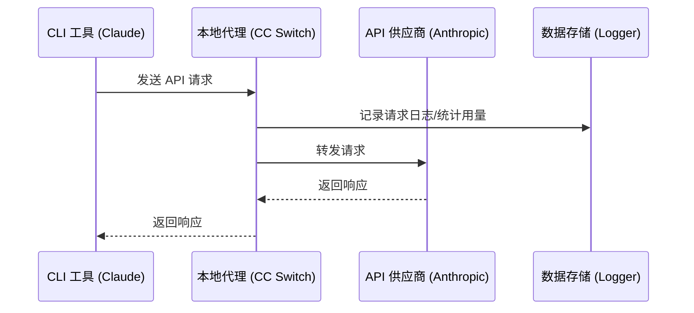
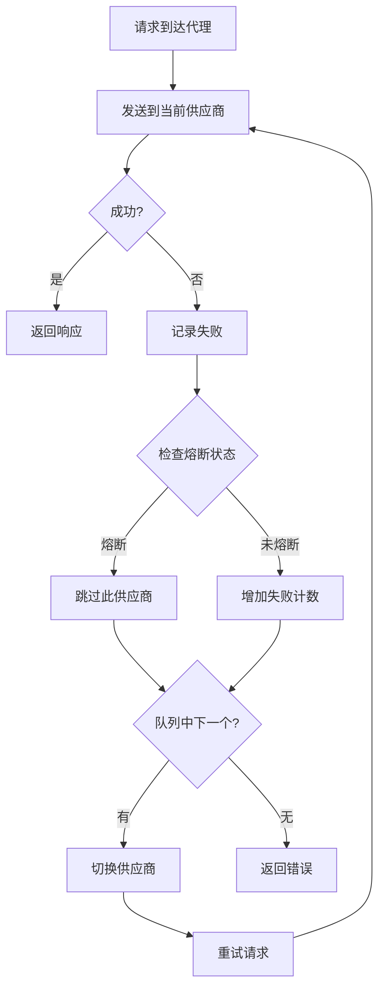
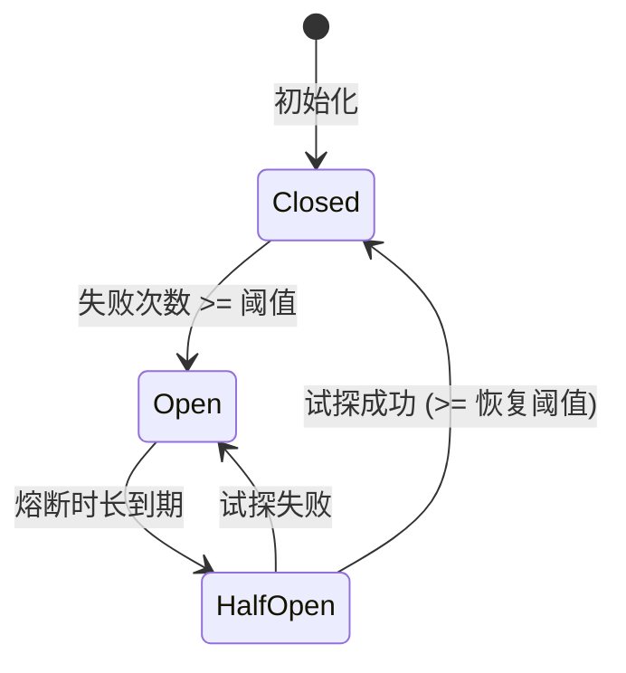

# CC Switch 中文使用手册（完整版）

> 来源：官方 farion1231/cc-switch docs/user-manual/zh（24 篇合并）
> 官网：https://ccswitch.io ｜ 下载：GitHub Releases ｜ 项目：github.com/farion1231/cc-switch

---


## 第一章 入门


### 1-getting-started_1.1-introduction.md

# 1.1 软件介绍

## 什么是 CC Switch

CC Switch 是一款跨平台桌面应用，专为使用 AI 工具的开发者设计。它帮助你统一管理 **Claude Code**、**Claude Desktop**、**Codex**、**Gemini CLI**、**OpenCode**、**OpenClaw** 和 **Hermes** 等受管应用的配置。

## 解决什么问题

在日常开发中，你可能会遇到这些痛点：

- **多供应商切换麻烦**：使用不同的 API 供应商（官方、中转服务商），需要手动修改配置文件
- **配置分散难管理**：Claude Code、Claude Desktop、Codex、Gemini、OpenCode、OpenClaw、Hermes 各有独立的配置文件，格式不同
- **无法监控用量**：不知道 API 调用了多少次，花了多少钱
- **服务不稳定**：单一供应商出问题时，整个工作流中断

CC Switch 通过统一的界面解决这些问题。

## 核心功能

### 供应商管理
- 一键切换多个 API 供应商配置
- 支持预设模板，快速添加常用供应商
- 统一供应商功能，跨应用共享配置
- Claude Desktop 第三方供应商、直连模式与模型映射
- 用量查询与余额显示
- 端点速度测试

### 扩展功能
- **MCP 服务器**：管理 Model Context Protocol 服务器，扩展 AI 能力
- **Prompts**：管理系统提示词预设，快速切换不同场景
- **Skills**：安装和管理技能扩展

### 代理与高可用
- 本地代理服务，记录请求日志和用量统计
- 自动故障转移，主供应商失败时自动切换备用
- 熔断器机制，防止频繁重试失败的供应商
- 详细的 Token 用量追踪与成本估算

## 支持的应用

| 应用 | 说明 |
|------|------|
| **Claude Code** | Anthropic 官方的 AI 编程助手 |
| **Claude Desktop** | Claude 桌面应用，支持官方登录与第三方 3P profile |
| **Codex** | OpenAI 的代码生成工具 |
| **Gemini CLI** | Google 的 AI 命令行工具 |
| **OpenCode** | 开源 AI 编程终端工具 |
| **OpenClaw** | 开源 AI 助手（多供应商网关） |
| **Hermes** | Hermes Agent，支持供应商、MCP、Skills 和 Memory 管理 |

## 支持的平台

- **Windows** 10 及以上
- **macOS** 12 (Monterey) 及以上
- **Linux** Ubuntu 22.04+ / Debian 11+ / Fedora 34+（x64 / ARM64）

## 技术架构

CC Switch 使用现代化的技术栈构建：

- **前端**：React 18 + TypeScript + Tailwind CSS
- **后端**：Tauri 2 + Rust
- **数据存储**：SQLite（供应商、MCP、Prompts）+ JSON（设备设置）

这种架构确保了：
- 跨平台一致的体验
- 原生级别的性能
- 安全的本地数据存储


---


### 1-getting-started_1.2-installation.md

# 1.2 安装指南

## 官方渠道与系统要求

请只从 **[ccswitch.io](https://ccswitch.io)**、**[GitHub Releases](https://github.com/farion1231/cc-switch/releases)** 或项目源码仓库获取 CC Switch。任何要求付费、充值或索取登录凭据的“CC Switch”网站或客户端都不是官方渠道。

| 系统 | 最低版本 | 架构 |
|------|----------|------|
| Windows | Windows 10 及以上 | x64 |
| macOS | macOS 12 (Monterey) 及以上 | Intel (x64) / Apple Silicon (arm64) |
| Linux | 见下方发行版说明 | x64 / ARM64 |

## 前置要求

### 安装 Node.js

CC Switch 管理的 CLI 工具（Claude Code、Codex、Gemini CLI）需要 Node.js 环境。

**推荐版本**：Node.js 18 LTS 或更高版本

#### Windows

1. 访问 [Node.js 官网](https://nodejs.org/)

2. 下载 LTS 版本安装包

3. 运行安装程序，按提示完成安装

4. 验证安装：

 ```bash
 node --version
 npm --version
 ```

#### macOS

```bash
# 使用 Homebrew 安装
brew install node

# 或使用 nvm（推荐）
curl -o- https://raw.githubusercontent.com/nvm-sh/nvm/v0.39.0/install.sh | bash
nvm install --lts
```

#### Linux

```bash
# Ubuntu/Debian
curl -fsSL https://deb.nodesource.com/setup_lts.x | sudo -E bash -
sudo apt-get install -y nodejs

# 或使用 nvm
curl -o- https://raw.githubusercontent.com/nvm-sh/nvm/v0.39.0/install.sh | bash
nvm install --lts
```

### 安装 CLI 工具

#### Claude Code

**方式一：Homebrew（macOS 推荐）**

```bash
brew install claude-code
```

**方式二：npm**

```bash
npm install -g @anthropic-ai/claude-code

# 国内用户如下载慢，使用镜像源
npm install -g @anthropic-ai/claude-code --registry=https://registry.npmmirror.com
```

#### Codex

**方式一：Homebrew（macOS 推荐）**

```bash
brew install codex
```

**方式二：npm**

```bash
npm install -g @openai/codex

# 国内用户如下载慢，使用镜像源
npm install -g @openai/codex --registry=https://registry.npmmirror.com
```

#### Gemini CLI

**方式一：Homebrew（macOS 推荐）**

```bash
brew install gemini-cli
```

**方式二：npm**

```bash
npm install -g @google/gemini-cli

# 国内用户如下载慢，使用镜像源
npm install -g @google/gemini-cli --registry=https://registry.npmmirror.com
```

> 💡 **提示**：如果经常遇到下载慢的问题，可以全局设置镜像源：
> ```bash
> npm config set registry https://registry.npmmirror.com
> ```

---

## Windows

### 安装包方式

1. 访问 [Releases 页面](https://github.com/farion1231/cc-switch/releases)
2. 下载 `CC-Switch-v{版本号}-Windows.msi`
3. 双击运行安装程序
4. 按提示完成安装

注意：运行安装程序后如果没有任何反应，可以在文件上点击右键，在弹出的菜单中打开 `属性`，`常规`页中的 `安全` 勾选 `解除锁定`

### 绿色版（免安装）

1. 下载 `CC-Switch-v{版本号}-Windows-Portable.zip`
2. 解压到任意目录
3. 运行 `CC-Switch.exe`

## macOS

### 方式一：Homebrew（推荐）

```bash
# 安装
brew install --cask cc-switch
```

更新到最新版本：

```bash
brew upgrade --cask cc-switch
```

### 方式二：手动下载

1. 下载 `CC-Switch-v{版本号}-macOS.dmg`（推荐）或 `CC-Switch-v{版本号}-macOS.zip`
2. 打开 DMG，或解压 zip 得到 `CC Switch.app`
3. 拖动到「应用程序」文件夹

### 已签名并公证

CC Switch macOS 版本已通过 Apple 代码签名和公证，可直接安装打开，无需额外操作。

## Linux

### ArchLinux

使用 AUR 助手安装：

```bash
# 使用 paru
paru -S cc-switch-bin

# 或使用 yay
yay -S cc-switch-bin
```

### Debian / Ubuntu

1. 根据架构下载 `CC-Switch-v{版本号}-Linux-x86_64.deb` 或 `CC-Switch-v{版本号}-Linux-arm64.deb`
2. 安装：

```bash
sudo dpkg -i CC-Switch-v{版本号}-Linux-*.deb

# 如果有依赖问题
sudo apt-get install -f
```

### AppImage（通用）

1. 根据架构下载 `CC-Switch-v{版本号}-Linux-x86_64.AppImage` 或 `CC-Switch-v{版本号}-Linux-arm64.AppImage`
2. 添加执行权限：

```bash
chmod +x CC-Switch-v{版本号}-Linux-*.AppImage
```

3. 运行：

```bash
./CC-Switch-v{版本号}-Linux-*.AppImage
```

## 验证安装

安装完成后，启动 CC Switch：

1. 应用窗口正常显示
2. 系统托盘出现 CC Switch 图标
3. 应用切换器中能看到已启用的受管应用，并能切换到目标应用面板

## 自动更新

CC Switch 内置自动更新功能：

- 启动时自动检查更新
- 有新版本时在界面显示更新提示
- 点击即可下载并安装

也可以在「设置 → 关于」中手动检查更新。

## 卸载

### Windows

- 通过「设置 → 应用」卸载
- 或运行安装目录下的卸载程序

### macOS

- 将 `CC Switch.app` 移到废纸篓
- 可选：删除配置目录 `~/.cc-switch/`

### Linux

```bash
# Debian/Ubuntu
sudo apt remove cc-switch

# ArchLinux
paru -R cc-switch-bin
```


---


### 1-getting-started_1.3-interface.md

# 1.3 界面概览

## 主界面布局

<!-- 📷 官方手册截图："image-20260108001629138"（原图: ../../assets/image-20260108001629138.png） -->

## 顶部导航栏

| 序号 | 元素 | 功能说明 |
|------|------|----------|
| ① | Logo | 点击访问 GitHub 项目页 |
| ② | 设置按钮 | 打开设置页面（快捷键 `Cmd/Ctrl + ,`） |
| ③ | 代理开关 | 启动/停止本地代理服务 |
| ④ | 应用切换器 | 切换 Claude / Claude Desktop / Codex / Gemini / OpenCode / OpenClaw / Hermes |
| ⑤ | 功能区 | 当前应用支持的功能入口 |
| ⑥ | 添加按钮 | 添加新供应商 |

### 应用切换器

点击下拉菜单切换当前管理的应用：

- **Claude** - 管理 Claude Code 配置
- **Claude Desktop** - 管理 Claude Desktop 第三方供应商与官方模式
- **Codex** - 管理 Codex 配置
- **Gemini** - 管理 Gemini CLI 配置
- **OpenCode** - 管理 OpenCode 配置
- **OpenClaw** - 管理 OpenClaw 配置
- **Hermes** - 管理 Hermes Agent 供应商与 Memory

切换后，供应商列表会显示对应应用的配置。

### 功能区按钮

| 按钮 | 功能 | 可见条件 |
|------|------|----------|
| Skills | 技能扩展管理 | Claude / Codex / Gemini / OpenCode / Hermes |
| Prompts | 系统提示词管理 | Claude / Codex / Gemini / OpenCode |
| MCP | MCP 服务器管理 | Claude / Codex / Gemini / OpenCode / Hermes |

## 供应商卡片

每个供应商以卡片形式展示，从左到右依次包含以下元素：

### 卡片元素（从左到右）

| 序号 | 元素 | 图标 | 功能说明 |
|------|------|------|----------|
| ① | 拖拽手柄 | ≡ | 按住上下拖动调整供应商顺序 |
| ② | 供应商图标 | 🔷 | 显示供应商品牌图标，可自定义颜色 |
| ③ | 供应商信息 | - | 名称、备注/端点地址（可点击打开官网） |
| ④ | 用量信息 | - | 显示剩余额度，多套餐时显示套餐数量 |
| ⑤ | 启用按钮 | ▶ | 切换为当前使用的供应商 |
| ⑥ | 编辑按钮 | ✏️ | 编辑供应商配置 |
| ⑦ | 复制按钮 | 📋 | 复制供应商（创建副本） |
| ⑧ | 测速按钮 | 🧪 | 测试模型可用性和响应速度 |
| ⑨ | 用量查询 | 📊 | 配置用量查询脚本 |
| ⑩ | 删除按钮 | 🗑️ | 删除供应商（当前启用时禁用） |

> 💡 **提示**：操作按钮区域（⑤-⑩）在鼠标悬停时显示，平时隐藏以保持界面简洁。

v3.15.0 起，Claude Code 与 Codex 的部分供应商卡片还会显示 **Local Routing 支持徽章**，用于快速判断该供应商是否适合通过本地路由转发。

### 按钮详细说明

| 按钮 | 状态变化 | 说明 |
|------|----------|------|
| **启用** | 已启用时显示 ✓ 并禁用 | 故障转移模式下变为「加入/已加入」 |
| **编辑** | 始终可用 | 打开编辑面板修改配置 |
| **复制** | 始终可用 | 创建供应商副本，名称后缀 `copy` |
| **测速** | 测试中显示加载动画 | 仅代理服务运行时可用 |
| **用量查询** | 始终可用 | 配置自定义用量查询脚本 |
| **删除** | 当前启用时半透明禁用 | 需先切换到其他供应商才能删除 |

### 卡片状态

| 状态 | 边框颜色 | 说明 |
|------|----------|------|
| **当前启用** | 🔵 蓝色边框 | 普通模式下当前使用的供应商 |
| **代理活跃** | 🟢 绿色边框 | 代理接管模式下实际使用的供应商 |
| **普通状态** | 默认边框 | 未启用的供应商 |
| **故障转移中** | 显示优先级徽章 | 如 P1、P2 表示故障转移优先级 |

### 健康状态徽章

在代理模式下，加入故障转移队列的供应商会显示健康状态：

| 徽章 | 颜色 | 说明 |
|------|------|------|
| 健康 | 🟢 绿色 | 连续失败 0 次 |
| 警告 | 🟡 黄色 | 连续失败 1-2 次 |
| 不健康 | 🔴 红色 | 连续失败 ≥3 次，可能触发熔断 |


## 系统托盘

CC Switch 在系统托盘显示图标，提供快速操作入口。

### 托盘菜单结构

<!-- 📷 官方手册截图："image-20260108002153668"（原图: ../../assets/image-20260108002153668.png） -->

### 菜单功能

| 菜单项 | 功能 |
|--------|------|
| 打开主界面 | 显示主窗口并聚焦 |
| 应用子菜单 | 按 Claude/Codex/Gemini 分组的折叠子菜单（如 "Claude · PackyCode"），可显示当前供应商与缓存用量摘要 |
| 供应商列表 | 在每个子菜单内，点击切换，当前启用的显示勾选标记 |
| 轻量模式 | 勾选框切换，进入/退出仅托盘运行模式 |
| 退出 | 完全退出应用 |

> **注意**：每个托盘子菜单的标题会显示当前供应商名称（如 "Claude · PackyCode"）。没有配置供应商的应用会显示禁用的"(无供应商)"条目。托盘目前聚焦 Claude / Codex / Gemini 三个可代理且可统计用量的应用；主界面应用可见性仍由设置中的"应用可见性"选项控制。

### 多语言支持

托盘菜单支持四种语言，根据设置自动切换：

| 语言 | 打开主界面 | 退出 |
|------|-----------|------|
| 简体中文 | 打开主界面 | 退出 |
| 繁體中文 | 開啟主介面 | 退出 |
| English | Open main window | Quit |
| 日本語 | メインウィンドウを開く | 終了 |

### 轻量模式

托盘菜单包含 **轻量模式** 切换开关（勾选框）。启用后：

- 主窗口关闭以释放资源
- 应用仅在系统托盘中运行
- 你仍可通过托盘子菜单切换供应商
- 在 macOS 上，Dock 图标也会隐藏

要退出轻量模式，取消勾选该选项或点击"打开主界面" — 主窗口将被重建并显示。

### 使用场景

托盘切换供应商无需打开主界面，适合：

- 频繁切换供应商
- 主窗口最小化时快速操作
- 后台运行时管理配置
- 使用轻量模式以最小化资源占用

## 设置页面

设置页面分为多个 Tab：

### 通用 Tab

- 语言设置（简体中文/繁體中文/English/日本語）
- 主题设置（跟随系统/浅色/深色）
- 窗口行为（开机自启、关闭行为）

### 高级 Tab

- 配置目录设置
- 代理服务配置
- 故障转移设置
- 定价配置
- 数据导入导出

### 用量 Tab

- 请求统计概览
- 趋势图表
- 请求日志
- 供应商/模型统计

### 关于 Tab

- 版本信息
- 更新检查
- 开源协议

## 快捷键

| 快捷键 | 功能 |
|--------|------|
| `Cmd/Ctrl + ,` | 打开设置 |
| `Cmd/Ctrl + F` | 搜索供应商 |
| `Esc` | 关闭弹窗/搜索 |

## 搜索功能

按 `Cmd/Ctrl + F` 打开搜索框：

- 支持按名称、备注、URL 搜索
- 实时过滤供应商列表
- 按 `Esc` 关闭搜索


---


### 1-getting-started_1.4-quickstart.md

# 1.4 快速上手

本节帮助你在 5 分钟内完成首次配置。

## 第一步：添加供应商

1. 点击主界面右上角的 **+** 按钮
2. 在「预设」下拉框中选择你的供应商
   - 常用预设：智谱 GLM、MiniMax、DeepSeek、Kimi、PackyCode
   - 或选择「自定义」手动配置
3. 填写 **API Key**
4. 点击「添加」

<!-- 📷 官方手册截图："image-20260108002807657"（原图: ../../assets/image-20260108002807657.png） -->

> 💡 **提示**：预设会自动填充端点地址，你只需要填写 API Key。

## 第二步：切换供应商

添加完成后，供应商会出现在列表中。

**方式一：主界面切换**
- 点击供应商卡片的「启用」按钮

**方式二：托盘快速切换**
- 右键系统托盘图标
- 直接点击供应商名称

## 第三步：生效方式

切换供应商后，各 CLI 工具的生效方式不同：

| 应用 | 生效方式 |
|------|----------|
| Claude Code | ✅ 即时生效（支持热重载） |
| Codex | 需要关闭并重新打开终端 |
| Gemini | ✅ 即时生效（每次请求重新读取配置） |
| OpenCode | 需要关闭并重新打开终端 |
| OpenClaw | 需要关闭并重新打开终端 |

### Claude Code 首次安装提示

如果 Claude Code 首次启动时提示需要**登录**或显示初始化引导，请在 CC Switch 中开启「跳过 Claude Code 初次安装确认」选项：

1. 打开 CC Switch「设置 → 通用」
2. 开启「跳过 Claude Code 初次安装确认」开关
3. 重新启动 Claude Code

<!-- 📷 官方手册截图："image-20260108002626389"（原图: ../../assets/image-20260108002626389.png） -->

> ⚠️ **注意**：此选项会写入 `~/.claude/settings.json` 的 `skipIntroduction` 字段，跳过官方的新手引导流程。

## 验证配置

重启后，启动对应的 CLI 工具并输入简单的问题进行测试：

```bash
# Claude Code - 启动后输入测试问题
claude
> 你好，请简单介绍一下自己

# Codex - 启动后输入测试问题
codex
> 你好，请简单介绍一下自己

# Gemini - 启动后输入测试问题
gemini
> 你好，请简单介绍一下自己

# OpenCode - 启动后输入测试问题
opencode
> 你好，请简单介绍一下自己

# OpenClaw - 启动后输入测试问题
openclaw
> 你好，请简单介绍一下自己
```

如果 AI 能正常回复，说明配置成功。

## 下一步

恭喜！你已经完成了基础配置。接下来可以：

- [添加更多供应商](../2-providers/2.1-add.md) - 配置多个供应商方便切换
- [配置 MCP 服务器](../3-extensions/3.1-mcp.md) - 扩展 AI 工具的能力
- [设置系统提示词](../3-extensions/3.2-prompts.md) - 自定义 AI 的行为
- [开启代理服务](../4-proxy/4.1-service.md) - 监控用量和自动故障转移

## 常见问题

### 切换后不生效？

确保重启了终端或 CLI 工具。配置文件在切换时已经更新，但运行中的程序不会自动重新加载。

### 找不到预设？

如果你的供应商不在预设列表中，选择「自定义」手动配置。参考 [添加供应商](../2-providers/2.1-add.md) 了解配置格式。

### 如何恢复官方登录？

选择「官方登录」预设（Claude/Codex）或「Google 官方」预设（Gemini），重启客户端后按登录流程操作。


---


### 1-getting-started_1.5-settings.md

# 1.5 个性化配置

本节介绍如何根据个人偏好配置 CC Switch。

## 打开设置

- 点击左上角 **⚙️** 按钮
- 或使用快捷键 `Cmd/Ctrl + ,`

## 语言设置

CC Switch 支持四种语言：

| 语言     | 说明     |
| -------- | -------- |
| 简体中文 | 默认语言 |
| 繁體中文 | 繁体中文界面 |
| English  | 英文界面 |
| 日本語   | 日文界面 |

切换语言后立即生效，无需重启。

## 主题设置

| 选项     | 说明                        |
| -------- | --------------------------- |
| 跟随系统 | 自动匹配系统的深色/浅色模式 |
| 浅色     | 始终使用浅色主题            |
| 深色     | 始终使用深色主题            |

## 窗口行为

### 开机自启

开启后，系统启动时自动运行 CC Switch。

- **Windows**：通过注册表实现
- **macOS**：通过 LaunchAgent 实现
- **Linux**：通过 XDG autostart 实现

### 关闭行为

| 选项         | 说明                         |
| ------------ | ---------------------------- |
| 最小化到托盘 | 点击关闭按钮时隐藏到系统托盘 |
| 直接退出     | 点击关闭按钮时完全退出应用   |

推荐使用「最小化到托盘」，方便通过托盘快速切换供应商。

### 轻量模式

v3.13.0 起新增「轻量模式」——一种**仅托盘运行**的状态，用于把空闲时的桌面占用降到最低。

**触发方式**：右键系统托盘图标 → 点击「轻量模式」。主窗口会被**销毁**（而不是隐藏），UI 资源和内存随之释放。

**退出方式**：从托盘菜单点击「打开主界面」，或通过深链接 / 再次启动 CC Switch。窗口会按需**重建**，状态保持一致。

| 特性         | 最小化到托盘         | 轻量模式                 |
| ------------ | -------------------- | ------------------------ |
| UI 进程      | 保留在内存中         | 完全销毁                 |
| 空闲资源占用 | 与正常运行相当       | 接近零                   |
| 再次打开速度 | 瞬时（直接显示）     | 略慢（需要重建窗口）     |
| 托盘切换功能 | 可用                 | 可用                     |
| 深链接唤起   | 可用                 | 可用（按需重建）         |

> 💡 **使用场景**：如果你 CC Switch 长时间常驻后台，主要通过托盘菜单切换供应商，开启轻量模式能显著降低内存占用。

> ⚠️ **注意**：轻量模式状态不持久 — 下次正常启动时会回到普通模式。需要长期使用可搭配开机自启。

### Claude 插件集成

开启后，CC Switch 在切换供应商时会自动同步配置到 VS Code 中的 Claude Code 插件（写入 `~/.claude/config.json` 的 `primaryApiKey`）。

> 💡 **使用场景**：如果你同时使用 Claude Code CLI 和 VS Code 插件，开启此选项可以保持两者配置一致。

### 跳过 Claude 引导

开启后，跳过 Claude Code 的新手引导流程，适合已熟悉 Claude Code 的用户。

> ⚠️ **注意**：此选项会写入 `~/.claude/settings.json` 的 `skipIntroduction` 字段。

### 应用可见性

选择在应用切换器中显示哪些应用。每个应用可以独立开关，但至少保留一个。

可配置的应用：Claude、Claude Desktop、Codex、Gemini、OpenCode、OpenClaw、Hermes。

> 💡 **使用场景**：如果你只使用 Claude Code 和 Codex CLI，可以隐藏其他应用，保持界面简洁。

### Skills 同步方式

设置技能安装到各应用目录时的同步方式：

| 方式              | 说明                                                 |
| ----------------- | ---------------------------------------------------- |
| 软链接（Symlink） | 创建符号链接指向技能源文件，占用空间小，更新实时同步 |
| 复制（Copy）      | 将技能文件完整复制到目标目录                         |

> 💡 **推荐**：默认使用软链接方式。如果遇到权限问题，可切换为复制方式。

### 终端设置

选择 CC Switch 打开终端时使用的终端应用程序。

支持的终端（按平台）：

| 平台    | 终端选项                                                           |
| ------- | ------------------------------------------------------------------ |
| macOS   | Terminal、iTerm2、Alacritty、Kitty、Ghostty、Otty、WezTerm、Kaku、Warp |
| Windows | CMD、PowerShell、Windows Terminal                                  |
| Linux   | GNOME Terminal、Konsole、Xfce4 Terminal、Alacritty、Kitty、Ghostty |

## 目录配置

### 应用配置目录

CC Switch 自身数据的存储位置，默认为 `~/.cc-switch/`。

### CLI 工具目录

可以自定义各 CLI 工具的配置目录：

| 配置          | 默认值         | 说明                 |
| ------------- | -------------- | -------------------- |
| Claude 目录   | `~/.claude/`   | Claude Code 配置目录 |
| Codex 目录    | `~/.codex/`    | Codex 配置目录       |
| Gemini 目录   | `~/.gemini/`   | Gemini CLI 配置目录  |
| OpenCode 目录 | `~/.config/opencode/` | OpenCode 配置目录    |
| OpenClaw 目录 | `~/.openclaw/` | OpenClaw 配置目录    |
| Hermes 目录   | `~/.hermes/`   | Hermes 配置目录      |

> ⚠️ **注意**：修改目录后需要重启应用，且对应的 CLI 工具也需要配置相同的目录。

## 数据管理

### 导出配置

点击「导出」按钮，保存包含以下内容的 SQL 备份文件：

- 所有供应商配置
- MCP 服务器配置
- Prompts 预设
- 用量日志
- 应用设置

导出文件名格式为 `cc-switch-export-{timestamp}.sql`。

### 导入配置

1. 点击「选择文件」
2. 选择之前导出的备份文件
3. 点击「导入」
4. 确认覆盖现有配置

> ⚠️ **注意**：导入会覆盖现有配置，建议先导出当前配置作为备份。

## 代理设置

设置 → 代理 Tab

代理 Tab 集中管理所有代理相关功能：

### 本地代理

启动/停止本地代理服务，配置监听地址和端口。详见 [4.1 代理服务](../4-proxy/4.1-service.md)。

### 故障转移

按应用（Claude/Codex/Gemini）配置故障转移队列和自动切换策略。详见 [4.3 故障转移](../4-proxy/4.3-failover.md)。

### 定价矫正器

配置模型定价矫正规则，用于代理计费统计的校准。

### 全局出站代理

配置 CC Switch 的出站 HTTP/HTTPS 代理，适用于需要通过代理访问外部 API 的场景。

## 高级设置

设置 → 高级 Tab

### 配置目录

自定义各应用的配置文件目录。详见下方「目录配置」章节。

### 数据管理

导入/导出配置备份。详见下方「数据管理」章节。

### 备份与恢复

备份管理面板提供对数据库备份的全面控制。

#### 自动备份设置

| 配置     | 选项                               | 默认值    |
| -------- | ---------------------------------- | --------- |
| 备份间隔 | 禁用、6h、12h、24h、48h、7d        | 24 小时   |
| 保留数量 | 3、5、10、15、20、30、50           | 10 个备份 |

设置间隔后，CC Switch 会按计划自动备份数据库。超出保留数量的旧备份会自动删除。

#### 备份列表

面板显示所有现有备份，包含：
- **显示名称**（根据时间戳自动生成，如 `db_backup_20260315_143000`）
- **创建时间**
- **文件大小**（如 "1.5 MB"）

#### 备份操作

| 操作         | 说明                                                                     |
| ------------ | ------------------------------------------------------------------------ |
| **立即备份** | 立即创建一个备份                                                         |
| **恢复**     | 从选定的备份恢复数据库。恢复前会自动创建当前数据库的安全备份             |
| **重命名**   | 修改备份的显示名称                                                       |
| **删除**     | 永久删除备份（需确认）                                                   |

> ⚠️ **重要**：恢复备份会覆盖当前数据库。恢复操作前始终会自动创建安全备份，以便在需要时恢复。

### 云同步（WebDAV）

通过 WebDAV 协议在多台设备间同步配置。使用 **v2 协议**，支持双层版本控制，提高可靠性。

| 配置项   | 说明                                                                         |
| -------- | ---------------------------------------------------------------------------- |
| 服务预设 | 坚果云 / Nextcloud / 群晖 / 自定义                                           |
| 服务地址 | WebDAV 服务器 URL                                                            |
| 用户名   | 登录用户名                                                                   |
| 密码     | 登录密码（应用专用密码；已保存的凭据在未修改时会被保留）                     |
| 远程目录 | 远程存储路径（默认 `cc-switch-sync`）                                        |
| 配置名称 | 设备配置文件名（默认 `default`）                                             |
| 自动同步 | 开启后按配置的间隔自动同步                                                   |

#### 操作

| 操作         | 说明                                                                                         |
| ------------ | -------------------------------------------------------------------------------------------- |
| **测试连接** | 验证 WebDAV URL、用户名和密码是否有效                                                        |
| **上传**     | 将本地数据库上传到远程，显示进度指示器                                                       |
| **下载**     | 下载远程数据库。下载前显示远程快照信息（协议版本、数据库版本、时间戳、大小）供确认。覆盖本地数据库前会自动创建安全备份 |

#### 自动同步

启用 **自动同步** 后：
- 首次激活时会显示确认对话框
- CC Switch 按配置的间隔自动将数据库同步到 WebDAV
- 面板中显示同步状态

#### 远程快照信息

下载前，CC Switch 会显示远程快照的详细信息：
- 协议版本（v2）
- 数据库兼容版本
- 远程备份的时间戳
- 文件大小
- 兼容性状态（不兼容时显示警告）

> ⚠️ **注意**：上传会覆盖远程数据，下载会覆盖本地数据。下载前始终会自动创建安全备份。

### 日志配置

| 配置项   | 说明                                |
| -------- | ----------------------------------- |
| 启用日志 | 开启/关闭应用日志记录               |
| 日志级别 | error / warn / info / debug / trace |

日志级别说明：

- **error** - 仅记录错误
- **warn** - 记录警告和错误
- **info** - 记录一般信息（推荐）
- **debug** - 记录调试信息
- **trace** - 记录所有详细信息

## OAuth 认证中心（Beta）

设置 → **OAuth 认证中心** Tab

v3.13.0 新增的 **OAuth 认证中心**（Beta）统一管理第三方 OAuth 凭据，目前支持三类账号：

| 账号类型                     | 用途                                            |
| ---------------------------- | ----------------------------------------------- |
| **GitHub Copilot**           | 配合 Copilot 反向代理使用                       |
| **ChatGPT (Codex OAuth)**    | 配合 Codex OAuth 反向代理使用，管理 ChatGPT 账号   |
| **xAI (Grok OAuth)**         | 配合 xAI Responses API 反向代理使用               |

**你可以在这里**：

- 通过 Device Code 流程登录 ChatGPT / GitHub / xAI 账号
- 查看已登录账号列表和认证状态
- 为多账号设置默认账号
- 移除单个账号或一键注销所有账号

xAI 集成使用 OAuth 2.0 Device Authorization Grant，不使用本机回环回调。其网络依赖契约如下：

| 依赖 | 端点 |
| ---- | ---- |
| OpenID discovery | `https://auth.x.ai/.well-known/openid-configuration` |
| 设备授权 | discovery 返回的 `device_authorization_endpoint`（当前为 `https://auth.x.ai/oauth2/device/code`） |
| Token 交换/刷新 | discovery 返回的 `token_endpoint`（当前为 `https://auth.x.ai/oauth2/token`） |
| 推理 | `https://api.x.ai/v1/responses` |
| 模型发现 | `https://api.x.ai/v1/models` |

流程不占用任何本地回调端口；认证和模型请求均复用 CC Switch 的全局出站代理设置。

xAI 集成**不使用**注册给 CC Switch 的 OAuth 应用，而是复用 xAI 官方 Grok CLI 注册的公共 OAuth 客户端身份与 scope（`client_id: b1a00492-073a-47ea-816f-4c329264a828`，包含 `grok-cli:access`）获取账号型 API 访问权限。

> ⚠️ **警告**：这些账号型反向代理使用逆向接入的 OAuth 流程，存在账号与服务条款风险。复用上游产品的 OAuth 客户端可能不受官方支持，并可能导致服务商限制或封禁账号。请在使用前审阅对应服务商条款并自行承担风险；现有 Codex 流程另见 [2.1 添加供应商 → Codex OAuth 反向代理](../2-providers/2.1-add.md#codex-oauth-反向代理claude-供应商) 的完整风险提示。

## 关于页面

设置 → 关于 Tab

### 版本信息

显示当前 CC Switch 版本号，支持：

- 查看发布说明
- 检查更新
- 下载并安装新版本

### 本地环境检查

自动检测已安装的 CLI 工具版本：

| 工具     | 检测内容           |
| -------- | ------------------ |
| Claude   | 当前版本、最新版本 |
| Codex    | 当前版本、最新版本 |
| Gemini   | 当前版本、最新版本 |
| OpenCode | 当前版本、最新版本 |
| OpenClaw | 当前版本、最新版本 |
| Hermes   | 当前版本、最新版本 |

点击「刷新」按钮可重新检测；检测到新版时可单独升级，也可以点击「全部升级」。未检测到的工具会显示安装按钮。安装与升级在后台静默执行，按钮上会显示进度，完成后自动刷新版本。

### 手动安装命令

提供快速安装/升级 CLI 工具的命令（该区域默认折叠，点击标题展开）：

```bash
npm i -g @anthropic-ai/claude-code@latest
npm i -g @openai/codex@latest
npm i -g @google/gemini-cli@latest
npm i -g opencode-ai@latest
npm i -g openclaw@latest
python3 -m pip install --upgrade "hermes-agent[web]"
```

点击「复制」按钮可复制到剪贴板。


---


## 第二章 供应商管理


### 2-providers_2.1-add.md

# 2.1 添加供应商

## 打开添加面板

点击主界面右上角的 **+** 按钮，打开添加供应商面板。

面板分为两个 Tab：
- **应用专属供应商**：仅用于当前选中的应用（Claude Code / Claude Desktop / Codex / Gemini / OpenCode / OpenClaw / Hermes）
- **统一供应商**：跨应用共享的配置

## 使用预设添加

预设是预先配置好的供应商模板，只需填写 API Key 即可使用。

### 操作步骤

1. 在「预设」下拉框中选择供应商
2. 名称和端点会自动填充
3. 填写你的 **API Key**
4. （可选）填写备注
5. 点击「添加」

### 常用预设

#### Claude 预设

| 预设名称 | 说明 |
|----------|------|
| Claude 官方 | 使用 Anthropic 官方账号登录 |
| DeepSeek | DeepSeek 模型 |
| 智谱 GLM | 智谱 AI 的 GLM 模型 |
| 智谱 GLM en | 智谱 AI（英文版） |
| 百炼 | 阿里云百炼（通义千问） |
| Kimi | Moonshot Kimi 模型 |
| Kimi For Coding | Kimi 编程专用模型 |
| StepFun | 阶跃星辰 Step模型 |
| ModelScope | 魔搭社区 |
| KAT-Coder | KAT-Coder 模型 |
| Longcat | Longcat AI |
| MiniMax | MiniMax 模型 |
| MiniMax en | MiniMax（英文版） |
| 火山 豆包AI | 豆包 Seed 模型 |
| BaiLing | 百灵 AI |
| AiHubMix | AiHubMix 聚合服务 |
| SiliconFlow | 硅基流动 |
| SiliconFlow en | 硅基流动（英文版） |
| DMXAPI | DMXAPI 中转服务 |
| PackyCode | PackyCode 中转服务 ⭐ |
| Cubence | Cubence 服务 |
| AIGoCode | AIGoCode 服务 |
| RightCode | RightCode 服务 |
| AICodeMirror | AICodeMirror 服务 |
| OpenRouter | 聚合路由服务 |
| Nvidia | Nvidia AI 服务 |
| Xiaomi MiMo | 小米 MiMo 模型 |

> ⭐ 标注为官方合作伙伴。预设列表可能随版本更新，以应用内实际显示为准。

#### Claude Desktop 预设

Claude Desktop 面板内置从 Claude Code 预设目录转换而来的供应商预设。添加时可选择：

- **直连模式**：供应商原生支持 Anthropic Messages API，且模型名是 Claude Desktop 可识别的三档角色 ID（`claude-sonnet-*` / `claude-opus-*` / `claude-haiku-*`），Claude Desktop 可直接访问
- **模型映射模式**：模型名非三档角色 ID（旧式 Claude ID、或 DeepSeek / Kimi 等非 Claude 模型）通过 CC Switch 本地网关映射为 Sonnet / Opus / Haiku 路由
- **Claude Desktop Official**：恢复 Claude Desktop 官方登录模式

完整操作请参阅 [2.6 Claude Desktop](./2.6-claude-desktop.md)。

#### Codex 预设

Codex 预设按上游协议分两类。

**原生 Responses 协议**（可直连或经标准代理转发）：

| 预设名称 | 说明 |
|----------|------|
| OpenAI 官方 | 使用 OpenAI 官方账号登录 |
| Azure OpenAI | Azure OpenAI 服务 |
| AiHubMix | AiHubMix 聚合服务 |
| DMXAPI | DMXAPI 中转服务 |
| PackyCode | PackyCode 中转服务 |
| OpenRouter | 聚合路由服务 |
| Cubence / AIGoCode / RightCode / AICodeMirror 等 | 各类中转服务 |

**Chat Completions 协议**（需开启「需要本地路由映射」，由代理自动转换）：

| 预设名称 | 说明 |
|----------|------|
| DeepSeek | DeepSeek 模型 |
| 智谱 GLM / GLM en | 智谱 AI 的 GLM 模型 |
| Kimi / Kimi For Coding | Moonshot Kimi 模型 |
| MiniMax / MiniMax en | MiniMax 模型 |
| StepFun / StepFun en | 阶跃星辰 Step 模型 |
| 百度千帆 Coding Plan | 百度千帆编程套餐 |
| 百炼 | 阿里云百炼（通义千问） |
| ModelScope | 魔搭社区 |
| Longcat | Longcat AI |
| 百灵 (BaiLing) | 百灵 AI |
| 小米 MiMo / MiMo Token Plan | 小米 MiMo 模型 |
| 火山 Agentplan | 火山引擎 Agent Plan |
| BytePlus | BytePlus 服务 |
| 火山 豆包AI | 豆包 Seed 模型 |
| SiliconFlow / SiliconFlow en | 硅基流动 |
| Novita AI | Novita AI 服务 |
| Nvidia | Nvidia AI 服务 |

> 💡 选择 Chat Completions 类预设时，「需要本地路由映射」开关和模型映射表会自动配置好，无需手动设置；详见下文「Codex 本地路由与模型映射」一节。预设列表持续更新，以应用内实际显示为准。

#### Gemini 预设

| 预设名称 | 说明 |
|----------|------|
| Google 官方 | 使用 Google OAuth 登录 |
| PackyCode | PackyCode 中转服务 |
| Cubence | Cubence 服务 |
| AIGoCode | AIGoCode 服务 |
| AICodeMirror | AICodeMirror 服务 |
| OpenRouter | 聚合路由服务 |
| 自定义 | 手动配置所有参数 |

#### OpenCode 预设

| 预设名称 | 说明 |
|----------|------|
| DeepSeek | DeepSeek 模型 |
| 智谱 GLM | 智谱 AI 的 GLM 模型 |
| 智谱 GLM en | 智谱 AI（英文版） |
| 百炼 | 阿里云百炼 |
| Kimi k2.5 | Moonshot Kimi-k2.5 模型 |
| Kimi For Coding | Kimi 编程专用模型 |
| StepFun | 阶跃星辰 Step模型 |
| ModelScope | 魔搭社区 |
| KAT-Coder | KAT-Coder 模型 |
| Longcat | Longcat AI |
| MiniMax | MiniMax 模型 |
| MiniMax en | MiniMax（英文版） |
| 火山 豆包AI | 豆包 Seed 模型 |
| BaiLing | 百灵 AI |
| Xiaomi MiMo | 小米 MiMo 模型 |
| AiHubMix | AiHubMix 聚合服务 |
| DMXAPI | DMXAPI 中转服务 |
| OpenRouter | 聚合路由服务 |
| Nvidia | Nvidia AI 服务 |
| PackyCode | PackyCode 中转服务 |
| Cubence | Cubence 服务 |
| AIGoCode | AIGoCode 服务 |
| RightCode | RightCode 服务 |
| AICodeMirror | AICodeMirror 服务 |
| OpenAI Compatible | OpenAI 兼容接口 |
| Oh My OpenCode | Oh My OpenCode 服务 |

> 💡 预设列表持续更新中，以应用内实际显示为准。

#### OpenClaw 预设

| 预设名称 | 说明 |
|----------|------|
| DeepSeek | DeepSeek 模型 |
| 智谱 GLM | 智谱 AI 的 GLM 模型 |
| 智谱 GLM en | 智谱 AI（英文版） |
| Qwen Coder | 通义千问编码模型 |
| Kimi k2.5 | Moonshot Kimi-k2.5 模型 |
| Kimi For Coding | Kimi 编程专用模型 |
| StepFun | 阶跃星辰 Step模型 |
| MiniMax | MiniMax 模型 |
| MiniMax en | MiniMax（英文版） |
| KAT-Coder | KAT-Coder 模型 |
| Longcat | Longcat AI |
| 火山 豆包AI | 豆包 Seed 模型 |
| BaiLing | 百灵 AI |
| Xiaomi MiMo | 小米 MiMo 模型 |
| AiHubMix | AiHubMix 聚合服务 |
| DMXAPI | DMXAPI 中转服务 |
| OpenRouter | 聚合路由服务 |
| ModelScope | 魔搭社区 |
| SiliconFlow | 硅基流动 |
| SiliconFlow en | 硅基流动（英文版） |
| Nvidia | Nvidia AI 服务 |
| PackyCode | PackyCode 中转服务 |
| Cubence | Cubence 服务 |
| AIGoCode | AIGoCode 服务 |
| RightCode | RightCode 服务 |
| AICodeMirror | AICodeMirror 服务 |
| AICoding | AICoding 服务 |
| CrazyRouter | CrazyRouter 服务 |
| SSSAiCode | SSSAiCode 服务 |
| AWS Bedrock | AWS Bedrock 服务 |
| OpenAI Compatible | OpenAI 兼容接口 |

## 自动获取模型

添加或编辑供应商时，可以自动从供应商端点发现可用模型列表，免去手动复制粘贴模型 ID 的繁琐流程。

1. 确保已填写 **API Key** 和 **端点地址**
2. 点击模型输入框旁的 **获取模型** 按钮（下载图标）
3. CC Switch 使用配置的 API Key 调用 OpenAI 兼容的 `/v1/models` 端点
4. 从按类别分组的下拉菜单中选择模型

此功能覆盖 **Claude Code / Claude Desktop / Codex / Gemini / OpenCode / OpenClaw / Hermes** 中带模型字段的供应商表单，适用于支持 `/v1/models` 端点的供应商。Codex OAuth 类供应商会按需从 ChatGPT Codex 后端获取实时模型列表。

**常见错误**：
- **认证失败（401/403）**：检查你的 API Key 是否正确
- **端点不支持（404/405）**：该供应商未提供 `/v1/models` 端点，需手动填写模型 ID
- **解析失败**：返回内容不符合 OpenAI 兼容格式
- **超时**：端点响应缓慢，请稍后重试或检查网络

## 自定义配置

选择「自定义」预设后，需要手动编辑 JSON 配置。

### Claude 配置格式

```json
{
  "env": {
    "ANTHROPIC_API_KEY": "your-api-key",
    "ANTHROPIC_BASE_URL": "https://api.example.com"
  }
}
```

| 字段 | 必填 | 说明 |
|------|------|------|
| `ANTHROPIC_API_KEY` | 是 | API 密钥 |
| `ANTHROPIC_BASE_URL` | 否 | 自定义端点地址 |
| `ANTHROPIC_AUTH_TOKEN` | 否 | 替代 API_KEY 的认证方式 |

### Codex 配置格式

Codex 使用两个配置文件：

**1. auth.json**（`~/.codex/auth.json`）- 存储 API 密钥：

```json
{
  "OPENAI_API_KEY": "your-api-key"
}
```

**2. config.toml**（`~/.codex/config.toml`）- 存储模型和端点配置：

```toml
# 基础配置
model_provider = "custom"
model = "gpt-5.2"
model_reasoning_effort = "high"
disable_response_storage = true

# 自定义供应商配置
[model_providers.custom]
name = "custom"
base_url = "https://api.example.com/v1"
wire_api = "responses"
requires_openai_auth = true
```

**auth.json 字段说明**：

| 字段 | 必填 | 说明 |
|------|------|------|
| `OPENAI_API_KEY` | 是 | API 密钥 |

**config.toml 字段说明**：

| 字段 | 必填 | 说明 |
|------|------|------|
| `model_provider` | 是 | 模型提供商名称（需与 `[model_providers.xxx]` 匹配） |
| `model` | 是 | 使用的模型（如 `gpt-5.2`、`gpt-4o`） |
| `model_reasoning_effort` | 否 | 推理强度：`low` / `medium` / `high` |
| `disable_response_storage` | 否 | 是否禁用响应存储 |
| `base_url` | 是 | API 端点地址 |
| `wire_api` | 否 | API 协议类型（通常为 `responses`） |
| `requires_openai_auth` | 否 | 是否使用 OpenAI 认证方式 |


### Gemini 配置格式

```json
{
  "env": {
    "GEMINI_API_KEY": "your-api-key",
    "GOOGLE_GEMINI_BASE_URL": "https://api.example.com"
  }
}
```

| 字段 | 必填 | 说明 |
|------|------|------|
| `GEMINI_API_KEY` | 是 | API 密钥 |
| `GOOGLE_GEMINI_BASE_URL` | 否 | 自定义端点地址 |
| `GEMINI_MODEL` | 否 | 指定模型 |

> 💡 认证类型由 CC Switch 自动检测（PackyCode API 代理 / Google OAuth / 通用 API Key），无需手动配置。

## 统一供应商

统一供应商可以跨 Claude Code / Codex / Gemini 共享配置，适用于支持多种 API 格式的中转服务。

### 创建统一供应商

1. 切换到「统一供应商」Tab
2. 点击「添加统一供应商」
3. 填写通用配置：
   - 名称
   - API Key
   - 端点地址
4. 勾选要同步的应用（Claude Code / Codex / Gemini）
5. 保存

### 同步机制

统一供应商会自动同步到勾选的应用：

- 修改统一供应商后，所有关联应用的配置同步更新
- 删除统一供应商后，关联的应用配置也会删除

### 保存并同步

编辑统一供应商时，可以选择：

| 操作 | 说明 |
|------|------|
| 保存 | 仅保存配置，不立即同步 |
| 保存并同步 | 保存配置并立即同步到所有启用的应用 |

### 手动同步

如果需要手动触发同步：

1. 在统一供应商卡片上点击「同步」按钮
2. 确认同步操作
3. 配置会覆盖各应用中关联的供应商

## 导入供应商

CC Switch 支持两种方式导入供应商配置：

### 方式一：深度链接导入

通过 `ccswitch://` 协议链接一键导入：

1. 点击或访问深度链接
2. CC Switch 自动打开并显示导入确认
3. 预览配置信息
4. 点击「确认导入」

**获取深度链接**：
- 从他人分享获取
- 使用 [在线生成工具](https://farion1231.github.io/cc-switch/deplink.html) 创建

### 方式二：数据库备份导入

从 SQL 备份文件批量导入：

1. 打开「设置 → 高级 → 数据管理」
2. 点击「选择文件」
3. 选择之前导出的 `.sql` 备份文件
4. 点击「导入」
5. 确认覆盖现有配置

**导入内容**：
- 所有供应商配置
- MCP 服务器配置
- Prompts 预设
- 用量日志

> ⚠️ **注意**：导入会覆盖现有数据库，建议先导出当前配置作为备份。导出的文件名格式为 `cc-switch-export-{时间戳}.sql`。

## Codex OAuth 反向代理（Claude 供应商）

v3.13.0 起，CC Switch 新增了 **Codex OAuth 反向代理**路径，让你可以**用 ChatGPT 账号**在 Claude Code 中复用 Codex 服务。

> 💡 **位置提示**：这项功能作为一个**新的 Claude 供应商卡片类型**出现，而不是 Codex 侧的预设。添加后会和普通 API-Key 型供应商并列在 Claude 的供应商列表中。

### 前提条件

- 拥有可登录的 **ChatGPT 账号**
- 能够访问 `auth.openai.com` 和 `chatgpt.com`
- **在使用前请先阅读本节末尾的 [⚠️ 风险提示](#️-风险提示重要)**

### 两个入口

你可以从下面任意一个入口开始：

#### 入口 A：从添加供应商面板开始（推荐新用户）

1. 切换到 **Claude** 应用
2. 点击右上角的 **+** 按钮打开添加供应商面板
3. 在预设列表的第三方分类下选择 **Codex (ChatGPT Plus/Pro)** 预设（以 UI 中显示的名称为准）
4. 如果尚未登录 ChatGPT 账号，面板会**自动引导**你进入登录流程（见下文"登录流程"）
5. 登录成功后，供应商表单会显示已登录的账号，点击「保存」完成添加

#### 入口 B：从 OAuth 认证中心开始（适合多账号管理）

1. 打开 **设置 → OAuth 认证中心**（标签页顶部带 **Beta** 标记）
2. 在 **ChatGPT (Codex OAuth)** 区块点击 **使用 ChatGPT 登录** 按钮
3. 完成登录流程（见下文）
4. 登录完成后，回到 **Claude** 应用 → **添加供应商** → 选择同一个 Codex (ChatGPT Plus/Pro) 预设
5. 在表单中的「选择账号」下拉框选择刚登录的账号，保存即可

### 登录流程（Device Code）

不管从哪个入口进入，登录流程都一致：

1. **获取验证码**：CC Switch 调用 OpenAI Device Code 流程，并在界面上显示：
   - 一个 **验证码**（约 8 位字符，例如 `ABCD-1234`）
   - 验证码右侧的 **复制** 按钮
   - 下方的授权链接 `https://auth.openai.com/codex/device`
   - "等待授权中..." 的动画提示
2. **浏览器授权**：点击链接（或手动访问该 URL），在浏览器中：
   - 登录你的 ChatGPT 账号
   - 输入上一步复制的验证码
   - 确认授权
3. **自动轮询完成**：CC Switch 会在后台持续轮询 OpenAI 服务器，检测到授权成功后自动关闭等待界面
4. **显示已登录账号**：登录的 ChatGPT 账号会出现在 **OAuth 认证中心 → 已登录账号**列表中，显示登录邮箱

> ⏱️ **验证码有效期约 15 分钟**。如果超时，界面会显示"Device Code 已过期"，点击「重试」即可重新获取验证码。

### 启用与使用

添加并保存 Codex OAuth 供应商后：

1. 在 Claude 供应商列表中找到它
2. 点击卡片的 **启用** 按钮 — 和普通供应商完全一致
3. Claude Code CLI 即可通过反向代理使用 ChatGPT 订阅
4. 托盘菜单的 **Claude** 子菜单中也会出现这个供应商，支持快速切换

> 💡 **底层细节**：CC Switch 会将请求路由到 `https://chatgpt.com/backend-api/codex`，Base URL 被强制重写 — 你**无需**在表单中手动填写端点地址。API 格式固定为 `openai_responses`。

### 默认模型

Codex OAuth 预设的默认模型映射：

| 角色          | 默认模型       |
| ------------- | -------------- |
| 主模型        | `gpt-5.4`      |
| Sonnet 角色   | `gpt-5.4`      |
| Opus 角色     | `gpt-5.4`      |
| Haiku 角色    | `gpt-5.4-mini` |

v3.15.0 起，Codex OAuth 模型选择不再只依赖硬编码列表。打开模型选择时，CC Switch 会按需从 ChatGPT Codex 后端拉取可用模型，默认映射仍可按需覆盖。

你可以在供应商的 JSON 编辑器中覆盖 `ANTHROPIC_MODEL` 等环境变量来自定义。

### 多账号管理（OAuth 认证中心）

**OAuth 认证中心**支持同时管理多个 ChatGPT 账号：

| 操作             | 说明                                                 |
| ---------------- | ---------------------------------------------------- |
| 添加其他账号     | 点击「添加其他账号」重复登录流程                     |
| 设为默认         | 在账号行点击「设为默认」—— 新建供应商默认使用该账号 |
| 为供应商选账号   | 供应商表单中通过「选择账号」下拉框指定特定账号       |
| 移除账号         | 点击账号右侧的红色 × 移除（Token 被清除）           |
| 注销所有账号     | 底部「注销所有账号」按钮一键清除                     |

> 💡 **使用场景**：如果你和团队共享一台开发机，可以为每个成员的 ChatGPT 账号各建一个供应商，通过托盘菜单快速切换。

### Token 自动刷新

- Token 会在**过期前 60 秒**自动刷新，全程后台进行，无需手动干预
- Refresh Token 存储在本地数据目录，不会上传到任何地方
- **不支持**导出 Token（防止泄露）

### 配额展示

登录并启用供应商后，**供应商卡片底部**会自动显示账号配额：

| 显示元素     | 示例               | 颜色规则                                    |
| ------------ | ------------------ | ------------------------------------------- |
| 使用百分比   | `45%`              | < 70% 绿色，70–89% 橙色，≥ 90% 红色         |
| 重置倒计时   | `7d12h 后重置`     | ChatGPT 账号的滑动窗口或每日限额            |
| 刷新按钮     | 圆形箭头           | 手动重新查询配额                            |

> ⚠️ **会话已过期**：如果 Token 完全失效（无法自动刷新），卡片底部会显示黄色警告框「会话已过期」。此时请到 **OAuth 认证中心**移除该账号并重新登录。

### 常见失败

| 场景                 | 表现                            | 解决方法                                |
| -------------------- | ------------------------------- | --------------------------------------- |
| 验证码超时           | 显示"Device Code 已过期"       | 点击「重试」重新获取验证码              |
| 浏览器拒绝授权       | 显示"用户拒绝授权"             | 重新登录，在浏览器中点击"授权"         |
| 网络错误             | 显示具体错误信息                | 检查网络连接，确认能访问 OpenAI 域名    |
| 创建供应商前未登录   | "请先登录 ChatGPT 账号"提示    | 先到 OAuth 认证中心完成登录             |
| Token 失效无法刷新   | 配额框显示"会话已过期"         | 移除账号后重新登录                      |
| 配额查询失败         | 配额框显示"查询失败"           | 点击「刷新」按钮重试                    |

### ⚠️ 风险提示（重要）

Codex OAuth 反向代理通过**逆向工程的 OAuth 流程**访问 ChatGPT 账号的 Codex 服务。启用前请务必理解以下风险：

1. **违反服务条款**：可能违反 OpenAI 的服务条款，该条款禁止未经授权的自动化访问、服务复制和绕过既定访问路径
2. **账号风险**：OpenAI 可能将异常使用模式标记为可疑自动化，对 ChatGPT 账号施加临时或永久限制
3. **无法保证长期可用**：OpenAI 随时可能更新其认证和检测机制，当前可用的方式未来可能被封堵

**启用此功能即表示你自行承担所有风险**。CC Switch 不对因使用本功能产生的账号限制、警告或服务暂停承担责任。

> 📖 完整免责声明及更多背景参见 [v3.13.0 Release Notes](../../../release-notes/v3.13.0-zh.md#️-风险提示)。

## 高级选项

### API 格式（仅 Claude）

添加使用第三方 API 的 Claude 供应商时，可能需要在高级选项中选择正确的 **API 格式**：

| 格式 | 说明 | 适用场景 |
|------|------|----------|
| **Anthropic Messages** | 原生 Anthropic API 格式（默认） | 直接 Anthropic API 或兼容代理 |
| **OpenAI Chat Completions** | OpenAI Chat API 格式，由代理自动转换 | 供应商仅支持 OpenAI Chat 格式 |
| **OpenAI Responses API** | OpenAI Responses API 格式，由代理自动转换 | 供应商仅支持 OpenAI Responses 格式 |

> **注意**：API 格式转换由代理服务处理。使用非 Anthropic 格式时，需要开启代理并启用应用接管才能正确转换请求/响应。详见 [4.1 代理服务](../4-proxy/4.1-service.md)。

当配置了非默认 API 格式时，高级选项区域会自动展开。

### 完整 URL 端点模式

v3.13.0 起新增的高级选项。默认情况下，CC Switch 会把配置的 `base_url` 视作**前缀**，再在其后拼接 `/v1/chat/completions` 等固定路径。对于部分厂商（如需要非标准 URL 布局的第三方服务），这种拼接方式会导致请求失败。

**启用方式**：

1. 编辑供应商，展开「高级选项」
2. 勾选 **完整 URL 模式** 复选框
3. 将**完整的上游端点**（而非前缀）填入 `base_url`

**示例对比**：

| 模式                    | `base_url` 填写                                  | 实际请求目标                                     |
| ----------------------- | ------------------------------------------------ | ------------------------------------------------ |
| 默认（前缀拼接）        | `https://api.example.com`                        | `https://api.example.com/v1/chat/completions`    |
| **完整 URL 模式**       | `https://api.example.com/custom/path/messages`   | `https://api.example.com/custom/path/messages`   |

**适用场景**：
- 供应商要求使用非标准路径（不是 `/v1/chat/completions`）
- 供应商有多层级路径结构
- 厂商专属的 API 网关路径

> 💡 **提示**：代理转发和 Stream Check 都会遵循「完整 URL 模式」配置，因此启用后无需额外调整。如果关闭此选项，路径拼接恢复为默认行为。

### Claude 通用配置快捷开关

编辑 Claude 供应商时，JSON 编辑器上方提供一组 **快捷开关**：

| 开关 | 效果 | 配置变更 |
|------|------|----------|
| **隐藏署名** | 清除提交/PR 的署名元数据 | 设置 `attribution: {commit: "", pr: ""}` |
| **启用 Teammates** | 启用 Agent 团队功能 | 设置 `env.CLAUDE_CODE_EXPERIMENTAL_AGENT_TEAMS = "1"` |
| **启用工具搜索** | 启用工具搜索功能 | 设置 `env.ENABLE_TOOL_SEARCH = "true"` |
| **最大强度思考** | 将 effort 级别设为 max | 设置 `env.CLAUDE_CODE_EFFORT_LEVEL = "max"` |
| **禁用自动更新** | 阻止 Claude Code 自动更新 | 设置 `env.DISABLE_AUTOUPDATER = "1"` |
| **禁用 Artifact 工具** | 不把 Artifact 工具放进请求的 tools 数组（部分第三方网关会因其 schema 校验失败而对每个请求返回 400） | 设置 `env.CLAUDE_CODE_DISABLE_ARTIFACT = "1"` |

取消勾选开关时，对应的配置项会被完全移除。更改会实时反映在 JSON 编辑器中。

此外，**应用通用配置** 复选框可将全局配置片段合并到供应商中。点击 **编辑通用配置** 可自定义共享的配置片段。

### Codex 本地路由与模型映射

部分第三方供应商只支持 **OpenAI Chat Completions** 协议，或使用非 GPT 模型名（如百度千帆、StepFun、SiliconFlow）。Codex 原生只认 OpenAI Responses API 与 GPT 系列模型，因此这类供应商需要 CC Switch 在本地做协议与模型转换。

#### 需要本地路由映射

编辑 Codex 供应商时，提供 **需要本地路由映射** 开关：

- **何时打开**：供应商使用 Chat Completions 协议，或模型名不是 Codex 默认的 GPT 系列
- **打开后**：CC Switch 本地代理会把 Codex 发出的 Responses 请求转换为上游的 Chat Completions，再把响应（含流式 SSE、推理内容、工具调用）转换回 Responses 格式
- **前提条件**：必须开启[本地路由服务](../4-proxy/4.1-service.md)并启用 Codex 接管，转换才会生效；使用过程中需保持本地路由开启

> 💡 选择 StepFun、SiliconFlow 等 Chat 格式预设时，此开关默认已打开，无需手动设置。

#### 模型映射

「需要本地路由映射」开启后，下方会出现 **模型映射** 表，用于声明该供应商可用的模型：

| 字段 | 说明 |
|------|------|
| 模型 ID | 上游真实模型名，如 `deepseek-v4-flash` |
| 显示名称 | （可选）在 `/model` 命令中显示的名称 |
| 上下文窗口 | （可选）模型的上下文长度 |

- 映射表会生成 Codex 的 `model_catalog_json`，让 Codex 的 `/model` 命令列出这些第三方模型名
- 表中条目按填写内容原样保存，是模型列表的唯一来源
- **修改后需要重启 Codex** 才能刷新模型列表（`model_catalog_json` 在 Codex 启动时加载）

#### 思考能力（Reasoning）自适应

开启本地路由后，CC Switch 会**自动识别**供应商的「思考」（reasoning）接口，把 Codex 发出的思考请求转换成上游能理解的参数，**无需手动配置**。识别依据是供应商的名称、端点和模型名：

- **聚合 / 托管平台优先**：OpenRouter、SiliconFlow 等按平台规则处理（同一模型在不同平台上的思考接口可能完全不同）
- **其余按模型品牌**：DeepSeek、Kimi / Moonshot、智谱 GLM、通义千问、MiniMax、小米 MiMo、阶跃星辰 StepFun 等各有对应规则

不同供应商支持的「思考」能力分两类：

| 能力 | 含义 | 代表供应商 |
|------|------|-----------|
| **支持思考等级** | 可调节思考强度（low / medium / high 等） | DeepSeek、OpenRouter、StepFun（仅 `step-3.5-flash-2603`） |
| **仅支持思考开关** | 只能开 / 关思考，**等级无效** | 智谱 GLM、通义千问、MiniMax、小米 MiMo、SiliconFlow |

> ⚠️ **思考等级对部分供应商无效**：如果供应商只支持「思考开关」，那么在 Codex 里调节思考等级（`model_reasoning_effort` 的 low / medium / high）**不会有任何效果**——CC Switch 不会把等级透传给这类上游（它们的接口不接受该参数，硬传可能导致请求被拒）。这类供应商的思考默认**开启**，靠「开 / 关」而非「调档」工作。只有支持思考等级的供应商（如 DeepSeek、OpenRouter），调节等级才真正生效。

> 💡 **识别基于名称 / 端点 / 模型名的关键词匹配**，不是真正的能力探测。官方域名（如 `api.deepseek.com`、`api.moonshot.cn`）都能正确识别；如果你用的中转改写了域名和模型名，可能识别不到，此时不会注入任何思考参数。

### Codex 1M 上下文窗口

添加 Codex 供应商时，提供 **启用 1M 上下文窗口** 开关：

- **启用时**：在 config.toml 中设置 `model_context_window = 1000000` 并自动填充 `model_auto_compact_token_limit = 900000`
- **禁用时**：移除这两个字段

开关开启后显示的文本框可自定义自动压缩限制值。v3.15.0 起，该开关仅在新增 Codex 供应商时显示；编辑已有供应商时可通过高级配置直接调整相关字段。

### 自定义图标

点击名称左侧的图标区域，可以：

- 选择预设图标
- 自定义图标颜色

### 网站链接

填写供应商的官网或控制台地址，方便快速访问：

- 点击供应商卡片的链接图标可直接打开
- 用于查看余额、获取 API Key 等

### 备注

添加备注信息，如：

- 账号用途（个人/工作）
- 套餐信息
- 到期时间

备注会显示在供应商卡片上，也支持搜索。

### 端点测速

添加供应商后，可以对 API 端点进行速度测试：

1. 点击供应商卡片的「测速」按钮
2. 在测速面板中添加多个端点 URL
3. 点击「测速」执行测试
4. 选择延迟最低的端点

**测速结果**：
- 🟢 绿色：延迟 < 500ms（优秀）
- 🟡 黄色：延迟 500-1000ms（一般）
- 🔴 红色：延迟 > 1000ms（较慢）

<!-- 📷 官方手册截图："image-20260108005327817"（原图: ../../assets/image-20260108005327817.png） -->


---


### 2-providers_2.2-switch.md

# 2.2 切换供应商

## 主界面切换

在供应商列表中，点击目标供应商卡片的「启用」按钮。

### 切换流程

1. 点击「启用」按钮
2. CC Switch 更新配置文件
3. 卡片状态变为「当前启用」
4. Claude/Gemini 即时生效，Codex 需重启终端

### 状态指示

| 状态 | 显示 | 说明 |
|------|------|------|
| 当前启用 | 蓝色边框 + 标签 | 配置文件中的当前供应商 |
| 代理活跃 | 绿色边框 | 代理模式下实际使用的供应商 |
| 普通 | 默认样式 | 未启用的供应商 |

## 托盘快速切换

通过系统托盘可以快速切换，无需打开主界面。

### 操作步骤

1. 右键点击系统托盘的 CC Switch 图标
2. 将鼠标悬停在对应应用的子菜单上（如 "Claude · 当前供应商"）
3. 点击要切换到的供应商名称
4. 切换完成，托盘会短暂提示

### 托盘菜单结构

v3.13.0 起，托盘菜单从原来的扁平列表重构为**按应用分组的分级子菜单**，为每个应用独立建立子菜单：

| 子菜单      | 说明                                         |
| ----------- | -------------------------------------------- |
| Claude      | Claude 所有供应商（含 Codex OAuth 反向代理） |
| Codex       | Codex 所有供应商                             |
| Gemini      | Gemini 所有供应商                            |

**重构带来的好处**：

- **防止菜单溢出**：有大量供应商时，扁平列表会超出屏幕高度；分级子菜单天然支持无限扩展
- **子菜单标题显示当前激活供应商与用量摘要**：无需打开子菜单即可知道 Claude / Codex / Gemini 当前使用哪个供应商，以及可用的缓存用量信息
- **按应用隔离操作**：切换 Claude 的供应商不会干扰到 Codex 或 Gemini 的视图

> 💡 **提示**：后台常驻 + 轻量模式 + 分级子菜单的组合特别适合频繁切换多个应用的重度用户。参考 [1.5 个性化配置 → 轻量模式](../1-getting-started/1.5-settings.md)。

<!-- 📷 官方手册截图："image-20260108004348993"（原图: ../../assets/image-20260108004348993.png） -->

## 生效方式

### Claude Code

**切换后即时生效**，无需重启。

Claude Code 支持热重载，会自动检测配置文件变更并重新加载。

### Codex

切换后需要重启：
- 关闭当前终端窗口
- 重新打开终端

### Gemini CLI

**切换后即时生效**，无需重启。

Gemini CLI 每次请求都会重新读取 `.env` 文件。

## 配置文件变更

切换供应商时，CC Switch 会修改以下文件：

### Claude

```
~/.claude/settings.json
```

修改内容：
```json
{
  "env": {
    "ANTHROPIC_API_KEY": "新的 API Key",
    "ANTHROPIC_BASE_URL": "新的端点"
  }
}
```

### Codex

```
~/.codex/auth.json
~/.codex/config.toml（如有额外配置）
```

### Gemini

```
~/.gemini/.env
~/.gemini/settings.json
```

## 切换失败处理

如果切换失败，可能的原因：

### 配置文件被锁定

其他程序正在使用配置文件。

**解决方法**：关闭正在运行的 CLI 工具，再尝试切换。

### 权限不足

没有写入配置文件的权限。

**解决方法**：检查配置目录的权限设置。

### 配置格式错误

供应商配置的 JSON 格式有误。

**解决方法**：编辑供应商，检查并修复 JSON 格式。


---


### 2-providers_2.3-edit.md

# 2.3 编辑供应商

## 打开编辑面板

1. 找到要编辑的供应商卡片
2. 鼠标悬停在卡片上，显示操作按钮
3. 点击「编辑」按钮

## 可编辑内容

### 基本信息

| 字段 | 说明 |
|------|------|
| 名称 | 供应商显示名称 |
| 备注 | 附加说明信息 |
| 网站链接 | 供应商官网或控制台地址 |
| 图标 | 自定义图标和颜色 |

### 图标自定义

CC Switch 提供丰富的图标自定义功能：

#### 图标选择器

1. 点击图标区域打开图标选择器
2. 使用搜索框按名称搜索图标
3. 点击选择想要的图标

图标库包含常见的 AI 服务商和技术图标，支持：
- 按名称模糊搜索
- 显示图标名称提示
- 实时预览选中效果

<!-- 📷 官方手册截图："image-20260108004734882"（原图: ../../assets/image-20260108004734882.png） -->

### 配置信息

JSON 格式的配置内容，包括：

- API Key
- 端点地址
- 其他环境变量

### 编辑当前启用的供应商

编辑当前启用的供应商时，有特殊的「回填」机制：

1. 打开编辑面板时，会从 live 配置文件读取最新内容
2. 如果你在 CLI 工具中手动修改过配置，这些修改会被同步回来
3. 保存后，修改会写入 live 配置文件

这确保了 CC Switch 和 CLI 工具的配置始终同步。

## 自动获取模型

编辑供应商时，可以自动从供应商端点获取可用模型列表：

1. 确保已填写 API Key 和端点地址
2. 点击模型输入框旁的 **获取模型** 按钮（下载图标）
3. 从分组下拉菜单中选择模型

详细说明请参阅 [2.1 添加供应商 — 自动获取模型](./2.1-add.md#自动获取模型)。

## 通用配置快捷开关（Claude）

编辑 Claude 供应商时，JSON 编辑器上方提供常用设置的快捷开关，包括工具搜索、禁用自动更新、Teammates、高效能模式等。详见 [2.1 添加供应商 — Claude 通用配置快捷开关](./2.1-add.md#claude-通用配置快捷开关)。

## 修改 API Key

编辑供应商时，可以直接在 **API Key** 输入框中修改：

1. 点击供应商卡片的「编辑」按钮
2. 在「API Key」输入框中输入新的密钥
3. 点击「保存」

> 💡 **提示**：API Key 输入框支持显示/隐藏切换，点击右侧的眼睛图标可查看完整密钥。

## 修改端点地址

编辑供应商时，可以直接在 **端点地址** 输入框中修改：

1. 点击供应商卡片的「编辑」按钮
2. 在「端点地址」输入框中输入新的 URL
3. 点击「保存」

### 端点地址格式

| 应用 | 格式示例 |
|------|----------|
| Claude | `https://api.example.com` |
| Codex | `https://api.example.com/v1` |
| Gemini | `https://api.example.com` |

## 添加自定义端点

供应商可以配置多个端点，用于：

- 速度测试时测试多个地址
- 故障转移时的备用端点

### 自动收集

添加供应商时，CC Switch 会自动从配置中提取端点地址。

### 手动添加

编辑供应商时，在「端点管理」区域可以：

- 添加新端点
- 删除现有端点
- 设置默认端点

## JSON 编辑器

配置使用 JSON 格式，编辑器提供：

- 语法高亮
- 格式校验
- 错误提示

### 常见错误

**缺少引号**：
```json
// ❌ 错误
{ env: { KEY: "value" } }

// ✅ 正确
{ "env": { "KEY": "value" } }
```

**多余逗号**：
```json
// ❌ 错误
{ "env": { "KEY": "value", } }

// ✅ 正确
{ "env": { "KEY": "value" } }
```

**未闭合括号**：
```json
// ❌ 错误
{ "env": { "KEY": "value" }

// ✅ 正确
{ "env": { "KEY": "value" } }
```

## 保存与生效

1. 点击「保存」按钮
2. 如果表单检测到非阻塞问题，会出现「先存上再说」确认提示；确认后仍可保存
3. 如果是当前启用的供应商，配置立即写入 live 文件
4. 重启 CLI 工具生效

## 取消编辑

点击「取消」或按 `Esc` 键关闭编辑面板，所有修改都不会保存。


---


### 2-providers_2.4-sort-duplicate.md

# 2.4 排序与复制

## 拖拽排序

通过拖拽调整供应商的显示顺序。

### 操作步骤

1. 将鼠标移到供应商卡片左侧的 **≡** 拖拽手柄
2. 按住鼠标左键
3. 上下拖动到目标位置
4. 松开鼠标完成排序

### 排序用途

- **常用优先**：将常用的供应商放在列表顶部
- **故障转移顺序**：排序会影响故障转移队列的默认顺序

## 复制供应商

快速创建供应商的副本，适用于：

- 基于现有配置创建变体
- 备份当前配置
- 创建测试用配置

v3.15.0 起，统一供应商列表也提供复制按钮，可直接从现有统一供应商创建副本后再调整同步应用和模型。

### 操作步骤

1. 鼠标悬停在供应商卡片上，显示操作按钮
2. 点击「复制」按钮
3. 自动创建副本，名称后缀 `copy`
4. 编辑副本修改配置

### 复制内容

复制会创建完整的副本，包括：

| 内容 | 是否复制 |
|------|----------|
| 名称 | ✅ 复制（添加 `copy` 后缀） |
| 配置 | ✅ 完整复制 |
| 备注 | ✅ 复制 |
| 网站链接 | ✅ 复制 |
| 图标 | ✅ 复制 |
| 端点列表 | ✅ 复制 |
| 排序位置 | ✅ 插入到原供应商下方 |

### 复制后编辑

复制完成后，通常需要修改：

1. **名称**：改为有意义的名称
2. **API Key**：如果是不同账号
3. **端点**：如果是不同服务

## 删除供应商

### 操作步骤

1. 鼠标悬停在供应商卡片上，显示操作按钮
2. 点击「删除」按钮
3. 确认删除

### 删除确认

删除前会弹出确认对话框，显示：

- 供应商名称
- 删除后无法恢复的提示

### 删除限制

- **当前启用的供应商**：可以删除，但建议先切换到其他供应商
- **统一供应商**：删除后，关联的应用配置也会被删除

<!-- 📷 官方手册截图："image-20260108004946288"（原图: ../../assets/image-20260108004946288.png） -->


---


### 2-providers_2.5-usage-query.md

# 2.5 用量查询

CC Switch 的配额/余额展示分为两大类：**自动查询**（官方订阅类，开箱即用）和**手动启用**（内置模板 + 自定义脚本，需要用户配置后再显示）。

| 类别                       | 范围                                                                  | 是否需要用户启用 |
| -------------------------- | --------------------------------------------------------------------- | ---------------- |
| **自动查询**               | Claude / Codex / Gemini 官方订阅、GitHub Copilot、Codex OAuth 反向代理 | 否（默认启用）   |
| **手动启用（内置模板）**   | Token Plan、第三方余额查询                                            | 是（见下文）     |
| **手动启用（自定义脚本）** | 未被内置模板覆盖的中转服务、私有部署、特殊 API                        | 是（见下文）     |

## 自动查询（官方订阅类）

v3.13.0 起，以下三类供应商在启用后会**自动**在卡片底部显示配额，用户无需任何额外配置：

| 类别            | 覆盖供应商                                | 显示内容                    |
| --------------- | ----------------------------------------- | --------------------------- |
| 官方订阅        | Claude / Codex / Gemini 官方登录          | 官方订阅配额                |
| GitHub Copilot  | Copilot 供应商卡片                        | Premium interactions 剩余量 |
| Codex OAuth     | Codex OAuth 反向代理卡片（Claude 供应商） | ChatGPT 账号 Codex 配额     |

这三类的共同特点是**数据来源唯一且语义明确**（官方订阅的使用率），不存在歧义，因此 CC Switch 直接调用对应的官方或 OAuth 查询接口。

### 自动查询的交互

- **卡片底部显示**：使用百分比 + 重置倒计时，颜色随使用率变化（< 70% 绿 / 70–89% 橙 / ≥ 90% 红）
- **手动刷新**：点击卡片上的刷新图标按钮重新查询
- **卡片简化**：对这三类供应商，**健康检查**和**用量查询配置**按钮会被自动隐藏，避免干扰内置展示
- **会话过期提示**：如果 Token 无法刷新，卡片会显示「会话已过期」警告（Copilot / Codex OAuth）

---

## 手动启用（内置模板 + 自定义脚本）

除了上述三类自动查询的供应商，**所有其他供应商**（包括 Token Plan、第三方余额查询、以及各类中转服务）都需要在供应商卡片上**手动打开「用量查询」开关**后才会显示配额。

### 为什么需要手动启用？

一个重要原因是：**同一个请求地址（同一家供应商）可能同时提供多种查询模式** —— 既可能有按套餐的配额查询，也可能有按账户余额的查询。CC Switch 无法自动推断你想查哪一种，所以这类供应商的内置查询**默认关闭**，由你选择合适的模板后启用。

### 覆盖的内置模板

v3.13.0 为以下类别提供了**开箱即用的内置模板**，启用后无需手写脚本：

| 类别       | 覆盖供应商                                                | 模板类型                |
| ---------- | --------------------------------------------------------- | ----------------------- |
| Token Plan | Kimi / Zhipu GLM / MiniMax / 火山方舟                      | 套餐配额（带使用进度）  |
| 第三方余额 | DeepSeek / StepFun / SiliconFlow / OpenRouter / Novita AI | 官方余额查询            |

> 💡 除了以上内置模板外，对未被覆盖的供应商，你可以使用**自定义脚本**方式（见下文）编写自己的查询逻辑。

### 启用步骤

1. 鼠标悬停在供应商卡片上，显示操作按钮
2. 点击 **用量查询** 按钮（📊 图标）
3. 在配置面板顶部打开 **启用用量查询** 开关
4. 选择合适的内置模板（例如 Token Plan、第三方余额）或选择「自定义」
5. 按需填入 API Key / Base URL / Access Token 等参数（大多数情况可留空，使用供应商本身的凭据）
6. 点击「测试脚本」确认能正常返回
7. 保存配置 —— 下次激活该供应商时，配额将显示在卡片底部

> ⚠️ **注意**：启用后的自动刷新间隔通过「自动查询间隔」字段控制（设为 `0` 禁用自动刷新），仅当供应商处于「当前启用」状态时才会触发后台查询。

---

## 自定义脚本查询（高级）

### 功能说明

当供应商**不在内置模板覆盖范围**内时，你可以用 JavaScript 编写自定义查询脚本。适用于中转服务、私有部署、特殊格式 API 等。

**使用场景**：
- 查看 API 账户剩余余额
- 监控套餐使用情况
- 多套餐额度汇总显示

## 打开配置

1. 鼠标悬停在供应商卡片上，显示操作按钮
2. 点击「用量查询」按钮（📊 图标）
3. 打开用量查询配置面板

## 启用用量查询

在配置面板顶部，开启「启用用量查询」开关。

## 预设模板

CC Switch 提供三种预设模板：

### 自定义模板

完全自定义请求和提取逻辑，适用于特殊 API 格式。

### 通用模板

适用于大多数标准 API 格式的供应商：

```javascript
({
  request: {
    url: "{{baseUrl}}/user/balance",
    method: "GET",
    headers: {
      "Authorization": "Bearer {{apiKey}}",
      "User-Agent": "cc-switch/1.0"
    }
  },
  extractor: function(response) {
    return {
      isValid: response.is_active || true,
      remaining: response.balance,
      unit: "USD"
    };
  }
})
```

**配置参数**：
| 参数 | 说明 |
|------|------|
| API Key | 用于认证的密钥（可选，留空则使用供应商配置的 Key） |
| Base URL | API 基础地址（可选，留空则使用供应商端点） |

### New API 模板

专为 New API 类型的中转服务设计：

```javascript
({
  request: {
    url: "{{baseUrl}}/api/user/self",
    method: "GET",
    headers: {
      "Content-Type": "application/json",
      "Authorization": "Bearer {{accessToken}}",
      "New-Api-User": "{{userId}}"
    },
  },
  extractor: function (response) {
    if (response.success && response.data) {
      return {
        planName: response.data.group || "默认套餐",
        remaining: response.data.quota / 500000,
        used: response.data.used_quota / 500000,
        total: (response.data.quota + response.data.used_quota) / 500000,
        unit: "USD",
      };
    }
    return {
      isValid: false,
      invalidMessage: response.message || "查询失败"
    };
  },
})
```

**配置参数**：
| 参数 | 说明 |
|------|------|
| Base URL | New API 服务地址 |
| Access Token | 访问令牌 |
| User ID | 用户 ID |

## 通用配置

### 超时时间

请求超时时间（秒），默认 10 秒。

### 自动查询间隔

自动刷新用量数据的间隔（分钟）：
- 设为 `0` 表示禁用自动查询
- 范围：0-1440 分钟（最长 24 小时）
- 仅当供应商处于「当前启用」状态时生效

## 提取器返回格式

提取器函数返回包含以下字段的对象，所有字段均可选：

| 字段 | 类型 | 必填 | 说明 |
|------|------|------|------|
| `isValid` | boolean | 否 | 账户是否有效，默认 true |
| `invalidMessage` | string | 否 | 无效时的提示信息 |
| `remaining` | number | 否 | 剩余额度 |
| `unit` | string | 否 | 单位（如 USD、CNY、次） |
| `planName` | string | 否 | 套餐名称（支持多套餐） |
| `total` | number | 否 | 总额度 |
| `used` | number | 否 | 已使用额度 |
| `extra` | string | 否 | 额外展示文本 |

## 测试脚本

配置完成后，点击「测试脚本」按钮验证：

1. 发送请求到配置的 URL
2. 执行提取器函数
3. 显示返回结果或错误信息

## 显示效果

配置成功后，供应商卡片上会显示：

- **单套餐**：直接显示剩余额度
- **多套餐**：显示套餐数量，点击展开查看详情

## 变量占位符

脚本中可使用以下占位符，运行时自动替换：

| 占位符 | 说明 |
|--------|------|
| `{{apiKey}}` | 配置的 API Key |
| `{{baseUrl}}` | 配置的 Base URL |
| `{{accessToken}}` | 配置的 Access Token（New API） |
| `{{userId}}` | 配置的 User ID（New API） |

## 常见供应商配置示例

### 故障排除

### 自动查询未显示配额（官方订阅类）

**检查**：
1. 确认供应商是官方订阅类 —— Claude / Codex / Gemini 官方登录、GitHub Copilot、Codex OAuth 反向代理
2. 供应商是否处于「当前启用」状态（非激活时不会触发查询）
3. 对于 OAuth 类型（Copilot / Codex OAuth），检查 Token 是否仍在有效期内；如果卡片显示「会话已过期」，请到 **OAuth 认证中心**重新登录
4. 网络是否可访问官方配额接口

### 手动启用后仍未显示配额

**检查**：
1. 供应商卡片的「用量查询」面板顶部**启用用量查询**开关是否已打开
2. 是否选择了合适的内置模板（Token Plan / 第三方余额 / 自定义）
3. 点击「测试脚本」查看返回的具体错误信息
4. API Key / Base URL 等必要字段是否填写正确
5. 网络是否可访问供应商的配额端点
6. 仅当供应商处于「当前启用」状态时，后台自动查询才会生效

### 查询失败

**检查**：
1. API Key 是否正确
2. Base URL 是否正确
3. 网络是否可访问
4. 超时时间是否足够

### 返回数据为空

**检查**：
1. 提取器函数是否有 `return` 语句
2. 响应数据结构是否与提取器匹配
3. 使用「测试脚本」查看原始响应

### 格式化失败

脚本语法错误时，点击「格式化」按钮会提示错误位置。

## 注意事项

- 用量查询会消耗少量 API 请求配额
- 建议设置合理的自动查询间隔，避免频繁请求
- 敏感信息（API Key、Token）会安全存储在本地


---


### 2-providers_2.6-claude-desktop.md

# 2.6 Claude Desktop

## 功能说明

Claude Desktop 面板用于在 CC Switch 中管理 Claude Desktop 的供应商配置。

开启后，你可以：

- 在 Claude Desktop 中使用第三方 Anthropic 兼容供应商
- 为三档角色 ID 之外的模型配置映射：旧式 Claude ID（如 `claude-3-5-sonnet`）、以及 DeepSeek / Kimi / DouBao / OpenAI / Gemini 等非 Claude 模型都需要
- 复用 Copilot / Codex OAuth / xAI OAuth 账号类供应商
- 在 Claude Desktop 官方模式和第三方供应商之间切换

Claude Desktop 与 Claude Code 是两个不同的应用入口。Claude Code 使用 `~/.claude/settings.json`，Claude Desktop 使用自己的 3P profile 配置；在 CC Switch 中也分别显示为「Claude」和「Claude Desktop」，图标右下角会有一个小图标用来区分。

## 支持范围

| 项目         | 说明                                                          |
| ------------ | ------------------------------------------------------------- |
| 支持系统     | macOS、Windows                                                |
| 暂不支持     | Linux 写入 Claude Desktop 3P 配置                             |
| 生效方式     | 切换供应商后需要重启 Claude Desktop                           |
| 官方模式     | 使用 Claude Desktop 内置登录，不需要 API Key 和接口地址       |
| 第三方模式   | 写入 CC Switch 管理的 3P profile                              |
| MCP / Skills | Claude Desktop 3P profile 不走 CC Switch 的 MCP / Skills 同步 |

## 快速上手

### 第一步：切换到 Claude Desktop 面板

在左侧应用切换器中选择 **Claude Desktop**。

<!-- 📷 官方手册截图："Claude Desktop 面板"（原图: ../../assets/claude-desktop-panel.png） -->

如果你没有看到该入口，请到：

设置 → 通用 → 应用可见性

确认 Claude Desktop 没有被隐藏。

### 第二步：导入或添加供应商

#### 优先使用：从 Claude Code 一键导入

很多用户最开始是在 Claude Code 里配置供应商，然后才想把同一批供应商带到 Claude Desktop。第一次启动 CC Switch，或第一次进入 Claude Desktop 面板时，如果这里还没有供应商，可以直接点击 **将 Claude Code 中已有的供应商导入**。

<!-- 📷 官方手册截图："从 Claude Code 导入供应商"（原图: ../../assets/claude-desktop-import-from-claude.png） -->

如果你已经在 Claude Code 那边配置了很多供应商，这个功能可以一键把它们导入到 Claude Desktop 面板，省掉逐个重新填写接口地址、API Key 和默认模型的工作。

导入规则：

- 已存在同 ID 供应商时不会覆盖
- 模型名为三档角色 ID（`claude-sonnet-*` / `claude-opus-*` / `claude-haiku-*`）且能直连的供应商会导入为直连模式
- 模型名非三档角色 ID（含旧式 Claude ID）或需要格式转换的供应商会尝试导入为模型映射模式
- `ANTHROPIC_DEFAULT_SONNET_MODEL`、`ANTHROPIC_DEFAULT_OPUS_MODEL`、`ANTHROPIC_DEFAULT_HAIKU_MODEL` 会转换为 Desktop 的 Sonnet / Opus / Haiku 映射
- 旧的 `[1M]` 后缀会转换为 Claude Desktop profile 中的 `supports1m` 标记
- 无法判断模型映射的供应商会被跳过

导入后请检查每个供应商的模型映射是否符合你的实际上游模型。任何不是 `claude-sonnet-*` / `claude-opus-*` / `claude-haiku-*` 三档角色 ID 的模型——包括 Kimi、DeepSeek、GLM、DouBao 等非 Claude 模型，以及旧式 Claude ID——通常都需要使用模型映射模式。

如果你已经在 Claude Code 中配置过供应商，优先使用上面的 **将 Claude Code 中已有的供应商导入**。这是迁移到 Claude Desktop 最省事的路径。

如果没有可导入的配置，或想单独给 Claude Desktop 添加一个供应商，再点击右上角 **+** 按钮添加供应商。

<!-- 📷 官方手册截图："Claude Desktop 添加供应商"（原图: ../../assets/claude-desktop-add-provider.png） -->

你可以选择：

- **预设供应商**：从内置 Claude Desktop 预设中选择，只填写 API Key
- **自定义供应商**：手动填写名称、接口地址、API Key 和模型设置
- **Claude Desktop Official**：恢复 Claude Desktop 官方登录模式

对于已经接受 Claude Desktop 三档角色 ID（`claude-sonnet-*` / `claude-opus-*` / `claude-haiku-*`）的原生 Anthropic Messages API 供应商，通常只需要：

1. 选择预设或自定义供应商
2. 填写 **API Key**
3. 确认 **接口地址**
4. 保持「需要模型映射」关闭
5. 点击「添加」

### 第三步：切换并重启 Claude Desktop

在供应商卡片上点击「启用」。

切换成功后：

- 直连供应商：重启 Claude Desktop 后生效
- 需要路由的供应商：保持 CC Switch 运行，开启 Claude Desktop 本地路由，然后重启 Claude Desktop

> 注意：Claude Desktop 不会像 Claude Code 那样热重载配置。每次切换供应商后，都需要完全退出并重新打开 Claude Desktop。

## 两种工作模式

### 直连模式

直连模式适合供应商本身已经提供 Anthropic Messages API，并且能被 Claude Desktop 直接访问。

直连模式下，CC Switch 会把 Claude Desktop 的 3P profile 指向供应商接口：

```json
{
  "inferenceProvider": "gateway",
  "inferenceGatewayBaseUrl": "https://api.example.com",
  "inferenceGatewayAuthScheme": "bearer",
  "inferenceGatewayApiKey": "你的 API Key"
}
```

适用场景：

- 供应商暴露原生 Anthropic Messages API
- 模型 ID 为 Claude Desktop 可识别的角色名：`claude-sonnet-*`、`claude-opus-*`、`claude-haiku-*`（或带 `anthropic/claude-` 前缀的同类名）
- 不需要格式转换
- 不需要 CC Switch 在使用期间保持本地路由

直连模式的「手动指定 Claude Desktop 模型列表」是高级选项。多数原生 Claude 模型供应商不需要填写，Claude Desktop 会自动读取 `/v1/models`。

仅当供应商的 `/v1/models` 不可用，或返回的模型名不能被 Claude Desktop 识别时，再手动添加模型。手动填写的模型名必须是 `claude-sonnet-*`、`claude-opus-*` 或 `claude-haiku-*` 形态（旧式 `claude-3-5-sonnet-…` 会被拒绝）。

### 模型映射模式

模型映射模式适合供应商提供的模型不是 `claude-sonnet-*` / `claude-opus-*` / `claude-haiku-*` 三档角色 ID（包括旧式 Claude ID 和 deepseek、kimi 等非 Claude 模型），或接口格式需要 CC Switch 转换。

开启「需要模型映射」后，Claude Desktop 会连接到 CC Switch 本地网关：

```text
http://127.0.0.1:15721/claude-desktop
```

CC Switch 会负责：

1. 向 Claude Desktop 暴露安全的 Claude 模型路由
2. 把 Desktop 选择的模型角色映射到真实上游模型
3. 按供应商要求转换 Anthropic / OpenAI / Gemini 请求格式
4. 用 CC Switch 中保存的供应商凭据访问上游

支持的 API 格式：

| 格式                          | 用途                            |
| ----------------------------- | ------------------------------- |
| Anthropic Messages            | 原生或兼容 Anthropic 请求       |
| OpenAI Chat Completions       | OpenAI 兼容 `/chat/completions` |
| OpenAI Responses API          | OpenAI Responses 兼容接口       |
| Gemini Native generateContent | Gemini 原生接口                 |

模型映射模式下，Claude Desktop 只看到 `claude-sonnet-*` / `claude-opus-*` / `claude-haiku-*` 三类角色路由；真实模型名不会直接写进 Claude Desktop profile。

## 配置模型映射

### 字段说明

| 字段         | 说明                                               |
| ------------ | -------------------------------------------------- |
| 模型角色     | Claude Desktop 可识别的 Sonnet / Opus / Haiku 路由 |
| 菜单显示名   | 在 Claude Desktop 模型菜单里显示的名称             |
| 实际请求模型 | 发送给上游供应商的真实模型 ID                      |
| 1M           | 向 Claude Desktop 声明该模型支持 1M 上下文         |

<!-- 📷 官方手册截图："Claude Desktop 模型映射"（原图: ../../assets/claude-desktop-model-mapping-rows.png） -->

### 推荐写法

如果你想在 Claude Desktop 中使用 Kimi：

| 模型角色 | 菜单显示名 | 实际请求模型 | 1M               |
| -------- | ---------- | ------------ | ---------------- |
| Sonnet   | Kimi K2    | `kimi-k2`    | 按供应商能力选择 |

如果你想使用 DeepSeek：

| 模型角色 | 菜单显示名      | 实际请求模型      | 1M               |
| -------- | --------------- | ----------------- | ---------------- |
| Sonnet   | DeepSeek V4 Pro | `deepseek-v4-pro` | 按供应商能力选择 |

这样做的原因是 Claude Desktop 现在会拒绝不属于 Sonnet / Opus / Haiku 三类角色的模型，所以需要 CC Switch 的路由功能进行一轮模型映射。

### 多角色映射

你可以同时配置 Sonnet、Opus、Haiku 三个角色：

| 模型角色 | 建议用途             |
| -------- | -------------------- |
| Sonnet   | 默认主力模型         |
| Opus     | 高质量或复杂任务模型 |
| Haiku    | 快速、低成本模型     |

如果供应商只有一个模型，只填写一个角色的实际请求模型也可以；留空的角色会自动沿用第一个已填模型（Sonnet 优先），因此 Haiku 等子 agent 调用始终有模型可用。模型映射模式至少需要填写一个实际请求模型。

## 本地路由开关

模型映射模式需要 CC Switch 本地路由参与请求转换。本地路由是一个强大，同时有一定复杂度的功能，为了避免不需要路由功能的用户误触，主页面的本地路由开关默认隐藏，需要路由功能时，请手动把它显示出来。

打开方式：

设置 → 路由 → 本地路由 → 开启 **在主页面显示本地路由开关**

<!-- 📷 官方手册截图："显示本地路由开关设置"（原图: ../../assets/local-routing-display-setting.png） -->

打开显示开关后，回到 Claude Desktop 面板，主界面右上角会看到 Claude Desktop 本地路由开关。

<!-- 📷 官方手册截图："Claude Desktop 本地路由开关"（原图: ../../assets/claude-desktop-route-toggle-context.png） -->

状态说明：

| 状态     | 说明                                           |
| -------- | ---------------------------------------------- |
| 开启     | 本地网关正在运行，地址通常是 `127.0.0.1:15721` |
| 关闭     | 直连供应商仍可使用；模型映射供应商无法正常工作 |
| 正在加载 | 路由服务正在启动或停止                         |

只有「需要模型映射」的供应商必须依赖本地路由。直连供应商不需要打开这个开关。

如果其它应用正在使用代理接管，关闭本地路由可能会被阻止。请先到设置中的路由服务区域关闭对应应用接管，再停止本地路由。

## 恢复官方 Claude Desktop

如果你想回到 Claude Desktop 官方登录：

1. 选择 **Claude Desktop Official**
2. 点击「启用」
3. 重启 Claude Desktop

CC Switch 会恢复 Claude Desktop 的官方 1P 模式，并移除 CC Switch 管理的 3P profile。

官方模式不需要 API Key，也不需要本地路由。

从 Claude Code 导入供应商的时候，会自动添加一个 **Claude Desktop Official**

## 配置文件位置

CC Switch 会写入 Claude Desktop 的 3P 配置目录。

### macOS

```text
~/Library/Application Support/Claude/claude_desktop_config.json
~/Library/Application Support/Claude-3p/claude_desktop_config.json
~/Library/Application Support/Claude-3p/configLibrary/_meta.json
~/Library/Application Support/Claude-3p/configLibrary/00000000-0000-4000-8000-000000157210.json
```

### Windows

```text
%LOCALAPPDATA%\Claude\claude_desktop_config.json
%LOCALAPPDATA%\Claude-3p\claude_desktop_config.json
%LOCALAPPDATA%\Claude-3p\configLibrary\_meta.json
%LOCALAPPDATA%\Claude-3p\configLibrary\00000000-0000-4000-8000-000000157210.json
```

### Linux

原生安装的 Claude Desktop 使用 `$XDG_CONFIG_HOME`；未设置时使用 `~/.config`：

```text
~/.config/Claude/claude_desktop_config.json
~/.config/Claude-3p/claude_desktop_config.json
~/.config/Claude-3p/configLibrary/_meta.json
~/.config/Claude-3p/configLibrary/00000000-0000-4000-8000-000000157210.json
```

当 CC Switch 本身通过 Flatpak 安装时，会刻意使用上面的宿主机 `~/.config` 路径，不会误用 Flatpak 私有的 `XDG_CONFIG_HOME`。这是有意的设计边界：CC Switch 不提供配置目录覆盖项，也不会尝试跟随宿主机自定义的 `XDG_CONFIG_HOME`，因为 Flatpak 会在沙箱内替换该变量，无法可靠地获知其原始值。如果 Claude Desktop 使用自定义 XDG 配置目录，请使用原生 CC Switch 软件包。随附的 Flatpak 当前已授予整个 Home 目录访问权；更严格的自定义 Flatpak 构建必须对 `xdg-config/Claude` 和 `xdg-config/Claude-3p` 授予读写权限。

配置文件由 CC Switch 自动维护，不建议手动编辑。出现配置不一致时，重新启用当前供应商通常可以修复。

## 状态提示与处理

Claude Desktop 面板顶部可能出现「Claude Desktop 配置需要检查」提示。

| 提示                                 | 处理方式                                         |
| ------------------------------------ | ------------------------------------------------ |
| 当前平台暂不支持                     | 请在 macOS、Windows 或 Linux 上使用 CC Switch    |
| profile 中存在非 Sonnet / Opus / Haiku 角色模型名 | 重新切换当前供应商，或编辑供应商改用模型映射 |
| 启用了模型映射但没有有效路由         | 编辑供应商，至少添加一条模型映射                 |
| 本地路由 token 尚未生成              | 重新切换该供应商，CC Switch 会写入新的本地 token |
| profile 指向的地址与当前供应商不一致 | 重新切换当前供应商，让 profile 回到正确地址      |

## 常见问题

### 切换成功但 Claude Desktop 没变化？

请完全退出并重启 Claude Desktop。Claude Desktop 读取 3P profile 的时机通常在启动阶段，切换后不会自动热更新。

### 模型映射供应商请求失败？

检查：

- CC Switch 是否仍在运行
- Claude Desktop 本地路由是否已开启
- 供应商 API Key 和接口地址是否正确
- 模型映射中是否填写了实际请求模型
- 切换供应商后是否重启了 Claude Desktop

### Claude Desktop 模型菜单里看不到我的品牌模型名？

编辑供应商，在模型映射中填写「菜单显示名」，然后重新启用供应商并重启 Claude Desktop。

### 直连模式下为什么报错？

直连模式要求供应商提供原生 Anthropic Messages API，并接受 Claude Desktop 的三档角色 ID（`claude-sonnet-*` / `claude-opus-*` / `claude-haiku-*`）。如果供应商使用 OpenAI、Gemini、非 Claude 模型 ID，或旧式 Claude ID（如 `claude-3-5-sonnet-…`）等任何非三档角色 ID，直连都会失败，请开启「需要模型映射」。

### 可以关闭 CC Switch 吗？

取决于模式：

- 直连模式：Claude Desktop 重启并加载配置后，可以不保持本地路由运行
- 模型映射模式：必须保持 CC Switch 运行，并保持 Claude Desktop 本地路由开启

### 是否会把真实上游模型名写入 Claude Desktop？

模型映射模式不会。Claude Desktop profile 中只保存安全的 Sonnet / Opus / Haiku 角色路由和显示名；真实上游模型名保存在 CC Switch 的供应商配置中，请求经过本地网关时再映射。

## 下一步

- [添加供应商](./2.1-add.md)
- [切换供应商](./2.2-switch.md)
- [代理服务](../4-proxy/4.1-service.md)
- [应用路由](../4-proxy/4.2-routing.md)


---


## 第三章 扩展


### 3-extensions_3.1-mcp.md

# 3.1 MCP 服务器管理

## 什么是 MCP

MCP (Model Context Protocol) 是一种协议，允许 AI 工具访问外部数据源和工具。通过 MCP 服务器，你可以让 AI：

- 访问文件系统
- 执行网络请求
- 查询数据库
- 调用外部 API

## 打开 MCP 面板

点击顶部导航栏的 **MCP** 按钮。

## 面板概览

<!-- 📷 官方手册截图："image-20260108005723522"（原图: ../../assets/image-20260108005723522.png） -->

## 添加 MCP 服务器

### 使用预设模板

1. 点击右上角 **+** 按钮
2. 在「预设」下拉框中选择模板
3. 根据需要修改配置
4. 点击「保存」

<!-- 📷 官方手册截图："image-20260108005739731"（原图: ../../assets/image-20260108005739731.png） -->

### 常用预设

| 预设 | 包名 | 功能说明 |
|------|------|----------|
| fetch | mcp-server-fetch | HTTP 请求工具，让 AI 能够获取网页内容 |
| time | @modelcontextprotocol/server-time | 时间工具，提供当前时间信息 |
| memory | @modelcontextprotocol/server-memory | 记忆工具，让 AI 能够存储和检索信息 |
| sequential-thinking | @modelcontextprotocol/server-sequential-thinking | 思维链工具，增强 AI 推理能力 |
| context7 | @upstash/context7-mcp | 文档搜索工具，查询技术文档 |

### 自定义配置

选择「自定义」后，需要填写：

| 字段 | 必填 | 说明 |
|------|------|------|
| 服务器 ID | 是 | 唯一标识符 |
| 名称 | 否 | 显示名称 |
| 描述 | 否 | 功能说明 |
| 传输类型 | 是 | stdio / http / sse |
| 命令 | 是* | stdio 类型必填 |
| 参数 | 否 | 命令行参数 |
| URL | 是* | http/sse 类型必填 |
| Headers | 否 | http/sse 类型的请求头 |
| 环境变量 | 否 | 传递给服务器的环境变量 |

## 传输类型

### stdio（标准输入输出）

最常用的类型，通过启动本地进程通信。

```json
{
  "command": "uvx",
  "args": ["mcp-server-fetch"],
  "env": {}
}
```

**要求**：
- 需要安装对应的命令（如 `uvx`、`npx`）
- 服务器程序需要在 PATH 中

### http

通过 HTTP 协议与远程服务器通信。

```json
{
  "url": "http://localhost:8080/mcp"
}
```

### sse（Server-Sent Events）

通过 SSE 协议与服务器通信，支持实时推送。

```json
{
  "url": "http://localhost:8080/sse"
}
```

## 应用绑定

每个 MCP 服务器可以独立控制启用的应用。

### 开关说明

| 开关 | 作用 | 配置文件路径 |
|------|------|--------------|
| Claude | 同步到 Claude Code | `~/.claude.json` 的 `mcpServers` |
| Codex | 同步到 Codex | `~/.codex/config.toml` 的 `[mcp_servers]` |
| Gemini | 同步到 Gemini CLI | `~/.gemini/settings.json` 的 `mcpServers` |
| OpenCode | 同步到 OpenCode | `~/.config/opencode/opencode.json` 的 `mcp` |
| Hermes | 同步到 Hermes | `~/.hermes/config.yaml` 的 `mcp_servers` |

> ⚠️ **注意**：OpenClaw 和 Claude Desktop 暂不支持 CC Switch MCP 同步。MCP 功能支持 Claude、Codex、Gemini、OpenCode 和 Hermes。

### 开关实现机制

当开启某个应用的开关时，CC Switch 会：

1. **更新数据库**：将服务器的 `apps.claude/codex/gemini/opencode/hermes` 状态设为 `true`
2. **同步到 Live 配置**：将服务器配置写入对应应用的配置文件
3. **即时生效**：下次启动 CLI 工具时自动加载新的 MCP 服务器

当关闭某个应用的开关时，CC Switch 会：

1. **更新数据库**：将对应应用状态设为 `false`
2. **从 Live 配置移除**：从应用配置文件中删除该服务器
3. **即时生效**：下次启动 CLI 工具时不再加载该 MCP 服务器

### 同步条件

MCP 服务器同步仅在对应应用已安装时执行：

- **Claude**：需存在 `~/.claude/` 目录或 `~/.claude.json` 文件
- **Codex**：需存在 `~/.codex/` 目录
- **Gemini**：需存在 `~/.gemini/` 目录
- **OpenCode**：需存在 `~/.config/opencode/` 目录
- **Hermes**：需存在 `~/.hermes/` 目录

> 💡 **提示**：如果某个 CLI 工具未安装，开启对应开关不会报错，但配置不会写入。

关闭开关后，配置会从文件中移除。

## 编辑服务器

1. 点击服务器行右侧的「编辑」按钮
2. 修改配置
3. 点击「保存」

修改会立即同步到已启用的应用配置文件。

## 删除服务器

1. 点击服务器行右侧的「删除」按钮
2. 确认删除

删除后，配置会从所有应用的配置文件中移除。

## 导入现有配置

如果你已经在 CLI 工具中配置了 MCP 服务器，可以导入到 CC Switch：

1. 点击「导入」按钮
2. 选择要导入的应用（Claude/Codex/Gemini/OpenCode/Hermes）
3. CC Switch 会读取现有配置并导入

## 配置文件格式

### Claude (`~/.claude.json`)

```json
{
  "mcpServers": {
    "mcp-fetch": {
      "command": "uvx",
      "args": ["mcp-server-fetch"]
    }
  }
}
```

### Codex (`~/.codex/config.toml`)

```toml
[mcp_servers.mcp-fetch]
command = "uvx"
args = ["mcp-server-fetch"]
```

### Gemini (`~/.gemini/settings.json`)

```json
{
  "mcpServers": {
    "mcp-fetch": {
      "command": "uvx",
      "args": ["mcp-server-fetch"]
    }
  }
}
```

## 常见问题

### 服务器启动失败

检查：
- 命令是否正确安装（如 `uvx`）
- 命令是否在 PATH 中
- 参数是否正确

### 配置不生效

确保：
- 对应应用的开关已开启
- 重启了 CLI 工具


---


### 3-extensions_3.2-prompts.md

# 3.2 Prompts 提示词管理

## 功能说明

Prompts 功能用于管理系统提示词预设。系统提示词会影响 AI 的行为和回复风格。

通过 CC Switch，你可以：

- 创建多个提示词预设
- 快速切换不同场景的提示词
- 跨设备同步提示词配置

## 打开 Prompts 面板

点击顶部导航栏的 **Prompts** 按钮。

## 面板概览

<!-- 📷 官方手册截图："image-20260108010110382"（原图: ../../assets/image-20260108010110382.png） -->

## 创建预设

### 操作步骤

1. 点击右上角 **+** 按钮
2. 输入预设名称
3. 在 Markdown 编辑器中编写提示词
4. 点击「保存」

### Markdown 编辑器

编辑器提供：

- 语法高亮
- 实时预览
- 常用格式快捷键

### 提示词编写建议

**结构化格式**：

```markdown
# 角色定义

你是一个专业的代码审查专家。

## 核心能力

- 代码质量分析
- 性能优化建议
- 安全漏洞检测

## 回复风格

- 简洁明了
- 提供具体示例
- 给出改进建议

## 注意事项

- 不要修改业务逻辑
- 保持代码风格一致
```

## 激活预设

### 操作方式

点击预设项的开关按钮，切换启用状态。

### 单一激活

同一时间只能激活一个预设。激活新预设时，之前的预设会自动停用。

### 同步目标

激活后，提示词会写入对应应用的文件：

| 应用 | 文件路径 |
|------|----------|
| Claude | `~/.claude/CLAUDE.md` |
| Codex | `~/.codex/AGENTS.md` |
| Gemini | `~/.gemini/GEMINI.md` |
| OpenCode | `~/.config/opencode/AGENTS.md` |

## 编辑预设

1. 点击预设项的「编辑」按钮
2. 修改名称或内容
3. 点击「保存」

如果编辑的是当前激活的预设，保存后会立即同步到配置文件。

## 删除预设

1. 点击预设项的「删除」按钮
2. 确认删除

已启用的预设不允许删除，需先停用后再删除。

## 智能回填

CC Switch 提供智能回填保护机制，确保你的手动修改不会丢失。

### 工作原理

1. 切换预设前，自动读取当前配置文件内容
2. 比较文件内容与数据库中的预设
3. 如果内容不同，说明用户手动修改过
4. 将手动修改的内容保存到当前预设
5. 然后再切换到新预设

### 保护场景

| 场景 | 处理方式 |
|------|----------|
| CLI 中直接编辑 `CLAUDE.md` | 修改自动保存到当前预设 |
| 外部编辑器修改配置文件 | 修改自动保存到当前预设 |
| 切换到其他预设 | 先保存当前修改，再切换 |

### 技术细节

回填机制在以下时机触发：

- **切换预设时**：保存当前 live 文件内容到当前预设
- **编辑当前预设时**：从 live 文件读取最新内容
- **首次启动时**：自动导入现有 live 文件内容

### 注意事项

- 回填仅在切换到不同预设时触发
- 如果当前没有激活的预设，不会触发回填
- 回填失败不会影响切换流程

## 跨应用使用

Prompts 是按应用分开管理的：

- 切换到 Claude 时，显示 Claude 的预设
- 切换到 Codex 时，显示 Codex 的预设
- 切换到 Gemini 时，显示 Gemini 的预设
- 切换到 OpenCode 时，显示 OpenCode 的预设

如需在多个应用使用相同的提示词，需要分别创建。

## 导入导出

### 通过深度链接分享

可以生成深度链接分享预设：

```
ccswitch://import/prompt?data=<base64编码的预设>
```

### 通过配置导出

导出配置时会包含所有预设，导入后可恢复。


---


### 3-extensions_3.3-skills.md

# 3.3 Skills 技能管理

## 功能说明

Skills 是可复用的能力扩展，让 AI 工具获得特定领域的专业能力。

技能以文件夹形式存在，包含：

- 提示词模板
- 工具定义
- 示例代码

## 支持的应用

Skills 功能支持五种应用：

- **Claude Code**
- **Codex**
- **Gemini CLI**
- **OpenCode**
- **Hermes**

## 打开 Skills 页面

当当前应用支持 Skills 时，点击顶部导航栏的 **Skills** 按钮。

## 页面概览

<!-- 📷 官方手册截图："image-20260108010253926"（原图: ../../assets/image-20260108010253926.png） -->

## 发现技能

### 预配置仓库

CC Switch 预配置了以下 GitHub 仓库：

| 仓库           | 说明                     |
| -------------- | ------------------------ |
| Anthropic 官方 | Anthropic 提供的官方技能 |
| ComposioHQ     | 社区维护的技能集合       |
| 社区精选       | 精选的高质量技能         |

<!-- 📷 官方手册截图："image-20260108010308060"（原图: ../../assets/image-20260108010308060.png） -->

### 搜索过滤

CC Switch 提供强大的搜索和过滤功能：

#### 搜索框

- 支持按技能名称搜索
- 支持按技能描述搜索
- 支持按目录名称搜索
- 实时过滤，输入即搜索

#### 状态过滤

使用下拉菜单按安装状态过滤：

| 选项   | 说明               |
| ------ | ------------------ |
| 全部   | 显示所有技能       |
| 已安装 | 仅显示已安装的技能 |
| 未安装 | 仅显示未安装的技能 |

<!-- 📷 官方手册截图："image-20260108010324583"（原图: ../../assets/image-20260108010324583.png） -->

#### 组合使用

搜索和过滤可以组合使用：

- 先选择「已安装」过滤
- 再输入关键词搜索
- 结果显示匹配数量

### 刷新列表

点击「刷新」按钮重新扫描仓库，获取最新技能。

## 安装技能

### 操作步骤

1. 找到要安装的技能卡片
2. 点击「安装」按钮
3. 等待安装完成

### 安装位置

| 应用     | 安装目录              |
| -------- | --------------------- |
| Claude   | `~/.claude/skills/`   |
| Codex    | `~/.codex/skills/`    |
| Gemini   | `~/.gemini/skills/`   |
| OpenCode | `~/.config/opencode/skills/` |
| Hermes | `~/.hermes/skills/` |

### 安装内容

安装会将技能文件夹复制到本地：

```
~/.claude/skills/
└── skill-name/
    ├── README.md
    ├── prompt.md
    └── tools/
        └── ...
```

## 卸载技能

### 操作步骤

1. 找到已安装的技能卡片
2. 点击「卸载」按钮
3. 确认卸载

### 卸载效果

- **自动备份**：删除前，技能会被备份到 `~/.cc-switch/skill-backups/`
- 从所有应用目录（Claude、Codex、Gemini、OpenCode、Hermes）移除技能
- 从 SSOT 目录（`~/.cc-switch/skills/`）移除技能
- 从数据库删除技能记录

### 从备份恢复

如需恢复之前卸载的技能：

1. 打开 Skills 页面
2. 点击 **从备份恢复** 按钮
3. 从列表中选择要恢复的备份（显示技能名称和备份日期）
4. 技能将被恢复并为当前应用启用

### 删除备份

如需删除旧的技能备份：

1. 在恢复对话框中，找到要删除的备份
2. 点击备份条目旁的 **删除** 按钮
3. 确认删除 — 此操作不可撤销

## 仓库管理

### 打开仓库管理

点击页面顶部的「仓库管理」按钮。

### 添加自定义仓库

1. 点击「添加仓库」
2. 填写仓库信息：
   - Owner：GitHub 用户名或组织名
   - Name：仓库名称
   - Branch：分支名（默认 main）
   - Subdirectory：技能所在子目录（可选）
3. 点击「添加」

### 仓库格式

```
https://github.com/{owner}/{name}/tree/{branch}/{subdirectory}
```

示例：

```
Owner: anthropics
Name: claude-skills
Branch: main
Subdirectory: skills
```

### 删除仓库

1. 在仓库列表中找到要删除的仓库
2. 点击「删除」按钮
3. 确认删除

删除仓库后，该仓库的技能不会从列表中消失，但无法再更新。

## 技能卡片信息

每个技能卡片显示：

| 信息 | 说明            |
| ---- | --------------- |
| 名称 | 技能名称        |
| 描述 | 功能说明        |
| 来源 | 所属仓库        |
| 状态 | 已安装 / 未安装 |

## 技能更新

v3.13.0 起，Skills 支持**自动更新检测**和**批量更新**，不再需要卸载后重新安装。

### 更新检测原理

CC Switch 基于 **SHA-256 内容哈希**比较本地已安装的 skill 与远端仓库版本。只要远端有任何文件内容变化，本地对应的 skill 卡片会自动显示「有新版本」标识。

### 单项更新

对于有新版本的 skill：

1. 在 Skills 面板找到带更新标识的 skill 卡片
2. 点击卡片上的 **更新** 按钮
3. 等待下载完成，状态自动刷新

### 全部更新

当有多个 skill 需要更新时：

1. 点击 Skills 面板顶部的 **全部更新** 按钮（出现时带滑入动画）
2. CC Switch 会批量下载所有需要更新的 skill
3. 完成后面板自动刷新，更新标识消失

> 💡 **建议**：定期点击「刷新」按钮触发一次远端扫描，确保更新检测结果最新。

## 存储位置切换

v3.13.0 起，Skills 的**源存储位置**可以在两个位置之间切换：

| 位置                     | 说明                                                     |
| ------------------------ | -------------------------------------------------------- |
| **CC Switch 内置存储**   | 默认位置 `~/.cc-switch/skills/`，由 CC Switch 统一管理    |
| **`~/.agents/skills`**   | 符合社区 agent 工具约定的共享目录，便于与其他工具协同    |

### 切换方式

在 Skills 面板的设置或管理菜单中选择目标存储位置。切换过程**不会丢失 skill 状态** —— CC Switch 会平滑迁移现有 skill 到新位置。

> ⚠️ **区别提示**：本节的「存储位置切换」管理的是 skill 的**源存储**。而 [1.5 个性化配置 → Skills 同步方式](../1-getting-started/1.5-settings.md) 管理的是 skill 如何**分发到各应用目录**（软链接 vs 复制），两者配合使用。

## 公共注册表搜索（skills.sh）

v3.13.0 集成了 **skills.sh** 公共注册表搜索，让你直接在 CC Switch 内发现社区 skill。

### 使用步骤

1. 点击「仓库管理」按钮打开对话框
2. 在对话框内使用 **skills.sh 搜索** 输入框
3. 输入关键词实时筛选结果
4. 点击目标 skill 即可快速添加到你的仓库列表

v3.13.0 还修复了 skills.sh 链接失效和空描述的兼容处理，社区 skill 的元数据显示更稳定。

## 常见问题

### 技能列表为空

可能原因：

- 网络问题，无法访问 GitHub
- 仓库配置错误

解决方法：

- 检查网络连接
- 点击「刷新」重试
- 检查仓库配置

### 安装失败

可能原因：

- 网络问题
- 磁盘空间不足
- 权限问题

解决方法：

- 检查网络连接
- 检查磁盘空间
- 检查目录权限

### 更新按钮不出现

可能原因：

- 远端仓库没有新内容
- CC Switch 尚未完成最新扫描

解决方法：

- 点击「刷新」重新扫描
- 确认仓库配置指向正确的分支和路径


---


### 3-extensions_3.4-sessions.md

# 3.4 会话管理器

会话管理器可让你在一处浏览、搜索和管理所有支持的 CLI 工具的对话会话。

## 支持的应用

| 应用 | 会话存储位置 |
|------|-------------|
| Claude Code | `~/.cache/claude/projects/*.jsonl` |
| Codex | Codex 配置会话目录 |
| OpenCode | `~/.local/share/opencode/`（JSON 或 SQLite） |
| OpenClaw | `~/.openclaw/agents/<agent>/sessions/*.jsonl` |
| Gemini CLI | `~/.cache/gemini/tmp/<project_hash>/chats/` |
| Hermes | `~/.hermes/state.db` 或 `~/.hermes/sessions/*.jsonl` |

## 打开会话管理器

点击主导航栏中的 **会话** 按钮。

> **注意**：会话管理器覆盖上表六类会话来源；Claude Desktop 入口会复用 Claude Code 会话视图。

## 界面布局

会话管理器采用 **双栏布局**：

- **左侧面板**：会话列表，包含搜索和过滤工具栏
- **右侧面板**：选中会话的详情和对话历史

### 会话列表（左侧面板）

每个会话条目显示：
- 供应商图标
- 会话标题
- 最后活跃时间（相对格式，如"5 分钟前"）

### 会话详情（右侧面板）

选中会话后，右侧面板显示：
- **标题**：来自会话标题、项目目录名称或会话 ID
- **最后活跃日期/时间**：完整时间戳
- **项目目录**：可点击复制完整路径（显示目录名，完整路径以提示框显示）
- **恢复命令**：以等宽字体显示（如可用）
- **对话历史**：完整消息记录

## 搜索与过滤

### 全文搜索

使用左侧面板顶部的搜索框，可搜索以下内容：
- 会话 ID
- 标题
- 摘要
- 项目目录
- 源文件路径

搜索支持前缀匹配，实时过滤结果。按 **Esc** 清除搜索。

### 供应商过滤

点击左侧面板右上角的供应商过滤下拉菜单，按应用过滤：
- **全部** — 显示所有供应商的会话
- **Claude Code**
- **Codex**
- **OpenCode**
- **OpenClaw**
- **Gemini CLI**
- **Hermes**

过滤可与搜索组合使用。

### 刷新

点击刷新按钮（圆形箭头图标），重新扫描所有供应商目录以发现新增或已删除的会话。

## 会话操作

### 恢复会话

点击选中会话上的 **恢复** 按钮（播放图标）继续对话。

**macOS 上**：
- CC Switch 使用你偏好的终端启动恢复命令
- 终端会在会话的项目目录中打开
- 如果终端启动失败，命令会被复制到剪贴板

**支持的终端（macOS）**：Terminal.app、iTerm2、Ghostty、Otty、Kitty、WezTerm、Kaku、Alacritty、Warp

**其他平台**：
- 恢复命令会被复制到剪贴板
- 在终端中粘贴即可恢复会话

> 如果会话没有可用的恢复命令，恢复按钮将被禁用。

#### 目录选择器（Claude 终端恢复）

v3.13.0 起，**Claude 会话**恢复前会弹出**目录选择器**，让你可以覆盖默认的项目目录。适用于下列场景：

- **项目已迁移**：原项目目录已被移动或重命名
- **软链接断裂**：原始路径无法访问
- **临时换目录**：想在不同的工作目录中继续对话

**使用方法**：

1. 点击 Claude 会话的 **恢复** 按钮
2. 在弹出的目录选择器中，确认默认目录或选择新目录
3. CC Switch 会在所选目录下启动 Claude 终端会话

> 💡 **提示**：Codex / Gemini / OpenCode / OpenClaw / Hermes 会话的恢复流程暂不包含目录选择器，仍使用会话原始项目目录。

### 删除会话

点击 **删除** 按钮（垃圾桶图标）永久删除会话文件。删除前会显示确认对话框。

> 没有本地源路径的会话（如不可变会话）无法删除。

### 批量操作

批量管理多个会话：

1. 点击左侧面板工具栏中的 **批量模式** 按钮（复选框图标）
2. 使用出现的复选框选择会话
3. 使用 **全选** 选择所有过滤结果，或使用 **清除** 取消选择
4. 点击 **批量删除**（红色垃圾桶图标）删除所有选中的会话

删除前会显示确认对话框并展示数量。结果会报告成功删除的数量和失败的数量。

## 对话历史

### 消息显示

消息按角色以颜色区分：
- **用户** 消息：绿色，左对齐
- **AI**（助手）消息：蓝色，右对齐
- **系统** 消息：琥珀色
- **工具** 消息：紫色

### 目录导航

对于较长的对话，提供目录导航功能：
- **桌面端（XL+ 屏幕）**：右侧边栏显示用户消息预览
- **较小屏幕**：右下角浮动按钮（列表图标），点击打开对话框

点击任意条目可滚动到对应消息，消息会短暂高亮显示。

## 提示

- 会话按最后活跃时间排序（最新在前）
- 会话数量徽章会随搜索和过滤实时更新
- OpenCode 会话可能来自 JSON 文件和 SQLite 数据库 — 重复项会自动去重


---


### 3-extensions_3.5-workspace.md

# 3.5 工作区文件与每日记忆

## 概述

工作区面板为 **OpenClaw** 提供文件管理和每日记忆功能。你可以编辑工作区配置文件并维护每日记忆日志。

> 此功能为 OpenClaw 专属。当 OpenClaw 为当前选中的应用时，导航栏中会显示工作区按钮。

## 工作区文件

### 文件位置

所有工作区文件存储在 `~/.openclaw/workspace/`。

点击面板顶部的目录路径可在文件管理器中打开。

### 可用文件

CC Switch 管理 9 个工作区文件，每个文件有特定用途：

| 文件 | 说明 |
|------|------|
| **AGENTS.md** | Agent 定义与配置 |
| **SOUL.md** | 系统灵魂/性格设置 |
| **USER.md** | 用户资料信息 |
| **IDENTITY.md** | 身份与角色定义 |
| **TOOLS.md** | 可用工具配置 |
| **MEMORY.md** | 系统记忆 |
| **HEARTBEAT.md** | 心跳配置 |
| **BOOTSTRAP.md** | 引导序列 |
| **BOOT.md** | 启动配置 |

### 文件状态

每个文件显示状态指示器：
- **绿色对勾**：文件已存在
- **空心圆圈**：文件尚未创建（首次保存时创建）

### 编辑文件

1. 点击任意文件卡片打开 Markdown 编辑器
2. 编辑内容
3. 点击 **保存** 将更改写入磁盘

如果文件尚不存在，将在首次保存时创建。

## 每日记忆

每日记忆功能提供按日期组织的日志系统，存储在 `~/.openclaw/workspace/memory/`。

### 访问每日记忆

点击工作区文件网格中的 **每日记忆** 卡片，打开记忆面板。

### 文件列表

面板显示所有每日记忆文件，按日期排序（最新在前）。每个条目显示：
- **日期**（从文件名格式化，如 `2026-04-01.md`）
- **文件大小**
- **预览**（内容的前 2 行）

### 创建今日笔记

点击 **创建今日** 按钮：
- 打开以今日日期命名的新笔记（`YYYY-MM-DD.md`）
- 如果今日笔记已存在，则打开进行编辑
- 文件仅在点击保存后才会持久化

### 搜索

搜索所有每日记忆文件：

1. 按 **Cmd/Ctrl+F** 或点击搜索图标
2. 输入搜索词
3. 结果显示匹配的文件，包含：
   - 每个文件的匹配数量
   - 匹配行的片段预览
   - 文件日期和大小

按 **Esc** 关闭搜索。

### 编辑与删除

- **编辑**：点击文件条目在 Markdown 编辑器中打开
- **删除**：将鼠标悬停在文件条目上，点击删除图标。会显示确认对话框 — 删除操作不可撤销。


---


## 第四章 代理与路由


### 4-proxy_4.1-service.md

# 4.1 代理服务

## 功能说明

代理服务在本地启动一个 HTTP 代理，所有 API 请求都通过代理转发。

**主要用途**：
- 记录请求日志
- 统计 API 用量
- 支持故障转移
- 集中管理多个应用的请求

## 启动代理

### 方式一：主界面开关

点击主界面顶部的 **代理开关** 按钮。

开关状态：
- 🔴 白色：代理未运行
- 🟢 绿色：代理运行中

<!-- 📷 官方手册截图："image-20260108011353927"（原图: ../../assets/image-20260108011353927.png） -->

### 方式二：设置页面

1. 打开「设置 → 高级 → 代理服务」
2. 点击右上角的开关

<!-- 📷 官方手册截图："image-20260108011338922"（原图: ../../assets/image-20260108011338922.png） -->

## 代理配置

### 基础配置

| 配置项 | 说明 | 默认值 |
|--------|------|--------|
| 监听地址 | 代理绑定的 IP 地址 | `127.0.0.1` |
| 监听端口 | 代理监听的端口 | `15721` |
| 启用日志 | 是否记录请求日志 | 开启 |

### 修改配置

1. **停止代理服务**（必须先停止）
2. 修改监听地址或端口
3. 点击「保存」
4. 重新启动代理

> ⚠️ 修改地址/端口需要先停止代理服务

### 监听地址说明

| 地址 | 说明 |
|------|------|
| `127.0.0.1` | 仅本机可访问（推荐） |
| `0.0.0.0` | 允许局域网访问 |

## 运行状态

代理运行时，面板显示以下信息：

### 服务地址

```
http://127.0.0.1:15721
```

点击「复制」按钮可复制地址。

### 当前供应商

显示各应用当前使用的供应商：

```
Claude: PackyCode
Codex: AIGoCode
Gemini: Google 官方
```

### 统计数据

| 指标 | 说明 |
|------|------|
| 活跃连接 | 当前正在处理的请求数 |
| 总请求数 | 启动以来的总请求数 |
| 成功率 | 请求成功的百分比（>90% 绿色，≤90% 黄色） |
| 运行时间 | 代理已运行的时长 |

### 故障转移队列

代理面板会按应用类型显示故障转移队列：

```
Claude
├── 1. PackyCode      [当前使用] ●
├── 2. AIGoCode                  ●
└── 3. 备用供应商                 ○

Codex
├── 1. AIGoCode       [当前使用] ●
└── 2. 备用供应商                 ●
```

队列说明：
- 数字表示优先级顺序
- 「当前使用」标签表示正在使用的供应商
- 健康徽章显示供应商状态：
  - 🟢 绿色：健康（连续失败 0 次）
  - 🟡 黄色：降级（连续失败 1-2 次）
  - 🔴 红色：不健康（连续失败 ≥3 次）

## 工作原理

### 请求流程



### 配置修改

启动代理并开启应用接管后，CC Switch 会修改应用配置：

**Claude**：
```json
{
  "env": {
    "ANTHROPIC_BASE_URL": "http://127.0.0.1:15721"
  }
}
```

**Codex**：
```toml
base_url = "http://127.0.0.1:15721/v1"
```

**Gemini**：
```
GOOGLE_GEMINI_BASE_URL=http://127.0.0.1:15721
```

## API 格式转换

代理支持为配置了非 Anthropic 格式的供应商自动进行 API 格式转换。这使你可以将仅支持 OpenAI 兼容 API 的供应商用于 Claude Code。

| 供应商 API 格式 | 代理行为 |
|-----------------|----------|
| **Anthropic Messages** | 透传（不转换） |
| **OpenAI Chat Completions** | 将 Anthropic 请求转换为 OpenAI Chat 格式，响应反向转换 |
| **OpenAI Responses API** | 将 Anthropic 请求转换为 OpenAI Responses 格式，响应反向转换 |

API 格式在添加或编辑 Claude 供应商时于[高级选项](../2-providers/2.1-add.md#api-格式仅-claude)中按供应商配置。

> **注意**：格式转换需要代理运行并启用应用接管。转换同时支持流式和非流式请求。

## 停止代理

### 方式一：主界面开关

点击代理开关按钮关闭。

### 方式二：设置页面

在代理服务面板中关闭开关。

### 停止后的处理

停止代理时，CC Switch 会：

1. 恢复应用配置到原始状态
2. 保存请求日志
3. 关闭所有连接

## 日志记录

### 开启日志

在代理面板中开启「启用日志」开关。

### 日志内容

每条请求记录包含：

| 字段 | 说明 |
|------|------|
| 时间 | 请求时间 |
| 应用 | Claude / Codex / Gemini |
| 供应商 | 使用的供应商 |
| 模型 | 请求的模型 |
| Token | 输入/输出 token 数 |
| 延迟 | 请求耗时 |
| 状态 | 成功/失败 |

### 查看日志

在「设置 → 用量」Tab 中查看请求日志。

## 常见问题

### 端口被占用

错误信息：`Address already in use`

解决方法：
1. 更换端口（如 5001）
2. 或关闭占用端口的程序

### 代理启动失败

检查：
- 端口是否被占用
- 是否有足够权限
- 防火墙是否阻止

### 请求超时

可能原因：
- 网络问题
- 供应商服务器问题
- 代理配置错误

解决方法：
- 检查网络连接
- 尝试直接访问供应商 API
- 检查供应商配置


---


### 4-proxy_4.2-routing.md

# 4.2 应用路由

## 功能说明

应用路由是指让 CC Switch 路由特定应用的 API 请求。

开启路由后：
- 应用的 API 请求会通过本地路由转发
- 可以记录请求日志和统计用量
- 可以使用故障转移功能

## 前提条件

使用应用路由功能前，需要先启动路由服务。

## 开启路由

### 操作位置

设置 → 高级 → 路由服务 → 应用路由区域

### 操作步骤

1. 确保路由服务已启动
2. 找到「应用路由」区域
3. 为需要的应用开启开关

### 路由开关

| 开关 | 作用 |
|------|------|
| Claude 路由 | 路由 Claude Code 的请求 |
| Codex 路由 | 路由 Codex 的请求 |
| Gemini 路由 | 路由 Gemini CLI 的请求 |

可以同时开启多个应用的路由。

## 路由原理

### 配置修改

开启路由后，CC Switch 会修改应用的配置文件，将 API 端点指向本地路由。

**Claude 配置变更**：

```json
// 路由前
{
  "env": {
    "ANTHROPIC_BASE_URL": "https://api.anthropic.com"
  }
}

// 路由后
{
  "env": {
    "ANTHROPIC_BASE_URL": "http://127.0.0.1:15721"
  }
}
```

**Codex 配置变更**：

```toml
# 路由前
base_url = "https://api.openai.com/v1"

# 路由后
base_url = "http://127.0.0.1:15721/v1"
```

**Gemini 配置变更**：

```bash
# 路由前
GOOGLE_GEMINI_BASE_URL=https://generativelanguage.googleapis.com

# 路由后
GOOGLE_GEMINI_BASE_URL=http://127.0.0.1:15721
```

### 请求转发

路由收到请求后：

1. 识别请求来源（Claude/Codex/Gemini）
2. 查找该应用当前启用的供应商
3. 将请求转发到供应商的实际端点
4. 记录请求日志
5. 返回响应给应用

## 路由状态指示

### 主界面指示

开启路由后，主界面会有以下变化：

- **路由 Logo 颜色**：从无色变为绿色
- **供应商卡片**：当前活跃的供应商显示绿色边框

### 供应商卡片状态

| 状态 | 边框颜色 | 说明 |
|------|----------|------|
| 当前启用 | 蓝色 | 配置文件中的供应商（非路由模式） |
| 路由活跃 | 绿色 | 路由实际使用的供应商 |
| 普通 | 默认 | 未使用的供应商 |

## 关闭路由

### 操作步骤

1. 在路由面板中关闭对应应用的路由开关
2. 或直接停止路由服务

### 配置恢复

关闭路由时，CC Switch 会：

1. 将应用配置恢复到路由前的状态
2. 保存当前的请求日志

## 路由与供应商切换

### 路由模式下切换供应商

在路由模式下切换供应商：

1. 在主界面点击供应商的「启用」按钮
2. 路由立即使用新供应商转发请求
3. **无需重启 CLI 工具**

这是路由模式的一大优势：切换供应商即时生效。

### 非路由模式下切换

在非路由模式下切换供应商：

1. 修改配置文件
2. 需要重启 CLI 工具才能生效

## 多应用路由

可以同时路由多个应用，每个应用独立管理：

- 独立的供应商配置
- 独立的故障转移队列
- 独立的请求统计

## 使用场景

### 场景一：用量监控

开启路由 + 日志记录，监控 API 使用情况。

### 场景二：快速切换

开启路由后，切换供应商无需重启 CLI 工具。

### 场景三：故障转移

开启路由是使用故障转移功能的前提。

## 注意事项

### 性能影响

路由会增加少量延迟（通常 < 10ms），对于大多数场景可以忽略。

### 网络要求

路由模式下，CLI 工具需要能够访问本地路由地址。

### 配置备份

开启路由前，CC Switch 会备份原始配置，关闭时恢复。

## 常见问题

### 路由后请求失败

检查：
- 路由服务是否正常运行
- 供应商配置是否正确
- 网络是否正常

### 关闭路由后配置未恢复

可能原因：
- 路由异常退出
- 配置文件被其他程序修改

解决方法：
- 手动编辑供应商，重新保存
- 或重新启用再关闭路由


---


### 4-proxy_4.3-failover.md

# 4.3 故障转移

## 功能说明

故障转移功能在主供应商请求失败时，自动切换到备用供应商，确保服务不中断。

**适用场景**：
- 供应商服务不稳定
- 需要高可用性
- 长时间运行的任务

## 前提条件

使用故障转移功能需要：

1. ✅ 启动代理服务
2. ✅ 开启应用接管
3. ✅ 配置故障转移队列
4. ✅ 开启自动故障转移

## 配置故障转移队列

### 打开配置页面

设置 → 高级 → 故障转移

### 选择应用

页面顶部有三个 Tab：
- Claude
- Codex
- Gemini

选择要配置的应用。

### 添加备用供应商

1. 在「故障转移队列」区域
2. 点击「添加供应商」
3. 从下拉列表选择供应商
4. 供应商会添加到队列末尾

### 调整优先级

拖拽供应商调整顺序：
- 序号越小，优先级越高
- 主供应商失败后，按顺序尝试备用供应商

### 移除供应商

点击供应商右侧的「移除」按钮。

## 主界面快捷操作

当代理和故障转移都开启时，供应商卡片会显示故障转移开关。

### 添加到队列

1. 找到供应商卡片
2. 开启故障转移开关
3. 供应商自动添加到队列

### 从队列移除

1. 关闭供应商卡片的故障转移开关
2. 供应商从队列中移除

## 开启自动故障转移

### 操作步骤

1. 在故障转移配置页面
2. 开启「自动故障转移」开关

### 开关说明

| 状态 | 行为 |
|------|------|
| 关闭 | 仅记录失败，不自动切换 |
| 开启 | 失败时自动切换到下一个供应商 |

## 故障转移流程



## 熔断器配置

熔断器防止频繁重试失败的供应商。

### 配置项

不同应用有独立的默认配置。以下为通用默认值，Claude 有独立的宽松配置。

| 配置 | 说明 | 通用默认值 | Claude 默认值 | 范围 |
|------|------|--------|--------|------|
| 失败阈值 | 连续失败多少次触发熔断 | 4 | 8 | 1-20 |
| 恢复成功阈值 | 半开状态下成功多少次后关闭熔断器 | 2 | 3 | 1-10 |
| 恢复等待时间 | 熔断后多久尝试恢复（秒） | 60 | 90 | 0-300 |
| 错误率阈值 | 错误率超过此值时打开熔断器 | 60% | 70% | 0-100% |
| 最小请求数 | 计算错误率前的最小请求数 | 10 | 15 | 5-100 |

> 💡 Claude 由于请求耗时较长，默认配置更为宽松，容忍更多失败次数。

### 超时配置

| 配置 | 说明 | 通用默认值 | Claude 默认值 | 范围 |
|------|------|--------|--------|------|
| 流式首字节超时 | 等待首个数据块的最大时间（秒） | 60 | 90 | 1-120 |
| 流式静默超时 | 数据块之间的最大间隔（秒） | 120 | 180 | 60-600（填 0 禁用） |
| 非流式超时 | 非流式请求的总超时时间（秒） | 600 | 600 | 60-1200 |

### 重试配置

| 配置 | 说明 | 通用默认值 | Claude 默认值 | 范围 |
|------|------|--------|--------|------|
| 最大重试次数 | 请求失败时的重试次数 | 3 | 6 | 0-10 |

> 💡 Gemini 的默认最大重试次数为 5。

### 熔断状态

| 状态 | 说明 |
|------|------|
| 关闭 | 正常状态，允许请求 |
| 开启 | 熔断状态，跳过此供应商 |
| 半开 | 尝试恢复，发送试探请求 |

### 状态转换



## 健康状态指示

### 供应商卡片

卡片上显示健康状态徽章：

| 徽章 | 状态 | 说明 |
|------|------|------|
| 🟢 | 健康 | 连续失败次数为 0 |
| 🟡 | 警告 | 有失败但未触发熔断 |
| 🔴 | 熔断 | 已触发熔断，暂时跳过 |

### 队列列表

故障转移队列中也显示每个供应商的健康状态。

## 故障转移日志

每次故障转移会记录：

| 信息 | 说明 |
|------|------|
| 时间 | 发生时间 |
| 原供应商 | 失败的供应商 |
| 新供应商 | 切换到的供应商 |
| 失败原因 | 错误信息 |

在用量统计的请求日志中可以查看。

## 最佳实践

### 队列配置建议

1. **主供应商**：最稳定、最快的供应商
2. **第一备用**：次优选择
3. **第二备用**：保底选择

### 熔断器配置建议

| 场景 | 失败阈值 | 熔断时长 |
|------|----------|----------|
| 高可用要求 | 2 | 30 秒 |
| 一般场景 | 3 | 60 秒 |
| 容忍偶发失败 | 5 | 120 秒 |

### 监控建议

定期检查：
- 各供应商的健康状态
- 故障转移发生频率
- 熔断触发情况

## 常见问题

### 故障转移没有触发

检查：
1. 代理服务是否运行
2. 应用接管是否开启
3. 自动故障转移是否开启
4. 队列中是否有备用供应商

### 频繁触发故障转移

可能原因：
- 主供应商不稳定
- 网络问题
- 配置错误

解决方法：
- 检查主供应商状态
- 调整熔断器参数
- 考虑更换主供应商

### 所有供应商都熔断

等待熔断时长到期后自动恢复，或：
1. 手动重启代理服务
2. 重置熔断状态


---


### 4-proxy_4.4-usage.md

# 4.4 用量统计

## 功能说明

用量统计功能记录和分析 API 请求数据，帮助你：

- 了解 API 使用情况
- 估算费用支出
- 分析使用模式
- 排查问题

v3.13.0 起，用量数据有两个来源：

| 数据来源                   | 覆盖范围                         | 是否需要代理拦截 |
| -------------------------- | -------------------------------- | ---------------- |
| **代理请求日志**           | 通过代理转发的所有请求           | 需要             |
| **CLI 会话日志**（v3.13 新增） | Claude / Codex / Gemini 会话历史 | 不需要           |

- **Codex 会话**：改用 JSONL 会话日志**精确解析**，替代原先的估算，并对模型名称做归一化保证定价查询一致
- **Gemini 会话**：通过 Gemini CLI 会话日志精确同步
- **Claude 会话**：同样支持从会话日志直接导入用量
- 用量面板支持**按应用筛选**（Claude / Codex / Gemini），数据互不干扰

## 前提条件

根据你使用的数据来源，前提条件不同：

**代理请求日志**（覆盖全部应用和所有代理请求）：

1. ✅ 启动代理服务
2. ✅ 开启应用接管
3. ✅ 开启日志记录

**CLI 会话日志**（v3.13 新增，无需代理）：

1. ✅ 在 CC Switch 中启用对应应用（Claude / Codex / Gemini）
2. ✅ 确保对应 CLI 有会话历史文件
3. ✅ CC Switch 会定期扫描会话目录并导入用量

## 打开用量统计

设置 → 用量 Tab

## 统计概览

### 汇总卡片

页面顶部显示关键指标：

| 指标 | 说明 |
|------|------|
| 总请求数 | 统计周期内的请求总数 |
| 真实消耗 Tokens | 输入 + 输出 + 缓存创建 + 缓存读取的缓存归一化总量 |
| 缓存命中率 | 缓存读取 Token 在可缓存输入中的占比 |
| 估算费用 | 基于定价配置计算的费用 |
| 成功率 | 成功请求的百分比 |

v3.15.0 起，用量页顶部改为筛选驱动的 Hero 卡。切换日期范围、应用、供应商或模型筛选时，Hero 中的真实消耗 Tokens、缓存命中率、请求数和费用会同步更新，并与下方日志和统计列表保持一致。

> 注意：由于缓存读取、缓存创建和 OpenAI 类协议的缓存上报方式在 v3.15.0 中做了归一化，历史 token 与费用数字可能与旧版估算不完全一致；新数字以当前归一化规则为准。

### 时间范围

可选择统计的时间范围：

| 选项 | 范围 |
|------|------|
| 今日 | 当天 00:00 至今 |
| 最近 7 天 | 过去 7 天 |
| 最近 30 天 | 过去 30 天 |

<!-- 📷 官方手册截图："image-20260108011730105"（原图: ../../assets/image-20260108011730105.png） -->

## 趋势图表

### 请求趋势

折线图展示请求数量的变化趋势：

- X 轴：时间
- Y 轴：请求数量
- 可按小时/天查看
- 支持缩放和拖拽

### Token 趋势

展示 Token 使用量的变化：

- 输入 Token（蓝色）- 用户发送的 prompt 内容
- 输出 Token（绿色）- AI 生成的回复内容
- 缓存创建 Token（橙色）- 首次创建缓存消耗的 Token
- 缓存命中 Token（紫色）- 复用缓存节省的 Token
- 成本（红色虚线，右侧 Y 轴）- 估算费用

> 💡 **缓存 Token 说明**：Anthropic API 支持 Prompt Caching 功能。缓存创建时收取较高费用（通常为输入价格的 1.25 倍），但后续命中缓存时只收取 0.1 倍的价格，可大幅降低重复请求的成本。

### 时间粒度

- **今日**：按小时显示（24 个数据点）
- **7 天/30 天**：按天显示


<!-- 📷 官方手册截图："image-20260108011742847"（原图: ../../assets/image-20260108011742847.png） -->

## 详细数据

页面下方有三个数据 Tab：

### 请求日志

每条请求的详细记录：

| 字段 | 说明 |
|------|------|
| 时间 | 请求时间 |
| 供应商 | 使用的供应商名称 |
| 模型 | 请求的模型（计费模型） |
| 输入 Token | 输入的 Token 数 |
| 输出 Token | 输出的 Token 数 |
| 缓存读取 | 缓存命中的 Token 数 |
| 缓存创建 | 缓存创建的 Token 数 |
| 总费用 | 估算费用（美元） |
| 耗时信息 | 请求耗时、首 Token 时间、流式/非流式 |
| 状态 | HTTP 状态码 |

#### 耗时信息说明

耗时信息列显示多个徽章：

| 徽章 | 说明 | 颜色规则 |
|------|------|----------|
| 总耗时 | 请求总时长（秒） | ≤5s 绿色，≤120s 橙色，>120s 红色 |
| 首 Token | 流式请求首个 Token 时间 | ≤5s 绿色，≤120s 橙色，>120s 红色 |
| 流式/非流式 | 请求类型 | 流式蓝色，非流式紫色 |

#### 查看详情

点击请求行可查看详细信息：

- 完整的请求参数
- 响应内容摘要
- 错误信息（如果失败）

#### 筛选日志

支持按以下条件筛选：

| 筛选项 | 选项 |
|--------|------|
| 应用类型 | 全部 / Claude / Codex / Gemini |
| 状态码 | 全部 / 200 / 400 / 401 / 429 / 500 |
| 供应商 | 文本搜索 |
| 模型 | 文本搜索 |
| 时间范围 | 开始时间 - 结束时间（日期时间选择器） |

操作按钮：
- **搜索**：应用筛选条件
- **重置**：恢复默认（过去 24 小时）
- **刷新**：重新加载数据

<!-- 📷 官方手册截图："image-20260108011859974"（原图: ../../assets/image-20260108011859974.png） -->

### 供应商统计

按供应商分组的统计数据：

| 字段 | 说明 |
|------|------|
| 供应商 | 供应商名称 |
| 请求数 | 该供应商的请求总数 |
| 成功数 | 成功的请求数 |
| 失败数 | 失败的请求数 |
| 成功率 | 成功百分比 |
| 总 Token | Token 使用总量 |
| 估算费用 | 该供应商的费用 |

<!-- 📷 官方手册截图："image-20260108011907928"（原图: ../../assets/image-20260108011907928.png） -->

### 模型统计

按模型分组的统计数据：

| 字段 | 说明 |
|------|------|
| 模型 | 模型名称 |
| 请求数 | 该模型的请求总数 |
| 输入 Token | 输入 Token 总量 |
| 输出 Token | 输出 Token 总量 |
| 平均延迟 | 平均响应时间 |
| 估算费用 | 该模型的费用 |

<!-- 📷 官方手册截图："image-20260108011915381"（原图: ../../assets/image-20260108011915381.png） -->

## 定价配置

### 打开定价配置

设置 → 高级 → 定价配置

### 配置模型价格

为每个模型设置价格（每百万 Token）：

| 字段 | 说明 |
|------|------|
| 模型 ID | 模型标识符（如 claude-3-sonnet） |
| 显示名称 | 自定义显示名称 |
| 输入价格 | 每百万输入 Token 的价格 |
| 输出价格 | 每百万输出 Token 的价格 |
| 缓存读取价格 | 每百万缓存命中 Token 的价格 |
| 缓存创建价格 | 每百万缓存创建 Token 的价格 |

### 模型 ID 匹配规则

在匹配定价前，CC Switch 会先对请求中的模型 ID 做标准化处理：

- 去掉最后一个 `/` 之前的前缀，并转成小写
- 去掉 `:` 之后的后缀，去掉末尾的 `[1m]`
- 将 `@` 替换为 `-`
- 去掉常见包装前缀、版本后缀、日期后缀（`-YYYY-MM-DD`、`-YYYYMMDD`）
- 部分模型族支持短 ID 匹配带版本的定价项

因此，在定价配置中请填写清洗后的模型 ID，而不是请求里的完整原始模型名。

| 原始模型名 | 应填写的模型 ID | 说明 |
|------|------|------|
| `stepfun-ai/step-3.5-flash` | `step-3.5-flash` | 去掉供应商前缀 |
| `moonshotai/kimi-k2-0905:exa` | `kimi-k2-0905` | 去掉前缀和 `:` 后缀 |
| `gpt-5.2-codex@low` | `gpt-5.2-codex-low` | 将 `@` 替换为 `-` |
| `OpenAI/GPT-5.5-2026-05-14` | `gpt-5.5` | 去掉前缀和日期后缀 |
| `anthropic/claude-opus-4.8` | `claude-opus-4-8` | 去掉前缀并匹配点号格式 |
| `global.anthropic.claude-opus-4-8-v1:0` | `claude-opus-4-8` | 去掉包装前缀、版本后缀和 `:` 后缀 |
| `claude-haiku-4-5` | `claude-haiku-4-5-20251001` | 短 ID 匹配带版本定价 |

### 操作

- **添加**：点击「添加」按钮新增模型定价
- **编辑**：点击行末的编辑图标修改
- **删除**：点击行末的删除图标移除

<!-- 📷 官方手册截图："image-20260108011933565"（原图: ../../assets/image-20260108011933565.png） -->

### 预设价格

CC Switch 预设了常用模型的官方价格（每百万 Token）。v3.13.0 修正了部分模型的 **CNY → USD 定价**并补齐了此前缺失的模型定义，同时修复了 **MiniMax 套餐配额数学**与 **0% → 100% 用量进度**，使费用估算和套餐进度展示更准确。

**Claude 系列（美元）**：

| 模型 | 输入 | 输出 | 缓存读取 | 缓存创建 |
|------|------|------|----------|----------|
| **Claude 4.8 系列** | | | | |
| claude-opus-4-8 | $5 | $25 | $0.50 | $6.25 |
| **Claude 4.5 系列** | | | | |
| claude-opus-4-5 | $5 | $25 | $0.50 | $6.25 |
| claude-sonnet-4-5 | $3 | $15 | $0.30 | $3.75 |
| claude-haiku-4-5 | $1 | $5 | $0.10 | $1.25 |
| **Claude 4 系列** | | | | |
| claude-opus-4 | $15 | $75 | $1.50 | $18.75 |
| claude-opus-4-1 | $15 | $75 | $1.50 | $18.75 |
| claude-sonnet-4 | $3 | $15 | $0.30 | $3.75 |
| **Claude 3.5 系列** | | | | |
| claude-3-5-sonnet | $3 | $15 | $0.30 | $3.75 |
| claude-3-5-haiku | $0.80 | $4 | $0.08 | $1.00 |

**OpenAI 系列 / Codex（美元）**：

| 模型 | 输入 | 输出 | 缓存读取 |
|------|------|------|----------|
| **GPT-5.2 系列** | | | |
| gpt-5.2 | $1.75 | $14 | $0.175 |
| **GPT-5.1 系列** | | | |
| gpt-5.1 | $1.25 | $10 | $0.125 |
| **GPT-5 系列** | | | |
| gpt-5 | $1.25 | $10 | $0.125 |

> 注：Codex 预设包含了 low/medium/high 等变体，价格与基础模型一致。

**Gemini 系列（美元）**：

| 模型 | 输入 | 输出 | 缓存读取 |
|------|------|------|----------|
| **Gemini 3 系列** | | | |
| gemini-3-pro-preview | $2 | $12 | $0.20 |
| gemini-3-flash-preview | $0.50 | $3 | $0.05 |
| **Gemini 2.5 系列** | | | |
| gemini-2.5-pro | $1.25 | $10 | $0.125 |
| gemini-2.5-flash | $0.30 | $2.50 | $0.03 |

**中国厂商模型**：

> 注：币种遵循各供应商官方定价页面。StepFun 当前按美元列出。
>
> **DeepSeek 兼容**：旧模型名 `deepseek-chat` / `deepseek-reasoner` 现等价于 `deepseek-v4-flash`（非思考/思考模式），按 v4-flash 价格计费。

| 模型 | 输入 | 输出 | 缓存读取 |
|------|------|------|----------|
| **StepFun** | | | |
| step-3.5-flash | $0.10 | $0.30 | $0.02 |
| **DeepSeek** | | | |
| deepseek-v4-flash | ¥1.00 | ¥2.00 | ¥0.20 |
| deepseek-v4-pro | ¥12.00 | ¥24.00 | ¥1.00 |
| **Kimi (月之暗面)** | | | |
| kimi-k2-thinking | ¥4.00 | ¥16.00 | ¥1.00 |
| kimi-k2 | ¥4.00 | ¥16.00 | ¥1.00 |
| kimi-k2-turbo | ¥8.00 | ¥58.00 | ¥1.00 |
| **MiniMax** | | | |
| minimax-m2.1 | ¥2.10 | ¥8.40 | ¥0.21 |
| minimax-m2.1-lightning | ¥2.10 | ¥16.80 | ¥0.21 |
| **其他** | | | |
| glm-4.7 | ¥2.00 | ¥8.00 | ¥0.40 |
| doubao-seed-code | ¥1.20 | ¥8.00 | ¥0.24 |
| mimo-v2-flash | 免费 | 免费 | - |

### 自定义价格

如果使用中转服务，价格可能不同：

1. 点击「编辑」按钮
2. 修改价格
3. 保存

## 常见问题

### 统计数据为空

检查：
- 代理服务是否运行
- 应用接管是否开启
- 日志记录是否开启
- 是否有请求通过代理

### 费用估算不准确

可能原因：
- 定价配置与实际不符
- 使用了中转服务的特殊定价

解决方法：
- 更新定价配置
- 参考供应商的实际账单

### Token 数量与供应商不一致

CC Switch 使用自己的方式估算 Token 数，可能与供应商的计算方式略有差异。以供应商账单为准。


---


### 4-proxy_4.5-model-test.md

# 4.5 模型检查

## 功能说明

模型检查功能（也称为 **Stream Check**）用于验证供应商配置的模型是否可用，通过发送实际的 API 请求来测试：

- 模型是否存在
- API Key 是否有效
- 端点是否正常响应
- 响应延迟是否正常
- 流式响应首字节时间（TTFB）

v3.13.0 起，Stream Check 覆盖范围扩展到 **Claude / Codex / Gemini / OpenCode / OpenClaw**，包括 OpenClaw 的全部协议变体（`openai-completions` 等）。OpenCode 通过 npm 包映射自动识别；OpenClaw 支持自定义 `auth-header` 检测，并处理了 Bedrock 错误消息、`baseURL` 回退等边界情况。

对于使用 Chat Completions 协议的 Codex 第三方供应商（如百度千帆、StepFun、SiliconFlow），Stream Check 会探测 `/chat/completions` 端点（而非 `/responses`），并与代理实际转发的 URL 顺序保持一致（origin-only 地址优先尝试 `/v1/...`），避免把可用供应商误判为不可用。

## 打开配置

设置 → 高级 → 模型测试

## 测试模型配置

为每个应用配置用于测试的模型：

| 应用     | 配置项        | 默认值   | 说明                                         |
| -------- | ------------- | -------- | -------------------------------------------- |
| Claude   | Claude 模型   | 系统默认 | 建议使用 Haiku 系列（成本低、速度快）        |
| Codex    | Codex 模型    | 系统默认 | 建议使用 mini 系列                           |
| Gemini   | Gemini 模型   | 系统默认 | 建议使用 Flash 系列                          |
| OpenCode | OpenCode 模型 | 系统默认 | v3.13.0 新增，通过 npm 包映射自动检测        |
| OpenClaw | OpenClaw 模型 | 系统默认 | v3.13.0 新增，覆盖全部协议变体及自定义 auth-header |

### 模型选择建议

选择测试模型时考虑：

1. **成本**：选择价格较低的模型（如 Haiku、Mini、Flash）
2. **速度**：选择响应快的模型
3. **可用性**：选择供应商支持的模型

## 检查参数配置

### 超时时间

| 参数 | 说明 | 默认值 | 范围 |
|------|------|--------|------|
| 超时时间 | 单次请求超时 | 45 秒 | 10-120 秒 |

设置过短可能导致误判，设置过长会延迟故障检测。

### 重试次数

| 参数 | 说明 | 默认值 | 范围 |
|------|------|--------|------|
| 最大重试 | 失败后重试次数 | 2 次 | 0-5 次 |

网络不稳定时建议增加重试次数。

### 降级阈值

| 参数 | 说明 | 默认值 | 范围 |
|------|------|--------|------|
| 降级阈值 | 响应超过此时间标记为降级 | 6000ms | 1000-30000ms |

超过阈值的供应商会被标记为「降级」状态，但仍可使用。

## 执行模型检查

### 手动测试

在供应商卡片上点击「测试」按钮：

1. 发送测试请求到配置的端点
2. 使用配置的测试模型
3. 等待响应或超时
4. 显示测试结果

### 测试内容

测试请求会：
- 发送简短的 prompt（如 "Hi"）
- 限制最大输出 token（通常 10-50）
- 使用流式响应检测首字节时间

## 测试结果

### 健康状态

| 状态 | 图标 | 说明 |
|------|------|------|
| 健康 | 🟢 | 响应正常，延迟在阈值内 |
| 降级 | 🟡 | 响应正常，但延迟超过阈值 |
| 不可用 | 🔴 | 请求失败或超时 |

### 结果信息

测试完成后显示：
- 响应延迟（毫秒）
- 首字节时间（TTFB）
- 错误信息（如果失败）

## 与故障转移集成

模型检查与故障转移功能配合使用：

### 健康检查

开启代理服务后，系统会定期对故障转移队列中的供应商执行健康检查：

1. 使用配置的测试模型发送请求
2. 根据响应更新健康状态
3. 不健康的供应商会被暂时跳过

### 熔断恢复

当供应商从熔断状态恢复时：

1. 执行模型检查验证可用性
2. 检查通过后恢复正常状态
3. 检查失败则继续熔断

## 常见问题

### 测试失败但实际可用

**可能原因**：
- 测试模型与实际使用的模型不同
- 供应商不支持配置的测试模型

**解决方法**：
- 修改测试模型为供应商支持的模型
- 检查供应商的模型列表

### 延迟过高

**可能原因**：
- 网络延迟
- 供应商服务器负载高
- 模型响应慢

**解决方法**：
- 使用更快的测试模型
- 调整降级阈值
- 考虑使用镜像端点

### 频繁超时

**可能原因**：
- 超时时间设置过短
- 网络不稳定
- 供应商服务不稳定

**解决方法**：
- 增加超时时间
- 增加重试次数
- 检查网络连接

## 注意事项

- 模型检查会消耗少量 API 配额
- 建议使用低成本模型进行测试
- 测试频率不宜过高，避免浪费配额
- 不同供应商支持的模型可能不同


---


## 第五章 常见问题


### 5-faq_5.1-config-files.md

# 5.1 配置文件说明

## CC Switch 数据存储

### 存储目录

默认位置：`~/.cc-switch/`

可在设置中自定义位置（用于云同步）。

### 目录结构

```
~/.cc-switch/
├── cc-switch.db      # SQLite 数据库（SSOT）
├── settings.json     # 设备级设置
├── skills/           # 技能 SSOT 目录
├── skill-backups/    # 技能备份（卸载时创建）
└── backups/          # 数据库备份
```

### 数据库内容

`cc-switch.db` 是 SQLite 数据库，存储：

| 表 | 内容 |
|-----|------|
| providers | 供应商配置 |
| provider_endpoints | 供应商端点候选列表 |
| mcp_servers | MCP 服务器配置 |
| prompts | 提示词预设 |
| skills | 技能安装状态 |
| skill_repos | 技能仓库配置 |
| proxy_config | 代理配置 |
| proxy_request_logs | 代理请求日志 |
| provider_health | 供应商健康状态 |
| model_pricing | 模型定价 |
| settings | 应用设置 |

### 设备设置

`settings.json` 存储设备级设置：

```json
{
  "language": "zh",
  "theme": "system",
  "windowBehavior": "minimize",
  "autoStart": false,
  "claudeConfigDir": null,
  "codexConfigDir": null,
  "geminiConfigDir": null,
  "opencodeConfigDir": null,
  "openclawConfigDir": null,
  "hermesConfigDir": null
}
```

这些设置不会跨设备同步。

### 自动备份

`backups/` 目录存储自动备份：

- 每次导入配置前自动创建
- 保留最近 10 个备份
- 文件名包含时间戳

## Claude Code 配置

### 配置目录

默认：`~/.claude/`

### 主要文件

```
~/.claude/
├── settings.json     # 主配置文件
├── CLAUDE.md         # 系统提示词
└── skills/           # 技能目录
    └── ...
```

### settings.json

```json
{
  "env": {
    "ANTHROPIC_API_KEY": "sk-xxx",
    "ANTHROPIC_BASE_URL": "https://api.anthropic.com"
  },
  "permissions": {
    "allow_file_access": true
  }
}
```

| 字段 | 说明 |
|------|------|
| `env.ANTHROPIC_API_KEY` | API 密钥 |
| `env.ANTHROPIC_BASE_URL` | API 端点（可选） |
| `env.ANTHROPIC_AUTH_TOKEN` | 替代认证方式 |

### MCP 配置

MCP 服务器配置在 `~/.claude.json`：

```json
{
  "mcpServers": {
    "mcp-fetch": {
      "command": "uvx",
      "args": ["mcp-server-fetch"]
    }
  }
}
```

## Codex 配置

### 配置目录

默认：`~/.codex/`

### 主要文件

```
~/.codex/
├── auth.json         # 认证配置
├── config.toml       # 主配置 + MCP
└── AGENTS.md         # 系统提示词
```

### auth.json

```json
{
  "OPENAI_API_KEY": "sk-xxx"
}
```

### config.toml

```toml
# 基础配置
base_url = "https://api.openai.com/v1"
model = "gpt-4"

# MCP 服务器
[mcp_servers.mcp-fetch]
command = "uvx"
args = ["mcp-server-fetch"]
```

## Gemini CLI 配置

### 配置目录

默认：`~/.gemini/`

### 主要文件

```
~/.gemini/
├── .env              # 环境变量（API Key）
├── settings.json     # 主配置 + MCP
└── GEMINI.md         # 系统提示词
```

### .env

```bash
GEMINI_API_KEY=xxx
GOOGLE_GEMINI_BASE_URL=https://generativelanguage.googleapis.com
GEMINI_MODEL=gemini-pro
```

### settings.json

```json
{
  "mcpServers": {
    "mcp-fetch": {
      "command": "uvx",
      "args": ["mcp-server-fetch"]
    }
  }
}
```

| 字段 | 说明 |
|------|------|
| `mcpServers` | MCP 服务器配置 |

## OpenCode 配置

### 配置目录

默认：`~/.config/opencode/`

### 主要文件

```
~/.config/opencode/
├── opencode.json     # 主配置文件
├── AGENTS.md         # 系统提示词
└── skills/           # 技能目录
    └── ...
```
## Hermes 配置

### 配置目录

默认：`~/.hermes/`

### 主要文件

```
~/.hermes/
├── config.yaml       # 主设置、供应商与 MCP 配置
├── .env              # API keys 与 secrets
├── SOUL.md           # Profile 身份/人格
├── memories/
│   ├── MEMORY.md     # Agent 记忆
│   └── USER.md       # 用户画像记忆
├── skills/           # 活跃技能目录
├── state.db          # SQLite 会话数据库
└── sessions/         # Gateway 转录与可选 JSON 快照
```

### config.yaml

Hermes 使用 YAML 配置。CC Switch 将 MCP 服务器写入 `mcp_servers`，将可编辑的供应商条目写入 `custom_providers`，读取 Hermes `providers` 字典中的只读条目，并在切换供应商时更新 `model.provider` / `model.default`。

## OpenClaw 配置

### 配置目录

默认：`~/.openclaw/`

### 主要文件

```
~/.openclaw/
├── openclaw.json     # 主配置文件（JSON5 格式）
└── skills/           # 技能目录
    └── ...
```

### openclaw.json

OpenClaw 使用 JSON5 格式配置文件，主要包含以下部分：

```json5
{
  // 模型供应商配置
  models: {
    mode: "merge",
    providers: {
      "custom-provider": {
        baseUrl: "https://api.example.com/v1",
        apiKey: "your-api-key",
        api: "openai-completions",
        models: [{ id: "model-id", name: "Model Name" }]
      }
    }
  },
  // 环境变量
  env: {
    ANTHROPIC_API_KEY: "sk-..."
  },
  // Agent 默认配置
  agents: {
    defaults: {
      model: {
        primary: "provider/model"
      },
      workspace: "~/.openclaw/workspace"
    }
  },
  // 工具配置
  tools: {}
}
```

| 字段 | 说明 |
|------|------|
| `models.providers` | 供应商配置（映射为 CC Switch 的"供应商"） |
| `env` | 环境变量配置 |
| `agents.defaults` | Agent 默认模型设置 |
| `tools` | 工具配置 |
| `agents.defaults.workspace` | 工作区目录路径 |

## 配置优先级

CC Switch 修改配置时的优先级：

1. **CC Switch 数据库** - 单一事实源 (SSOT)
2. **Live 配置文件** - 切换供应商时写入
3. **回填机制** - 编辑当前供应商时从 Live 文件读取

## 手动编辑配置

### 可以手动编辑

- CLI 工具的配置文件（会被 CC Switch 回填）
- CC Switch 的 `settings.json`

### 不建议手动编辑

- `cc-switch.db` 数据库文件
- 备份文件

### 编辑后同步

如果手动编辑了 CLI 工具的配置：

1. 打开 CC Switch
2. 编辑对应的供应商
3. 会看到手动修改的内容已回填
4. 保存以同步到数据库

## 配置迁移

### 从旧版本迁移

CC Switch v3.7.0 从 JSON 文件迁移到 SQLite：

- 首次启动自动迁移
- 迁移成功后显示提示
- 旧配置文件保留作为备份

### 跨设备迁移

1. 在源设备导出配置
2. 在目标设备导入配置
3. 或使用云同步功能

## 配置备份建议

### 定期备份

建议定期导出配置：

1. 设置 → 高级 → 数据管理
2. 点击「导出」
3. 保存到安全位置

### 备份内容

导出文件包含：

- 所有供应商配置
- MCP 服务器配置
- Prompts 预设
- 应用设置

### 不包含的内容

- 用量日志（数据量大）
- 设备级设置（不适合跨设备）


---


### 5-faq_5.2-questions.md

# 5.2 常见问题 FAQ

## 安装问题

### macOS 安装

CC Switch macOS 版本已通过 Apple 代码签名和公证，可直接下载安装，无需额外操作。如遇问题，请尝试从 [Releases 页面](https://github.com/farion1231/cc-switch/releases) 下载最新版本。

### Windows 安装后无法启动

**可能原因**：
- 缺少 WebView2 运行时
- 杀毒软件拦截

**解决方法**：
1. 安装 [Microsoft Edge WebView2](https://developer.microsoft.com/en-us/microsoft-edge/webview2/)
2. 将 CC Switch 添加到杀毒软件白名单

### Linux 启动报错

**问题**：AppImage 无法启动

**解决方法**：
```bash
# 添加执行权限
chmod +x CC-Switch-*.AppImage

# 如果仍然失败，尝试
./CC-Switch-*.AppImage --no-sandbox
```

### Linux 点击无响应 / 缩放后黑屏（Wayland + NVIDIA）

**问题**：主界面网页内容区完全点不动（标题栏的最小化/最大化/关闭仍可点），窗口缩放或最大化-还原后黑屏。常见于 Wayland 会话 + NVIDIA 显卡。

**原因**：AppImage 的 GTK 启动钩子会无条件强制 `GDK_BACKEND=x11`（走 XWayland）以规避历史上的原生 Wayland 崩溃；但在较新的 Wayland + NVIDIA 环境下，强制 XWayland 反而使 WebKitGTK 的网页内容收不到指针事件。现有的 `WEBKIT_DISABLE_*` 缓解措施对此无效，因为根因是被强制的窗口后端，而非渲染。

**解决方法**：用专用环境变量 `CC_SWITCH_GDK_BACKEND` 切回原生 Wayland（该开关在 GTK 初始化前生效，钩子不会覆盖它）：

```bash
CC_SWITCH_GDK_BACKEND=wayland ./CC-Switch-*.AppImage
```

- 从桌面图标启动时，把它写进 `.desktop` 的 `Exec=` 行（如 `env CC_SWITCH_GDK_BACKEND=wayland /path/to/AppImage`），或在会话环境中设置，否则图标启动读不到该变量。
- 该变量是通用的：在 tiling Wayland 合成器（sway/Hyprland）下若反而出现点击失效，可设 `CC_SWITCH_GDK_BACKEND=x11`。
- 不设置时行为与现状完全一致（仍走 x11），无副作用。

## 供应商问题

### 切换供应商后不生效

**原因**：CLI 工具需要重新加载配置

**解决方法**：
- Claude Code：关闭并重新打开终端，或重启 IDE
- Codex：关闭并重新打开终端
- Gemini：托盘切换可即时生效，无需重启

### API Key 无效

**检查步骤**：
1. 确认 API Key 正确复制（无多余空格）
2. 确认 API Key 未过期
3. 确认端点地址正确
4. 使用速度测试验证连接

### 如何恢复官方登录

**操作步骤**：
1. 选择「官方登录」预设（Claude/Codex）或「Google 官方」预设（Gemini）
2. 点击「启用」
3. 重启对应的 CLI 工具
4. 按照 CLI 工具的登录流程操作

## 代理问题

### 代理服务启动失败

**可能原因**：端口被占用

**解决方法**：
1. 检查端口占用：
   ```bash
   # macOS/Linux
   lsof -i :49152
   
   # Windows
   netstat -ano | findstr :49152
   ```
2. 关闭占用端口的程序
3. 或尝试修改配置恢复默认端口：
   - 打开「设置 → 代理服务」
   - 点击「恢复默认」按钮

### 代理模式下请求超时

**可能原因**：
- 网络问题
- 供应商服务器问题
- 代理配置错误

**解决方法**：
1. 检查网络连接
2. 尝试直接访问供应商 API（关闭代理）
3. 检查供应商配置是否正确

### 关闭代理后配置未恢复

**可能原因**：代理异常退出

**解决方法**：
1. 编辑当前供应商
2. 检查端点地址是否正确
3. 保存以更新配置

## 故障转移问题

### 故障转移没有触发

**检查清单**：
- [ ] 代理服务是否运行
- [ ] 应用接管是否开启
- [ ] 自动故障转移是否开启
- [ ] 队列中是否有备用供应商

### 频繁触发故障转移

**可能原因**：
- 主供应商不稳定
- 熔断器阈值设置过低

**解决方法**：
1. 检查主供应商状态
2. 调高失败阈值（如从 3 改为 5）
3. 考虑更换主供应商

### 所有供应商都熔断了

**解决方法**：
1. 等待熔断时长到期（默认 60 秒）
2. 或重启代理服务重置状态

## 数据问题

### 配置丢失

**可能原因**：
- 配置目录被删除
- 数据库损坏

**解决方法**：
1. 检查 `~/.cc-switch/` 目录是否存在
2. 从备份恢复：`~/.cc-switch/backups/`
3. 或从之前导出的配置文件导入

### 导入配置失败

**可能原因**：
- 文件格式错误
- 版本不兼容

**解决方法**：
1. 确认文件是 CC Switch 导出的 SQL 备份文件
2. 检查文件内容是否完整
3. 尝试用文本编辑器打开检查格式

### 用量统计数据为空

**检查清单**：
- [ ] 代理服务是否运行
- [ ] 应用接管是否开启
- [ ] 日志记录是否开启
- [ ] 是否有请求通过代理

## 配额与余额

### 为什么有的供应商自动显示配额，有的需要手动启用？

只有**官方订阅类**（Claude / Codex / Gemini 官方登录、GitHub Copilot、Codex OAuth 反向代理）会在启用供应商后自动显示配额。**其他所有供应商**（包括 Token Plan 和第三方余额查询）都需要手动到供应商卡片的「用量查询」面板中打开开关并选择内置模板，因为同一个请求地址可能同时有"套餐"和"余额"两种查询模式，需要你自行选择。详见 [2.5 用量查询 → 手动启用](../2-providers/2.5-usage-query.md#手动启用内置模板--自定义脚本)。

### 官方订阅供应商没有显示配额

**检查**：
1. 确认供应商处于「当前启用」状态（非激活时不触发查询）
2. 对于 Copilot / Codex OAuth，检查 OAuth Token 是否仍在有效期内；如果卡片显示「会话已过期」，请到 **OAuth 认证中心**重新登录
3. 检查网络连通性
4. 点击卡片上的刷新图标手动重新查询

### Token Plan 或第三方余额启用后仍不显示

**检查**：
1. 确认在「用量查询」面板中已打开「启用用量查询」开关
2. 已经选择了合适的内置模板并保存
3. 点击「测试脚本」查看具体错误信息
4. 供应商需要处于「当前启用」状态后台才会自动刷新

### Codex 用量和直连时对不上

v3.13.0 将 Codex 用量从估算切换为**基于 JSONL 会话日志的精确解析**，同时对模型名称做归一化以保证定价查询一致。新数据会与官方账单对齐；若仍看到旧的估算数据，可以删除历史条目或等待新会话数据覆盖。

## Codex OAuth 反向代理

### 启用 Codex OAuth 反向代理有什么风险？

Codex OAuth 反向代理通过**逆向工程的 OAuth 流程**访问 ChatGPT 账号的 Codex 服务，可能违反 OpenAI 的服务条款，存在账号被限制或暂停的风险，且长期可用性无法保证。**启用即表示自行承担所有风险**。

完整免责声明参见 [v3.13.0 Release Notes → 风险提示](../../../release-notes/v3.13.0-zh.md#️-风险提示) 和 [2.1 添加供应商 → Codex OAuth 反向代理](../2-providers/2.1-add.md)。

### 如何登录 Codex OAuth？

完整的 Device Code 登录流程（验证码 + 浏览器授权）、两个入口（添加供应商面板 / OAuth 认证中心）、多账号管理和常见失败场景，参见 [2.1 添加供应商 → Codex OAuth 反向代理（Claude 供应商）](../2-providers/2.1-add.md#codex-oauth-反向代理claude-供应商)。

### Codex OAuth 登录后配额没显示

**解决方法**：
1. 确认在 **OAuth 认证中心**（设置 → OAuth 认证中心，带 Beta 标记）中已完成 OAuth 登录流程
2. 检查 Token 是否仍在有效期内 — 卡片上如果显示"会话已过期"表示 Token 无法刷新
3. 如果过期，在 OAuth 认证中心移除该账号后重新登录

## 其他问题

### 托盘图标不显示

**macOS**：
- 检查系统设置中的菜单栏图标设置

**Windows**：
- 检查任务栏设置，确保 CC Switch 图标未被隐藏

**Linux**：
- 需要安装系统托盘支持（如 `libappindicator`）

### 界面显示异常

**解决方法**：
1. 尝试切换主题（浅色/深色）
2. 重启应用
3. 删除 `~/.cc-switch/settings.json` 重置设置

### 更新失败

**解决方法**：
1. 检查网络连接
2. 手动下载最新版本安装
3. 如使用 Homebrew：`brew upgrade --cask cc-switch`

## 轻量模式

### 如何进入轻量模式？

从系统托盘菜单切换"轻量模式"。主窗口关闭，CC Switch 仅作为托盘应用运行。再次切换或点击"打开主界面"即可退出。

### 轻量模式下应用占用更少内存？

是的。轻量模式会销毁主窗口及其 Web 视图，显著减少内存占用，同时保留托盘菜单功能。

### 轻量模式下深链接还能唤起主界面吗？

可以。CC Switch v3.13.0 起会覆盖所有窗口重新显示路径（正常启动、深链接、单例激活、托盘 `show_main` 以及轻量模式返程），点击 `ccswitch://` 链接会**按需重建**主窗口并显示导入确认对话框。第一次打开会比普通状态略慢（需要重建窗口），但后续切换恢复正常速度。

## 获取帮助

### 提交 Issue

如果以上方法都无法解决问题：

1. 访问 [GitHub Issues](https://github.com/farion1231/cc-switch/issues)
2. 搜索是否有类似问题
3. 如果没有，创建新 Issue
4. 提供以下信息：
   - 操作系统和版本
   - CC Switch 版本
   - 问题描述和复现步骤
   - 错误信息（如有）

### 日志文件

CC Switch 的日志位于应用配置目录中。默认配置目录是用户主目录下的 `.cc-switch`；如果你在高级设置中修改过配置目录，请以自定义目录为准。

提交 Issue 时，请按问题类型附上：

- 普通错误、网络或代理问题：`~/.cc-switch/logs/` 中的 `cc-switch.log` 及其轮转文件
- 应用崩溃：`~/.cc-switch/crash.log` 及 `crash.log.1`、`crash.log.2`
- Windows 默认路径为 `C:\Users\<用户名>\.cc-switch\...`

运行日志按 20 MB 轮转，并保留最近 4 个归档；重启应用不会再清空已有日志。日志可能包含运行环境信息，公开提交前建议先检查内容。


---


### 5-faq_5.3-deeplink.md

# 5.3 深度链接协议

## 功能说明

CC Switch 支持 `ccswitch://` 深度链接协议，可以通过链接一键导入配置。

**使用场景**：
- 团队共享配置
- 教程中的一键配置
- 跨设备快速同步

## 在线生成工具

CC Switch 提供在线深度链接生成工具：

**访问地址**：[https://farion1231.github.io/cc-switch/deplink.html](https://farion1231.github.io/cc-switch/deplink.html)

### 使用方法

1. 打开上述网页
2. 选择导入类型（供应商/MCP/Prompt）
3. 填写配置信息
4. 点击「生成链接」
5. 复制生成的深度链接
6. 分享给他人或在其他设备使用

## 协议格式

### V1 协议

使用 URL 参数格式，易读易生成：

```
ccswitch://v1/import?resource={type}&app={app}&name={name}&...
```

**通用参数**：

| 参数 | 必填 | 说明 |
|------|------|------|
| `resource` | 是 | 资源类型：`provider` / `mcp` / `prompt` / `skill` |
| `app` | 是 | 应用类型：`claude` / `codex` / `gemini` / `opencode` / `openclaw` |
| `name` | 是 | 名称 |

**供应商参数**（resource=provider）：

| 参数 | 必填 | 说明 |
|------|------|------|
| `endpoint` | 否 | API 端点地址（支持逗号分隔多个 URL） |
| `apiKey` | 否 | API 密钥 |
| `homepage` | 否 | 供应商官网 |
| `model` | 否 | 默认模型 |
| `haikuModel` | 否 | Haiku 模型（仅 Claude） |
| `sonnetModel` | 否 | Sonnet 模型（仅 Claude） |
| `opusModel` | 否 | Opus 模型（仅 Claude） |
| `notes` | 否 | 备注 |
| `icon` | 否 | 图标 |
| `config` | 否 | Base64 编码的配置内容 |
| `configFormat` | 否 | 配置格式：`json` / `toml` |
| `configUrl` | 否 | 远程配置 URL |
| `enabled` | 否 | 是否启用（布尔值） |
| `usageScript` | 否 | 用量查询脚本 |
| `usageEnabled` | 否 | 是否启用用量查询（**默认 false**）。脚本正文会完整展示在导入确认框中；未显式传 `true` 时仅导入不启用，可在应用内手动开启 |
| `usageApiKey` | 否 | 用量查询专用 API Key |
| `usageBaseUrl` | 否 | 用量查询专用地址 |
| `usageAccessToken` | 否 | 用量查询访问令牌 |
| `usageUserId` | 否 | 用量查询用户 ID |
| `usageAutoInterval` | 否 | 自动查询间隔（分钟） |

**提示词参数**（resource=prompt）：

| 参数 | 必填 | 说明 |
|------|------|------|
| `content` | 是 | 提示词内容 |
| `description` | 否 | 描述 |
| `enabled` | 否 | 是否启用（布尔值） |

**MCP 参数**（resource=mcp）：

| 参数 | 必填 | 说明 |
|------|------|------|
| `apps` | 是 | 应用列表（逗号分隔，如 `claude,codex,gemini,opencode`） |
| `config` | 是 | MCP 服务器配置（JSON 格式） |
| `enabled` | 否 | 是否启用（布尔值） |

**Skill 参数**（resource=skill）：

| 参数 | 必填 | 说明 |
|------|------|------|
| `repo` | 是 | 仓库（格式：`owner/name`） |
| `directory` | 否 | 目录路径 |
| `branch` | 否 | Git 分支 |

**示例**：
```
ccswitch://v1/import?resource=provider&app=claude&name=My%20Provider&endpoint=https%3A%2F%2Fapi.example.com&apiKey=sk-xxx
```

## 导入类型示例

### 导入供应商

```
ccswitch://v1/import?resource=provider&app=claude&name=My%20Provider&endpoint=https%3A%2F%2Fapi.example.com&apiKey=sk-xxx
```

### 导入 MCP 服务器

```
ccswitch://v1/import?resource=mcp&apps=claude,codex&config=%7B%22command%22%3A%22uvx%22%2C%22args%22%3A%5B%22mcp-server-fetch%22%5D%7D&name=mcp-fetch
```

### 导入 Prompt 预设

```
ccswitch://v1/import?resource=prompt&app=claude&name=%E4%BB%A3%E7%A0%81%E5%AE%A1%E6%9F%A5&content=%23%20%E8%A7%92%E8%89%B2%0A%E4%BD%A0%E6%98%AF%E4%B8%80%E4%B8%AA%E4%B8%93%E4%B8%9A%E7%9A%84%E4%BB%A3%E7%A0%81%E5%AE%A1%E6%9F%A5%E4%B8%93%E5%AE%B6
```

### 导入 Skill

```
ccswitch://v1/import?resource=skill&name=my-skill&repo=owner/repo&directory=skills/my-skill&branch=main
```

## 生成深度链接

### 手动生成

1. 准备参数
2. 按 V1 协议格式拼接 URL
3. URL 编码特殊字符

**示例**：

```javascript
const params = new URLSearchParams({
  resource: 'provider',
  app: 'claude',
  name: 'My Provider',
  endpoint: 'https://api.example.com',
  apiKey: 'sk-xxx'
});

const url = `ccswitch://v1/import?${params.toString()}`;
```

### 在线工具

使用 CC Switch 官方提供的在线深度链接生成工具更方便。

## 使用深度链接

### 点击链接

在浏览器或其他应用中点击深度链接：

1. 系统会询问是否打开 CC Switch
2. 确认后 CC Switch 打开
3. 显示导入确认对话框
4. 确认导入

### 导入确认

导入前会显示确认对话框，包含：

- 导入类型
- 配置预览
- 确认/取消按钮

**安全提示**：只导入来自可信来源的配置。

## 协议注册

### 自动注册

CC Switch 安装时会自动注册 `ccswitch://` 协议。

### 手动注册

如果协议未正确注册：

**macOS**：
重新安装应用，或运行：
```bash
/usr/bin/open -a "CC Switch" --args --register-protocol
```

**Windows**：
重新安装应用，或检查注册表：
```
HKEY_CLASSES_ROOT\ccswitch
```

**Linux**：
检查 `.desktop` 文件中的 `MimeType` 配置。

## 安全考虑

### 敏感信息

深度链接中可能包含敏感信息（如 API Key）：

- 不要在公开场合分享包含 API Key 的链接
- 分享前移除或替换敏感信息
- 使用安全渠道传输链接

### 验证来源

导入前 CC Switch 会：

1. 验证数据格式
2. 显示配置预览
3. 要求用户确认

### 恶意链接防护

CC Switch 会检查：

- 数据格式是否合法
- 必填字段是否完整
- 配置值是否在合理范围

## 示例链接

### 示例：导入 Claude 供应商

```
ccswitch://v1/import?resource=provider&app=claude&name=Test%20Provider&apiKey=sk-xxx&endpoint=https%3A%2F%2Fapi.example.com
```

### 示例：导入 MCP 服务器

```
ccswitch://v1/import?resource=mcp&name=mcp-fetch&apps=claude,codex,gemini&config=%7B%22command%22%3A%22uvx%22%2C%22args%22%3A%5B%22mcp-server-fetch%22%5D%7D
```

## 故障排除

### 链接无法打开

**检查**：
1. CC Switch 是否已安装
2. 协议是否正确注册
3. 链接格式是否正确

### 导入失败

**可能原因**：
- Base64 编码错误
- JSON 格式错误
- 缺少必填字段

**解决方法**：
1. 检查原始 JSON 格式
2. 重新进行 Base64 编码
3. 确保所有必填字段都存在


---


### 5-faq_5.4-env-conflict.md

# 5.4 环境变量冲突

## 功能说明

CC Switch 会自动检测系统环境变量与应用配置的冲突，避免配置被意外覆盖。

**检测的环境变量**：
- `ANTHROPIC_API_KEY` - Claude API 密钥
- `ANTHROPIC_BASE_URL` - Claude API 端点
- `OPENAI_API_KEY` - OpenAI API 密钥
- `GEMINI_API_KEY` - Gemini API 密钥
- 其他相关环境变量

## 冲突警告

当检测到冲突时，界面顶部会显示黄色警告横幅：

```
⚠️ 检测到环境变量冲突
发现 X 个环境变量可能与 CC Switch 配置冲突
[展开] [关闭]
```

## 查看冲突详情

点击「展开」按钮查看详细信息：

| 字段 | 说明 |
|------|------|
| 变量名 | 环境变量名称 |
| 变量值 | 当前设置的值 |
| 来源 | 变量的来源位置 |

### 来源类型

| 来源 | 说明 |
|------|------|
| 用户注册表 | Windows 用户级环境变量 |
| 系统注册表 | Windows 系统级环境变量 |
| Shell 配置 | macOS/Linux 的 shell 配置文件 |
| 系统环境 | 系统级环境变量 |

## 处理冲突

### 选择要删除的变量

1. 勾选要删除的环境变量
2. 或点击「全选」选择所有冲突变量

### 删除变量

1. 点击「删除选中」按钮
2. 确认删除操作
3. CC Switch 会自动备份并删除选中的变量

### 自动备份

删除前会自动备份：

- 备份位置：`~/.cc-switch/env-backups/`
- 备份格式：JSON 文件
- 包含变量名、值、来源等信息

## 忽略警告

如果确认冲突不影响使用，可以：

1. 点击警告横幅右侧的「关闭」按钮
2. 警告会暂时隐藏
3. 下次启动时会重新检测

## 手动处理

如果不想通过 CC Switch 删除，可以手动处理：

### Windows

1. 打开「系统属性 → 高级 → 环境变量」
2. 在用户变量或系统变量中找到冲突变量
3. 删除或修改变量

### macOS / Linux

1. 编辑 shell 配置文件（如 `~/.zshrc`、`~/.bashrc`）
2. 删除或注释掉相关的 `export` 语句
3. 重新加载配置：`source ~/.zshrc`

## 为什么会冲突

环境变量的优先级通常高于配置文件，可能导致：

- CC Switch 设置的供应商配置被覆盖
- API 请求发送到错误的端点
- 使用错误的 API 密钥

## 最佳实践

1. **使用 CC Switch 管理配置**：避免在系统环境变量中设置 API 密钥
2. **定期检查**：关注冲突警告，及时处理
3. **备份重要变量**：删除前确认已备份

## 恢复已删除的变量

如果误删了环境变量：

1. 找到备份文件：`~/.cc-switch/env-backups/`
2. 打开对应的 JSON 文件
3. 手动恢复变量到系统环境


---
