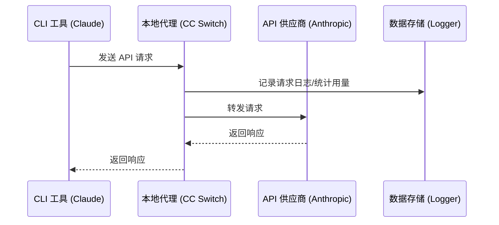
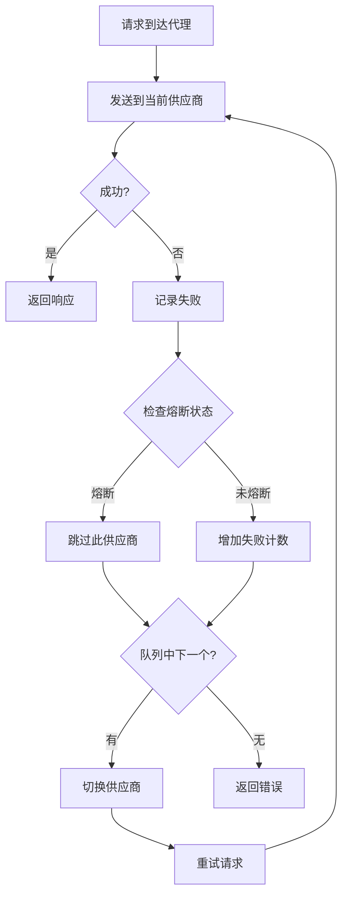
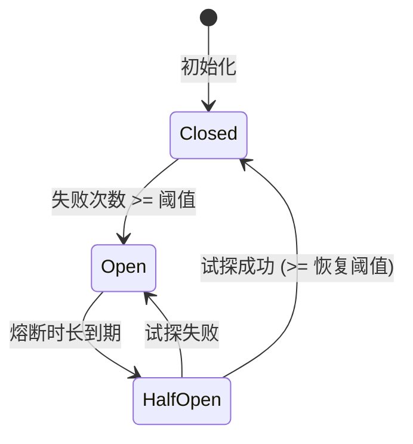

# 代理与路由

## 功能说明

代理服务在本地启动一个 HTTP 代理，所有 API 请求都通过代理转发。

**主要用途**：
- 记录请求日志
- 统计 API 用量
- 支持故障转移
- 集中管理多个应用的请求

## 启动代理

### 方式一：主界面开关

点击主界面顶部的 **代理开关** 按钮。

开关状态：
- 🔴 白色：代理未运行
- 🟢 绿色：代理运行中

<!-- 📷 官方手册截图："image-20260108011353927"（原图: ../../assets/image-20260108011353927.png） -->

### 方式二：设置页面

1. 打开「设置 → 高级 → 代理服务」
2. 点击右上角的开关

<!-- 📷 官方手册截图："image-20260108011338922"（原图: ../../assets/image-20260108011338922.png） -->

## 代理配置

### 基础配置

| 配置项 | 说明 | 默认值 |
|--------|------|--------|
| 监听地址 | 代理绑定的 IP 地址 | `127.0.0.1` |
| 监听端口 | 代理监听的端口 | `15721` |
| 启用日志 | 是否记录请求日志 | 开启 |

### 修改配置

1. **停止代理服务**（必须先停止）
2. 修改监听地址或端口
3. 点击「保存」
4. 重新启动代理

> ⚠️ 修改地址/端口需要先停止代理服务

### 监听地址说明

| 地址 | 说明 |
|------|------|
| `127.0.0.1` | 仅本机可访问（推荐） |
| `0.0.0.0` | 允许局域网访问 |

## 运行状态

代理运行时，面板显示以下信息：

### 服务地址

```
http://127.0.0.1:15721
```

点击「复制」按钮可复制地址。

### 当前供应商

显示各应用当前使用的供应商：

```
Claude: PackyCode
Codex: AIGoCode
Gemini: Google 官方
```

### 统计数据

| 指标 | 说明 |
|------|------|
| 活跃连接 | 当前正在处理的请求数 |
| 总请求数 | 启动以来的总请求数 |
| 成功率 | 请求成功的百分比（>90% 绿色，≤90% 黄色） |
| 运行时间 | 代理已运行的时长 |

### 故障转移队列

代理面板会按应用类型显示故障转移队列：

```
Claude
├── 1. PackyCode      [当前使用] ●
├── 2. AIGoCode                  ●
└── 3. 备用供应商                 ○

Codex
├── 1. AIGoCode       [当前使用] ●
└── 2. 备用供应商                 ●
```

队列说明：
- 数字表示优先级顺序
- 「当前使用」标签表示正在使用的供应商
- 健康徽章显示供应商状态：
  - 🟢 绿色：健康（连续失败 0 次）
  - 🟡 黄色：降级（连续失败 1-2 次）
  - 🔴 红色：不健康（连续失败 ≥3 次）

## 工作原理

### 请求流程



### 配置修改

启动代理并开启应用接管后，CC Switch 会修改应用配置：

**Claude**：
```json
{
  "env": {
    "ANTHROPIC_BASE_URL": "http://127.0.0.1:15721"
  }
}
```

**Codex**：
```toml
base_url = "http://127.0.0.1:15721/v1"
```

**Gemini**：
```
GOOGLE_GEMINI_BASE_URL=http://127.0.0.1:15721
```

## API 格式转换

代理支持为配置了非 Anthropic 格式的供应商自动进行 API 格式转换。这使你可以将仅支持 OpenAI 兼容 API 的供应商用于 Claude Code。

| 供应商 API 格式 | 代理行为 |
|-----------------|----------|
| **Anthropic Messages** | 透传（不转换） |
| **OpenAI Chat Completions** | 将 Anthropic 请求转换为 OpenAI Chat 格式，响应反向转换 |
| **OpenAI Responses API** | 将 Anthropic 请求转换为 OpenAI Responses 格式，响应反向转换 |

API 格式在添加或编辑 Claude 供应商时于[高级选项](../2-providers/2.1-add.md#api-格式仅-claude)中按供应商配置。

> **注意**：格式转换需要代理运行并启用应用接管。转换同时支持流式和非流式请求。

## 停止代理

### 方式一：主界面开关

点击代理开关按钮关闭。

### 方式二：设置页面

在代理服务面板中关闭开关。

### 停止后的处理

停止代理时，CC Switch 会：

1. 恢复应用配置到原始状态
2. 保存请求日志
3. 关闭所有连接

## 日志记录

### 开启日志

在代理面板中开启「启用日志」开关。

### 日志内容

每条请求记录包含：

| 字段 | 说明 |
|------|------|
| 时间 | 请求时间 |
| 应用 | Claude / Codex / Gemini |
| 供应商 | 使用的供应商 |
| 模型 | 请求的模型 |
| Token | 输入/输出 token 数 |
| 延迟 | 请求耗时 |
| 状态 | 成功/失败 |

### 查看日志

在「设置 → 用量」Tab 中查看请求日志。

## 常见问题

### 端口被占用

错误信息：`Address already in use`

解决方法：
1. 更换端口（如 5001）
2. 或关闭占用端口的程序

### 代理启动失败

检查：
- 端口是否被占用
- 是否有足够权限
- 防火墙是否阻止

### 请求超时

可能原因：
- 网络问题
- 供应商服务器问题
- 代理配置错误

解决方法：
- 检查网络连接
- 尝试直接访问供应商 API
- 检查供应商配置

---

## 功能说明

应用路由是指让 CC Switch 路由特定应用的 API 请求。

开启路由后：
- 应用的 API 请求会通过本地路由转发
- 可以记录请求日志和统计用量
- 可以使用故障转移功能

## 前提条件

使用应用路由功能前，需要先启动路由服务。

## 开启路由

### 操作位置

设置 → 高级 → 路由服务 → 应用路由区域

### 操作步骤

1. 确保路由服务已启动
2. 找到「应用路由」区域
3. 为需要的应用开启开关

### 路由开关

| 开关 | 作用 |
|------|------|
| Claude 路由 | 路由 Claude Code 的请求 |
| Codex 路由 | 路由 Codex 的请求 |
| Gemini 路由 | 路由 Gemini CLI 的请求 |

可以同时开启多个应用的路由。

## 路由原理

### 配置修改

开启路由后，CC Switch 会修改应用的配置文件，将 API 端点指向本地路由。

**Claude 配置变更**：

```json
// 路由前
{
  "env": {
    "ANTHROPIC_BASE_URL": "https://api.anthropic.com"
  }
}

// 路由后
{
  "env": {
    "ANTHROPIC_BASE_URL": "http://127.0.0.1:15721"
  }
}
```

**Codex 配置变更**：

```toml
base_url = "https://api.openai.com/v1"

base_url = "http://127.0.0.1:15721/v1"
```

**Gemini 配置变更**：

```bash
GOOGLE_GEMINI_BASE_URL=https://generativelanguage.googleapis.com

GOOGLE_GEMINI_BASE_URL=http://127.0.0.1:15721
```

### 请求转发

路由收到请求后：

1. 识别请求来源（Claude/Codex/Gemini）
2. 查找该应用当前启用的供应商
3. 将请求转发到供应商的实际端点
4. 记录请求日志
5. 返回响应给应用

## 路由状态指示

### 主界面指示

开启路由后，主界面会有以下变化：

- **路由 Logo 颜色**：从无色变为绿色
- **供应商卡片**：当前活跃的供应商显示绿色边框

### 供应商卡片状态

| 状态 | 边框颜色 | 说明 |
|------|----------|------|
| 当前启用 | 蓝色 | 配置文件中的供应商（非路由模式） |
| 路由活跃 | 绿色 | 路由实际使用的供应商 |
| 普通 | 默认 | 未使用的供应商 |

## 关闭路由

### 操作步骤

1. 在路由面板中关闭对应应用的路由开关
2. 或直接停止路由服务

### 配置恢复

关闭路由时，CC Switch 会：

1. 将应用配置恢复到路由前的状态
2. 保存当前的请求日志

## 路由与供应商切换

### 路由模式下切换供应商

在路由模式下切换供应商：

1. 在主界面点击供应商的「启用」按钮
2. 路由立即使用新供应商转发请求
3. **无需重启 CLI 工具**

这是路由模式的一大优势：切换供应商即时生效。

### 非路由模式下切换

在非路由模式下切换供应商：

1. 修改配置文件
2. 需要重启 CLI 工具才能生效

## 多应用路由

可以同时路由多个应用，每个应用独立管理：

- 独立的供应商配置
- 独立的故障转移队列
- 独立的请求统计

## 使用场景

### 场景一：用量监控

开启路由 + 日志记录，监控 API 使用情况。

### 场景二：快速切换

开启路由后，切换供应商无需重启 CLI 工具。

### 场景三：故障转移

开启路由是使用故障转移功能的前提。

## 注意事项

### 性能影响

路由会增加少量延迟（通常 < 10ms），对于大多数场景可以忽略。

### 网络要求

路由模式下，CLI 工具需要能够访问本地路由地址。

### 配置备份

开启路由前，CC Switch 会备份原始配置，关闭时恢复。

## 常见问题

### 路由后请求失败

检查：
- 路由服务是否正常运行
- 供应商配置是否正确
- 网络是否正常

### 关闭路由后配置未恢复

可能原因：
- 路由异常退出
- 配置文件被其他程序修改

解决方法：
- 手动编辑供应商，重新保存
- 或重新启用再关闭路由

---

## 功能说明

故障转移功能在主供应商请求失败时，自动切换到备用供应商，确保服务不中断。

**适用场景**：
- 供应商服务不稳定
- 需要高可用性
- 长时间运行的任务

## 前提条件

使用故障转移功能需要：

1. ✅ 启动代理服务
2. ✅ 开启应用接管
3. ✅ 配置故障转移队列
4. ✅ 开启自动故障转移

## 配置故障转移队列

### 打开配置页面

设置 → 高级 → 故障转移

### 选择应用

页面顶部有三个 Tab：
- Claude
- Codex
- Gemini

选择要配置的应用。

### 添加备用供应商

1. 在「故障转移队列」区域
2. 点击「添加供应商」
3. 从下拉列表选择供应商
4. 供应商会添加到队列末尾

### 调整优先级

拖拽供应商调整顺序：
- 序号越小，优先级越高
- 主供应商失败后，按顺序尝试备用供应商

### 移除供应商

点击供应商右侧的「移除」按钮。

## 主界面快捷操作

当代理和故障转移都开启时，供应商卡片会显示故障转移开关。

### 添加到队列

1. 找到供应商卡片
2. 开启故障转移开关
3. 供应商自动添加到队列

### 从队列移除

1. 关闭供应商卡片的故障转移开关
2. 供应商从队列中移除

## 开启自动故障转移

### 操作步骤

1. 在故障转移配置页面
2. 开启「自动故障转移」开关

### 开关说明

| 状态 | 行为 |
|------|------|
| 关闭 | 仅记录失败，不自动切换 |
| 开启 | 失败时自动切换到下一个供应商 |

## 故障转移流程



## 熔断器配置

熔断器防止频繁重试失败的供应商。

### 配置项

不同应用有独立的默认配置。以下为通用默认值，Claude 有独立的宽松配置。

| 配置 | 说明 | 通用默认值 | Claude 默认值 | 范围 |
|------|------|--------|--------|------|
| 失败阈值 | 连续失败多少次触发熔断 | 4 | 8 | 1-20 |
| 恢复成功阈值 | 半开状态下成功多少次后关闭熔断器 | 2 | 3 | 1-10 |
| 恢复等待时间 | 熔断后多久尝试恢复（秒） | 60 | 90 | 0-300 |
| 错误率阈值 | 错误率超过此值时打开熔断器 | 60% | 70% | 0-100% |
| 最小请求数 | 计算错误率前的最小请求数 | 10 | 15 | 5-100 |

> 💡 Claude 由于请求耗时较长，默认配置更为宽松，容忍更多失败次数。

### 超时配置

| 配置 | 说明 | 通用默认值 | Claude 默认值 | 范围 |
|------|------|--------|--------|------|
| 流式首字节超时 | 等待首个数据块的最大时间（秒） | 60 | 90 | 1-120 |
| 流式静默超时 | 数据块之间的最大间隔（秒） | 120 | 180 | 60-600（填 0 禁用） |
| 非流式超时 | 非流式请求的总超时时间（秒） | 600 | 600 | 60-1200 |

### 重试配置

| 配置 | 说明 | 通用默认值 | Claude 默认值 | 范围 |
|------|------|--------|--------|------|
| 最大重试次数 | 请求失败时的重试次数 | 3 | 6 | 0-10 |

> 💡 Gemini 的默认最大重试次数为 5。

### 熔断状态

| 状态 | 说明 |
|------|------|
| 关闭 | 正常状态，允许请求 |
| 开启 | 熔断状态，跳过此供应商 |
| 半开 | 尝试恢复，发送试探请求 |

### 状态转换



## 健康状态指示

### 供应商卡片

卡片上显示健康状态徽章：

| 徽章 | 状态 | 说明 |
|------|------|------|
| 🟢 | 健康 | 连续失败次数为 0 |
| 🟡 | 警告 | 有失败但未触发熔断 |
| 🔴 | 熔断 | 已触发熔断，暂时跳过 |

### 队列列表

故障转移队列中也显示每个供应商的健康状态。

## 故障转移日志

每次故障转移会记录：

| 信息 | 说明 |
|------|------|
| 时间 | 发生时间 |
| 原供应商 | 失败的供应商 |
| 新供应商 | 切换到的供应商 |
| 失败原因 | 错误信息 |

在用量统计的请求日志中可以查看。

## 最佳实践

### 队列配置建议

1. **主供应商**：最稳定、最快的供应商
2. **第一备用**：次优选择
3. **第二备用**：保底选择

### 熔断器配置建议

| 场景 | 失败阈值 | 熔断时长 |
|------|----------|----------|
| 高可用要求 | 2 | 30 秒 |
| 一般场景 | 3 | 60 秒 |
| 容忍偶发失败 | 5 | 120 秒 |

### 监控建议

定期检查：
- 各供应商的健康状态
- 故障转移发生频率
- 熔断触发情况

## 常见问题

### 故障转移没有触发

检查：
1. 代理服务是否运行
2. 应用接管是否开启
3. 自动故障转移是否开启
4. 队列中是否有备用供应商

### 频繁触发故障转移

可能原因：
- 主供应商不稳定
- 网络问题
- 配置错误

解决方法：
- 检查主供应商状态
- 调整熔断器参数
- 考虑更换主供应商

### 所有供应商都熔断

等待熔断时长到期后自动恢复，或：
1. 手动重启代理服务
2. 重置熔断状态

---

## 功能说明

用量统计功能记录和分析 API 请求数据，帮助你：

- 了解 API 使用情况
- 估算费用支出
- 分析使用模式
- 排查问题

v3.13.0 起，用量数据有两个来源：

| 数据来源                   | 覆盖范围                         | 是否需要代理拦截 |
| -------------------------- | -------------------------------- | ---------------- |
| **代理请求日志**           | 通过代理转发的所有请求           | 需要             |
| **CLI 会话日志**（v3.13 新增） | Claude / Codex / Gemini 会话历史 | 不需要           |

- **Codex 会话**：改用 JSONL 会话日志**精确解析**，替代原先的估算，并对模型名称做归一化保证定价查询一致
- **Gemini 会话**：通过 Gemini CLI 会话日志精确同步
- **Claude 会话**：同样支持从会话日志直接导入用量
- 用量面板支持**按应用筛选**（Claude / Codex / Gemini），数据互不干扰

## 前提条件

根据你使用的数据来源，前提条件不同：

**代理请求日志**（覆盖全部应用和所有代理请求）：

1. ✅ 启动代理服务
2. ✅ 开启应用接管
3. ✅ 开启日志记录

**CLI 会话日志**（v3.13 新增，无需代理）：

1. ✅ 在 CC Switch 中启用对应应用（Claude / Codex / Gemini）
2. ✅ 确保对应 CLI 有会话历史文件
3. ✅ CC Switch 会定期扫描会话目录并导入用量

## 打开用量统计

设置 → 用量 Tab

## 统计概览

### 汇总卡片

页面顶部显示关键指标：

| 指标 | 说明 |
|------|------|
| 总请求数 | 统计周期内的请求总数 |
| 真实消耗 Tokens | 输入 + 输出 + 缓存创建 + 缓存读取的缓存归一化总量 |
| 缓存命中率 | 缓存读取 Token 在可缓存输入中的占比 |
| 估算费用 | 基于定价配置计算的费用 |
| 成功率 | 成功请求的百分比 |

v3.15.0 起，用量页顶部改为筛选驱动的 Hero 卡。切换日期范围、应用、供应商或模型筛选时，Hero 中的真实消耗 Tokens、缓存命中率、请求数和费用会同步更新，并与下方日志和统计列表保持一致。

> 注意：由于缓存读取、缓存创建和 OpenAI 类协议的缓存上报方式在 v3.15.0 中做了归一化，历史 token 与费用数字可能与旧版估算不完全一致；新数字以当前归一化规则为准。

### 时间范围

可选择统计的时间范围：

| 选项 | 范围 |
|------|------|
| 今日 | 当天 00:00 至今 |
| 最近 7 天 | 过去 7 天 |
| 最近 30 天 | 过去 30 天 |

<!-- 📷 官方手册截图："image-20260108011730105"（原图: ../../assets/image-20260108011730105.png） -->

## 趋势图表

### 请求趋势

折线图展示请求数量的变化趋势：

- X 轴：时间
- Y 轴：请求数量
- 可按小时/天查看
- 支持缩放和拖拽

### Token 趋势

展示 Token 使用量的变化：

- 输入 Token（蓝色）- 用户发送的 prompt 内容
- 输出 Token（绿色）- AI 生成的回复内容
- 缓存创建 Token（橙色）- 首次创建缓存消耗的 Token
- 缓存命中 Token（紫色）- 复用缓存节省的 Token
- 成本（红色虚线，右侧 Y 轴）- 估算费用

> 💡 **缓存 Token 说明**：Anthropic API 支持 Prompt Caching 功能。缓存创建时收取较高费用（通常为输入价格的 1.25 倍），但后续命中缓存时只收取 0.1 倍的价格，可大幅降低重复请求的成本。

### 时间粒度

- **今日**：按小时显示（24 个数据点）
- **7 天/30 天**：按天显示


<!-- 📷 官方手册截图："image-20260108011742847"（原图: ../../assets/image-20260108011742847.png） -->

## 详细数据

页面下方有三个数据 Tab：

### 请求日志

每条请求的详细记录：

| 字段 | 说明 |
|------|------|
| 时间 | 请求时间 |
| 供应商 | 使用的供应商名称 |
| 模型 | 请求的模型（计费模型） |
| 输入 Token | 输入的 Token 数 |
| 输出 Token | 输出的 Token 数 |
| 缓存读取 | 缓存命中的 Token 数 |
| 缓存创建 | 缓存创建的 Token 数 |
| 总费用 | 估算费用（美元） |
| 耗时信息 | 请求耗时、首 Token 时间、流式/非流式 |
| 状态 | HTTP 状态码 |

#### 耗时信息说明

耗时信息列显示多个徽章：

| 徽章 | 说明 | 颜色规则 |
|------|------|----------|
| 总耗时 | 请求总时长（秒） | ≤5s 绿色，≤120s 橙色，>120s 红色 |
| 首 Token | 流式请求首个 Token 时间 | ≤5s 绿色，≤120s 橙色，>120s 红色 |
| 流式/非流式 | 请求类型 | 流式蓝色，非流式紫色 |

#### 查看详情

点击请求行可查看详细信息：

- 完整的请求参数
- 响应内容摘要
- 错误信息（如果失败）

#### 筛选日志

支持按以下条件筛选：

| 筛选项 | 选项 |
|--------|------|
| 应用类型 | 全部 / Claude / Codex / Gemini |
| 状态码 | 全部 / 200 / 400 / 401 / 429 / 500 |
| 供应商 | 文本搜索 |
| 模型 | 文本搜索 |
| 时间范围 | 开始时间 - 结束时间（日期时间选择器） |

操作按钮：
- **搜索**：应用筛选条件
- **重置**：恢复默认（过去 24 小时）
- **刷新**：重新加载数据

<!-- 📷 官方手册截图："image-20260108011859974"（原图: ../../assets/image-20260108011859974.png） -->

### 供应商统计

按供应商分组的统计数据：

| 字段 | 说明 |
|------|------|
| 供应商 | 供应商名称 |
| 请求数 | 该供应商的请求总数 |
| 成功数 | 成功的请求数 |
| 失败数 | 失败的请求数 |
| 成功率 | 成功百分比 |
| 总 Token | Token 使用总量 |
| 估算费用 | 该供应商的费用 |

<!-- 📷 官方手册截图："image-20260108011907928"（原图: ../../assets/image-20260108011907928.png） -->

### 模型统计

按模型分组的统计数据：

| 字段 | 说明 |
|------|------|
| 模型 | 模型名称 |
| 请求数 | 该模型的请求总数 |
| 输入 Token | 输入 Token 总量 |
| 输出 Token | 输出 Token 总量 |
| 平均延迟 | 平均响应时间 |
| 估算费用 | 该模型的费用 |

<!-- 📷 官方手册截图："image-20260108011915381"（原图: ../../assets/image-20260108011915381.png） -->

## 定价配置

### 打开定价配置

设置 → 高级 → 定价配置

### 配置模型价格

为每个模型设置价格（每百万 Token）：

| 字段 | 说明 |
|------|------|
| 模型 ID | 模型标识符（如 claude-3-sonnet） |
| 显示名称 | 自定义显示名称 |
| 输入价格 | 每百万输入 Token 的价格 |
| 输出价格 | 每百万输出 Token 的价格 |
| 缓存读取价格 | 每百万缓存命中 Token 的价格 |
| 缓存创建价格 | 每百万缓存创建 Token 的价格 |

### 模型 ID 匹配规则

在匹配定价前，CC Switch 会先对请求中的模型 ID 做标准化处理：

- 去掉最后一个 `/` 之前的前缀，并转成小写
- 去掉 `:` 之后的后缀，去掉末尾的 `[1m]`
- 将 `@` 替换为 `-`
- 去掉常见包装前缀、版本后缀、日期后缀（`-YYYY-MM-DD`、`-YYYYMMDD`）
- 部分模型族支持短 ID 匹配带版本的定价项

因此，在定价配置中请填写清洗后的模型 ID，而不是请求里的完整原始模型名。

| 原始模型名 | 应填写的模型 ID | 说明 |
|------|------|------|
| `stepfun-ai/step-3.5-flash` | `step-3.5-flash` | 去掉供应商前缀 |
| `moonshotai/kimi-k2-0905:exa` | `kimi-k2-0905` | 去掉前缀和 `:` 后缀 |
| `gpt-5.2-codex@low` | `gpt-5.2-codex-low` | 将 `@` 替换为 `-` |
| `OpenAI/GPT-5.5-2026-05-14` | `gpt-5.5` | 去掉前缀和日期后缀 |
| `anthropic/claude-opus-4.8` | `claude-opus-4-8` | 去掉前缀并匹配点号格式 |
| `global.anthropic.claude-opus-4-8-v1:0` | `claude-opus-4-8` | 去掉包装前缀、版本后缀和 `:` 后缀 |
| `claude-haiku-4-5` | `claude-haiku-4-5-20251001` | 短 ID 匹配带版本定价 |

### 操作

- **添加**：点击「添加」按钮新增模型定价
- **编辑**：点击行末的编辑图标修改
- **删除**：点击行末的删除图标移除

<!-- 📷 官方手册截图："image-20260108011933565"（原图: ../../assets/image-20260108011933565.png） -->

### 预设价格

CC Switch 预设了常用模型的官方价格（每百万 Token）。v3.13.0 修正了部分模型的 **CNY → USD 定价**并补齐了此前缺失的模型定义，同时修复了 **MiniMax 套餐配额数学**与 **0% → 100% 用量进度**，使费用估算和套餐进度展示更准确。

**Claude 系列（美元）**：

| 模型 | 输入 | 输出 | 缓存读取 | 缓存创建 |
|------|------|------|----------|----------|
| **Claude 4.8 系列** | | | | |
| claude-opus-4-8 | $5 | $25 | $0.50 | $6.25 |
| **Claude 4.5 系列** | | | | |
| claude-opus-4-5 | $5 | $25 | $0.50 | $6.25 |
| claude-sonnet-4-5 | $3 | $15 | $0.30 | $3.75 |
| claude-haiku-4-5 | $1 | $5 | $0.10 | $1.25 |
| **Claude 4 系列** | | | | |
| claude-opus-4 | $15 | $75 | $1.50 | $18.75 |
| claude-opus-4-1 | $15 | $75 | $1.50 | $18.75 |
| claude-sonnet-4 | $3 | $15 | $0.30 | $3.75 |
| **Claude 3.5 系列** | | | | |
| claude-3-5-sonnet | $3 | $15 | $0.30 | $3.75 |
| claude-3-5-haiku | $0.80 | $4 | $0.08 | $1.00 |

**OpenAI 系列 / Codex（美元）**：

| 模型 | 输入 | 输出 | 缓存读取 |
|------|------|------|----------|
| **GPT-5.2 系列** | | | |
| gpt-5.2 | $1.75 | $14 | $0.175 |
| **GPT-5.1 系列** | | | |
| gpt-5.1 | $1.25 | $10 | $0.125 |
| **GPT-5 系列** | | | |
| gpt-5 | $1.25 | $10 | $0.125 |

> 注：Codex 预设包含了 low/medium/high 等变体，价格与基础模型一致。

**Gemini 系列（美元）**：

| 模型 | 输入 | 输出 | 缓存读取 |
|------|------|------|----------|
| **Gemini 3 系列** | | | |
| gemini-3-pro-preview | $2 | $12 | $0.20 |
| gemini-3-flash-preview | $0.50 | $3 | $0.05 |
| **Gemini 2.5 系列** | | | |
| gemini-2.5-pro | $1.25 | $10 | $0.125 |
| gemini-2.5-flash | $0.30 | $2.50 | $0.03 |

**中国厂商模型**：

> 注：币种遵循各供应商官方定价页面。StepFun 当前按美元列出。
>
> **DeepSeek 兼容**：旧模型名 `deepseek-chat` / `deepseek-reasoner` 现等价于 `deepseek-v4-flash`（非思考/思考模式），按 v4-flash 价格计费。

| 模型 | 输入 | 输出 | 缓存读取 |
|------|------|------|----------|
| **StepFun** | | | |
| step-3.5-flash | $0.10 | $0.30 | $0.02 |
| **DeepSeek** | | | |
| deepseek-v4-flash | ¥1.00 | ¥2.00 | ¥0.20 |
| deepseek-v4-pro | ¥12.00 | ¥24.00 | ¥1.00 |
| **Kimi (月之暗面)** | | | |
| kimi-k2-thinking | ¥4.00 | ¥16.00 | ¥1.00 |
| kimi-k2 | ¥4.00 | ¥16.00 | ¥1.00 |
| kimi-k2-turbo | ¥8.00 | ¥58.00 | ¥1.00 |
| **MiniMax** | | | |
| minimax-m2.1 | ¥2.10 | ¥8.40 | ¥0.21 |
| minimax-m2.1-lightning | ¥2.10 | ¥16.80 | ¥0.21 |
| **其他** | | | |
| glm-4.7 | ¥2.00 | ¥8.00 | ¥0.40 |
| doubao-seed-code | ¥1.20 | ¥8.00 | ¥0.24 |
| mimo-v2-flash | 免费 | 免费 | - |

### 自定义价格

如果使用中转服务，价格可能不同：

1. 点击「编辑」按钮
2. 修改价格
3. 保存

## 常见问题

### 统计数据为空

检查：
- 代理服务是否运行
- 应用接管是否开启
- 日志记录是否开启
- 是否有请求通过代理

### 费用估算不准确

可能原因：
- 定价配置与实际不符
- 使用了中转服务的特殊定价

解决方法：
- 更新定价配置
- 参考供应商的实际账单

### Token 数量与供应商不一致

CC Switch 使用自己的方式估算 Token 数，可能与供应商的计算方式略有差异。以供应商账单为准。

---

## 功能说明

模型检查功能（也称为 **Stream Check**）用于验证供应商配置的模型是否可用，通过发送实际的 API 请求来测试：

- 模型是否存在
- API Key 是否有效
- 端点是否正常响应
- 响应延迟是否正常
- 流式响应首字节时间（TTFB）

v3.13.0 起，Stream Check 覆盖范围扩展到 **Claude / Codex / Gemini / OpenCode / OpenClaw**，包括 OpenClaw 的全部协议变体（`openai-completions` 等）。OpenCode 通过 npm 包映射自动识别；OpenClaw 支持自定义 `auth-header` 检测，并处理了 Bedrock 错误消息、`baseURL` 回退等边界情况。

对于使用 Chat Completions 协议的 Codex 第三方供应商（如百度千帆、StepFun、SiliconFlow），Stream Check 会探测 `/chat/completions` 端点（而非 `/responses`），并与代理实际转发的 URL 顺序保持一致（origin-only 地址优先尝试 `/v1/...`），避免把可用供应商误判为不可用。

## 打开配置

设置 → 高级 → 模型测试

## 测试模型配置

为每个应用配置用于测试的模型：

| 应用     | 配置项        | 默认值   | 说明                                         |
| -------- | ------------- | -------- | -------------------------------------------- |
| Claude   | Claude 模型   | 系统默认 | 建议使用 Haiku 系列（成本低、速度快）        |
| Codex    | Codex 模型    | 系统默认 | 建议使用 mini 系列                           |
| Gemini   | Gemini 模型   | 系统默认 | 建议使用 Flash 系列                          |
| OpenCode | OpenCode 模型 | 系统默认 | v3.13.0 新增，通过 npm 包映射自动检测        |
| OpenClaw | OpenClaw 模型 | 系统默认 | v3.13.0 新增，覆盖全部协议变体及自定义 auth-header |

### 模型选择建议

选择测试模型时考虑：

1. **成本**：选择价格较低的模型（如 Haiku、Mini、Flash）
2. **速度**：选择响应快的模型
3. **可用性**：选择供应商支持的模型

## 检查参数配置

### 超时时间

| 参数 | 说明 | 默认值 | 范围 |
|------|------|--------|------|
| 超时时间 | 单次请求超时 | 45 秒 | 10-120 秒 |

设置过短可能导致误判，设置过长会延迟故障检测。

### 重试次数

| 参数 | 说明 | 默认值 | 范围 |
|------|------|--------|------|
| 最大重试 | 失败后重试次数 | 2 次 | 0-5 次 |

网络不稳定时建议增加重试次数。

### 降级阈值

| 参数 | 说明 | 默认值 | 范围 |
|------|------|--------|------|
| 降级阈值 | 响应超过此时间标记为降级 | 6000ms | 1000-30000ms |

超过阈值的供应商会被标记为「降级」状态，但仍可使用。

## 执行模型检查

### 手动测试

在供应商卡片上点击「测试」按钮：

1. 发送测试请求到配置的端点
2. 使用配置的测试模型
3. 等待响应或超时
4. 显示测试结果

### 测试内容

测试请求会：
- 发送简短的 prompt（如 "Hi"）
- 限制最大输出 token（通常 10-50）
- 使用流式响应检测首字节时间

## 测试结果

### 健康状态

| 状态 | 图标 | 说明 |
|------|------|------|
| 健康 | 🟢 | 响应正常，延迟在阈值内 |
| 降级 | 🟡 | 响应正常，但延迟超过阈值 |
| 不可用 | 🔴 | 请求失败或超时 |

### 结果信息

测试完成后显示：
- 响应延迟（毫秒）
- 首字节时间（TTFB）
- 错误信息（如果失败）

## 与故障转移集成

模型检查与故障转移功能配合使用：

### 健康检查

开启代理服务后，系统会定期对故障转移队列中的供应商执行健康检查：

1. 使用配置的测试模型发送请求
2. 根据响应更新健康状态
3. 不健康的供应商会被暂时跳过

### 熔断恢复

当供应商从熔断状态恢复时：

1. 执行模型检查验证可用性
2. 检查通过后恢复正常状态
3. 检查失败则继续熔断

## 常见问题

### 测试失败但实际可用

**可能原因**：
- 测试模型与实际使用的模型不同
- 供应商不支持配置的测试模型

**解决方法**：
- 修改测试模型为供应商支持的模型
- 检查供应商的模型列表

### 延迟过高

**可能原因**：
- 网络延迟
- 供应商服务器负载高
- 模型响应慢

**解决方法**：
- 使用更快的测试模型
- 调整降级阈值
- 考虑使用镜像端点

### 频繁超时

**可能原因**：
- 超时时间设置过短
- 网络不稳定
- 供应商服务不稳定

**解决方法**：
- 增加超时时间
- 增加重试次数
- 检查网络连接

## 注意事项

- 模型检查会消耗少量 API 配额
- 建议使用低成本模型进行测试
- 测试频率不宜过高，避免浪费配额
- 不同供应商支持的模型可能不同

---
